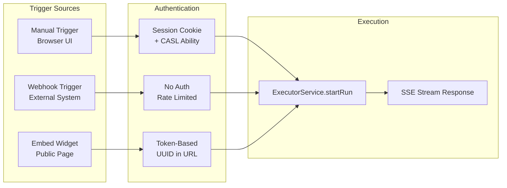
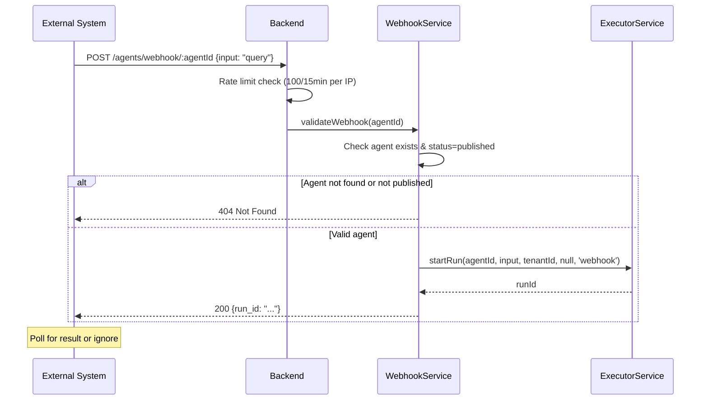
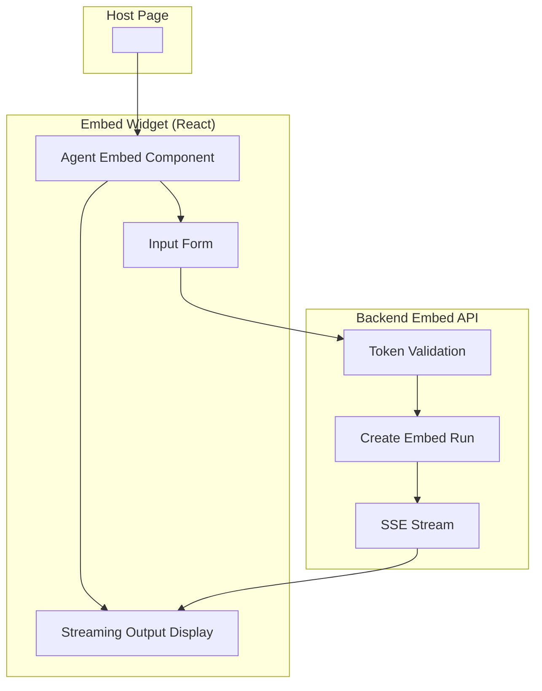
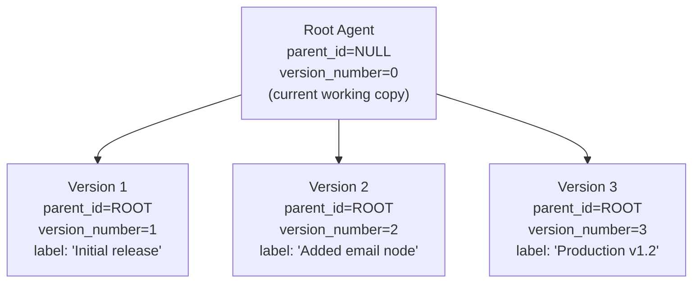
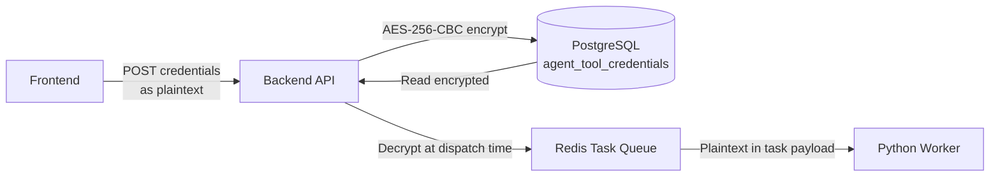

# Agent Triggers & Embed Widget: Detail Design

## Overview

Agents support three trigger types: manual execution from the UI, webhook-based triggers from external systems, and embed widget triggers for public-facing agent access. Each trigger type has different authentication, rate limiting, and input handling requirements.

## Trigger Types



## Manual Trigger (UI)

### Flow

1. User enters input text in the canvas editor toolbar
2. Frontend calls `POST /api/agents/:id/run` with `{ input: "..." }`
3. Backend creates run record with `trigger_type: 'manual'`
4. Frontend subscribes to `GET /api/agents/:id/run/:runId/stream` (SSE)
5. Real-time step updates streamed until completion

### Authorization

- Requires active session (`requireAuth` middleware)
- Requires tenant context (`requireTenant` middleware)
- Requires `read Agent` CASL ability to start a run
- Requires `manage Agent` to cancel a run

### Input Validation

```typescript
const agentRunBodySchema = z.object({
  input: z.string().min(1).max(50000),
})
```

## Webhook Trigger

### Flow



### Configuration

| Setting | Value | Purpose |
|---------|-------|---------|
| **Endpoint** | `POST /agents/webhook/:agentId` | Public URL (no `/api` prefix) |
| **Authentication** | None | Public access for external systems |
| **Rate Limit** | 100 requests / 15 minutes per IP | Abuse prevention |
| **Agent Status** | Must be `published` | Draft agents cannot be triggered |
| **Input Fields** | `input`, `message`, or `query` | Flexible input field names |

### Input Extraction

The webhook controller looks for input in the request body in this priority order:

1. `body.input` — primary field
2. `body.message` — alternative (chat-style)
3. `body.query` — alternative (search-style)

### Response

```json
{
  "run_id": "abc123...",
  "status": "pending"
}
```

The external system can poll `GET /api/agents/:id/runs` (with auth) or subscribe to the SSE stream to track progress.

## Embed Widget

### Architecture



### Token Management

| Endpoint | Auth | Purpose |
|----------|------|---------|
| `POST /api/agents/:id/embed-token` | requireAuth + requireTenant | Create embed token |
| `GET /api/agents/:id/embed-tokens` | requireAuth + requireTenant | List embed tokens |
| `DELETE /api/agents/embed-tokens/:tid` | requireAuth + requireTenant | Revoke embed token |

Embed tokens are UUID-based and stored in the database. They provide:
- Public access without session authentication
- Per-agent scoping (token is tied to a specific agent)
- Revocable access (delete token to block widget)

### Embed API Endpoints

| Method | Path | Auth | Purpose |
|--------|------|------|---------|
| GET/POST | `/api/agents/embed/:token/:id/*` | Token validation | Widget endpoints |

The embed endpoints mirror the standard agent run/stream API but authenticate via the URL token instead of a session cookie.

### Widget Configuration

The embed widget can be customized via token metadata:
- Agent name display
- Agent avatar/icon
- Custom styling (theme inheritance)

## Version Management

### Version-as-Row Pattern



### Version Operations

| Operation | Endpoint | Effect |
|-----------|----------|--------|
| Save version | `POST /api/agents/:id/versions` | Creates new row with `parent_id=root, version_number=N+1` |
| List versions | `GET /api/agents/:id/versions` | Returns all rows where `parent_id=:id` |
| Restore version | `POST /api/agents/:id/versions/:vid/restore` | Copies DSL from version row to root row |
| Delete version | `DELETE /api/agents/:id/versions/:vid` | Removes version row (root unaffected) |

### Save Version Schema

```typescript
const saveVersionSchema = z.object({
  version_label: z.string().max(128).optional(),
  change_summary: z.string().max(1000).optional(),
})
```

## Run History

### List Runs

`GET /api/agents/:id/runs` returns paginated execution history:

```json
{
  "items": [
    {
      "id": "run-uuid",
      "status": "completed",
      "mode": "pipeline",
      "input": "What is...",
      "output": "The answer is...",
      "total_nodes": 8,
      "completed_nodes": 8,
      "duration_ms": 12500,
      "trigger_type": "manual",
      "triggered_by": "user-uuid",
      "created_at": "2026-03-24T10:00:00Z"
    }
  ],
  "total": 42
}
```

### Run Status Values

| Status | Description |
|--------|-------------|
| `pending` | Run created, execution not yet started |
| `running` | Graph execution in progress |
| `completed` | All nodes completed successfully |
| `failed` | Unrecoverable error during execution |
| `cancelled` | User cancelled the run |

## Tool Credentials

### Credential Storage



### Security Properties

| Property | Implementation |
|----------|---------------|
| Encryption at rest | AES-256-CBC with unique IV per credential |
| Never returned to frontend | API responses sanitize credential values |
| Decrypted only at dispatch | Credentials decrypted when building task payload |
| Unique constraint | `(tenant_id, COALESCE(agent_id, '00...'), tool_type)` |
| Scope hierarchy | Tenant-level defaults (`agent_id=NULL`) + agent-specific overrides |

### Credential CRUD

| Method | Path | Purpose |
|--------|------|---------|
| GET | `/api/agents/tools/credentials` | List credentials (values redacted) |
| POST | `/api/agents/tools/credentials` | Create credential |
| PUT | `/api/agents/tools/credentials/:id` | Update credential |
| DELETE | `/api/agents/tools/credentials/:id` | Delete credential |

## Template Gallery

### Template Sources

| Source | `is_system` | `tenant_id` | Deletable |
|--------|:-:|:-:|:-:|
| System templates | `true` | `NULL` | No |
| Tenant-specific | `false` | Set | Yes |

### Create from Template

1. User selects template from gallery
2. Frontend calls `POST /api/agents` with `{ template_id: "..." }`
3. Backend copies DSL from template into new agent
4. New agent created in `draft` status
5. User can modify DSL before publishing

## Key Files

| File | Purpose |
|------|---------|
| `be/src/modules/agents/routes/agent-webhook.routes.ts` | Public webhook endpoint (rate-limited) |
| `be/src/modules/agents/routes/agent-embed.routes.ts` | Token-based embed endpoints |
| `be/src/modules/agents/services/agent-webhook.service.ts` | Webhook validation (status check) |
| `be/src/modules/agents/services/agent-embed.service.ts` | Embed token auth + SSE |
| `be/src/modules/agents/services/agent-tool-credential.service.ts` | AES-256-CBC credential management |
| `be/src/modules/agents/services/agent.service.ts` | CRUD, versioning, duplication, export |
