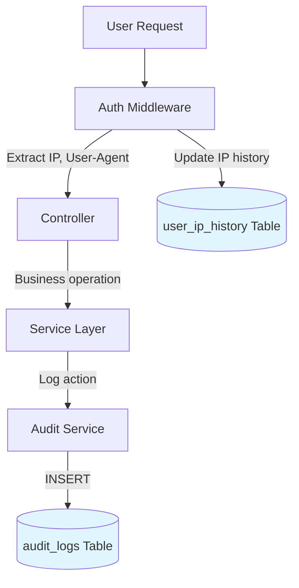
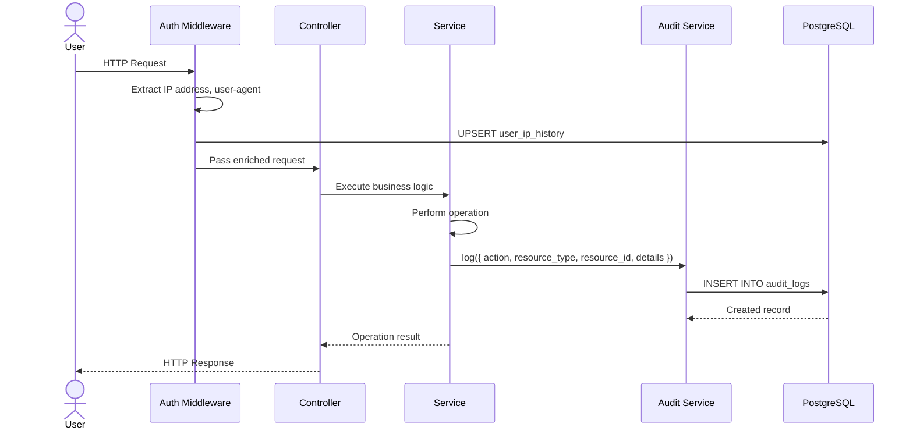
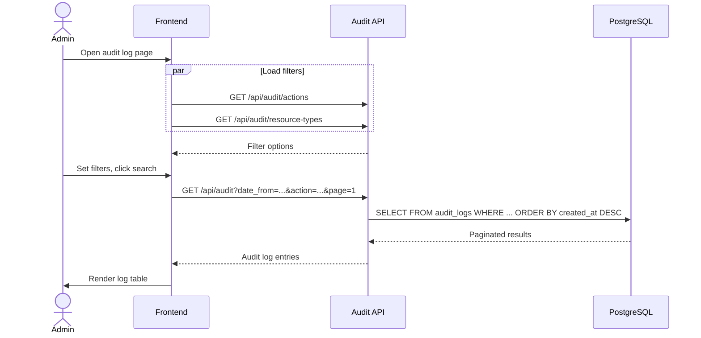

# Audit Logging Detail Design

## Overview

The Audit module provides an immutable, append-only log of user actions across B-Knowledge. Every significant operation is recorded with contextual metadata for compliance, debugging, and security analysis.

## Audit Capture Flow

## Data Model

### audit_logs

| Field | Type | Description |
|-------|------|-------------|
| id | UUID | Primary key |
| user_id | UUID | Acting user |
| action | string | Action identifier (e.g., `user.login`, `document.create`) |
| resource_type | string | Entity type (e.g., `document`, `dataset`, `user`) |
| resource_id | string | ID of affected resource |
| details | JSONB | Action-specific metadata |
| ip_address | string | Client IP from request |
| user_agent | string | Client user-agent header |
| created_at | timestamp | Immutable creation timestamp |

### user_ip_history

| Field | Type | Description |
|-------|------|-------------|
| id | UUID | Primary key |
| user_id | UUID | User reference |
| ip_address | string | Observed IP |
| last_seen_at | timestamp | Last request from this IP |

## Immutability Guarantee

The `audit_logs` table is **append-only**. No UPDATE or DELETE operations are permitted at the application layer. This ensures a tamper-evident record of all actions.

## Capture Sequence

## API Endpoints

### Query Audit Logs

| Method | Path | Description |
|--------|------|-------------|
| GET | `/api/audit` | Paginated audit log query |
| GET | `/api/audit/actions` | Distinct action types |
| GET | `/api/audit/resource-types` | Distinct resource types |

### Query Parameters for GET /api/audit

| Param | Type | Description |
|-------|------|-------------|
| `date_from` | ISO datetime | Start of date range |
| `date_to` | ISO datetime | End of date range |
| `user_id` | UUID | Filter by acting user |
| `action` | string | Filter by action type |
| `resource_type` | string | Filter by resource type |
| `search` | string | Full-text search on details JSONB |
| `page` | number | Page number |
| `page_size` | number | Results per page |

### Filter Discovery

`GET /api/audit/actions` and `GET /api/audit/resource-types` return distinct values to populate filter dropdowns in the UI.

## Action Types

| Action | Resource Type | Trigger |
|--------|--------------|---------|
| `user.login` | user | Successful login |
| `user.logout` | user | Logout |
| `user.create` | user | Admin creates user |
| `document.create` | document | Document uploaded |
| `document.delete` | document | Document removed |
| `dataset.create` | knowledgebase | Dataset created |
| `dataset.update` | knowledgebase | Dataset settings changed |
| `llm_provider.create` | llm_provider | Provider configured |
| `chat.create` | chat_session | New chat session |
| `settings.update` | settings | System settings changed |

## IP History

The `user_ip_history` table is updated on every authenticated request via middleware. It tracks the set of IP addresses each user has connected from and when they were last seen, supporting security review without querying the full audit log.

## Query Flow

## Key Files

| File | Purpose |
|------|---------|
| `be/src/modules/audit/` | Module root |
| `be/src/modules/audit/audit.controller.ts` | Route handlers |
| `be/src/modules/audit/audit.service.ts` | Logging and query logic |
| `be/src/modules/audit/audit.model.ts` | Knex model for audit_logs |
| `fe/src/features/audit/` | Frontend feature |
