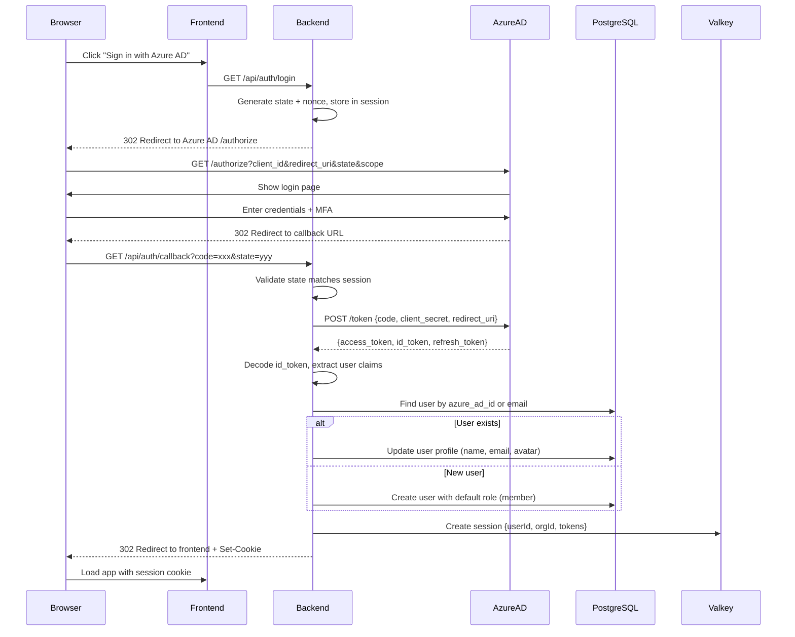
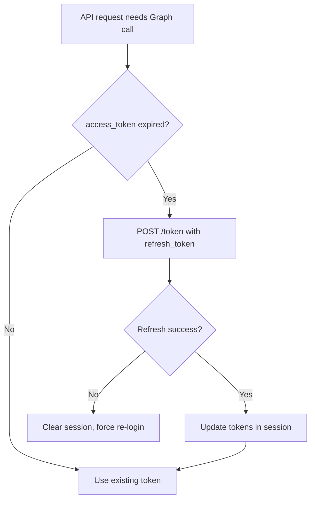
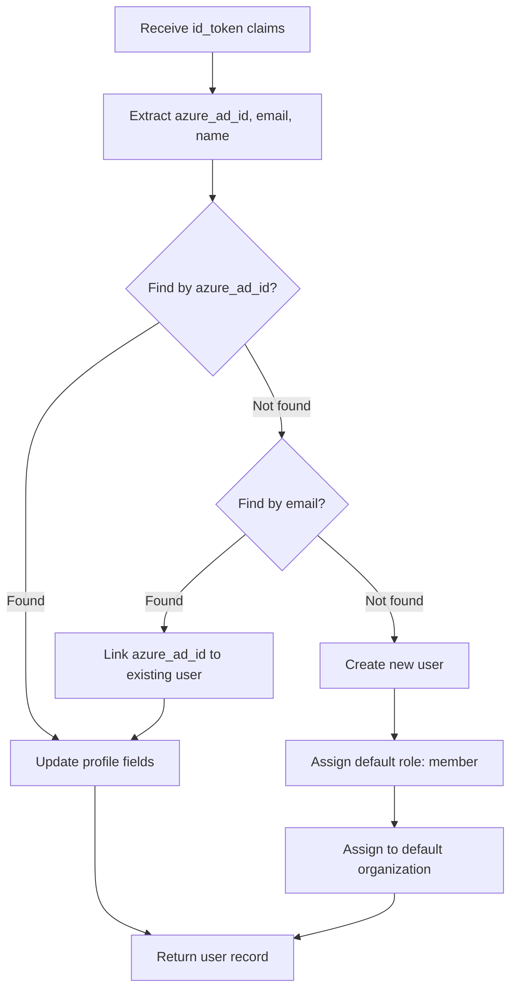
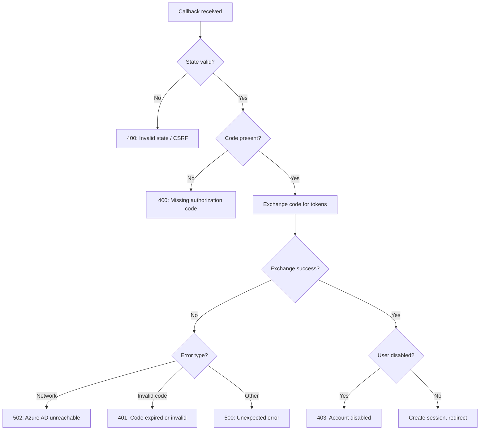

# Auth: Azure AD OAuth2 Flow

## Overview

Azure AD authentication uses the OAuth2 Authorization Code flow. The backend acts as a confidential client, exchanging an authorization code for tokens and creating a local session.

## Sequence Diagram

## Token Handling

| Token | Storage | Purpose | Lifetime |
|-------|---------|---------|----------|
| `access_token` | Valkey session | Call Microsoft Graph API | ~1 hour |
| `id_token` | Decoded, not stored | Extract user claims (sub, email, name) | ~1 hour |
| `refresh_token` | Valkey session | Obtain new access_token | Days/weeks |

### Token Refresh

## User Creation / Update Logic

### Claim Mapping

| Azure AD Claim | DB Field | Notes |
|----------------|----------|-------|
| `oid` / `sub` | `azure_ad_id` | Primary match key |
| `preferred_username` | `email` | Fallback match key |
| `name` | `display_name` | Updated on each login |
| `given_name` | `first_name` | Optional |
| `family_name` | `last_name` | Optional |

## Error Handling

| Error Scenario | HTTP Status | User Experience |
|----------------|-------------|-----------------|
| Invalid state parameter | 400 | Redirect to login with error |
| Code exchange failure | 401 | Redirect to login with error |
| Azure AD unreachable | 502 | Error page, retry prompt |
| User account disabled | 403 | "Account disabled" message |
| Organization not found | 403 | "No organization access" message |

## Key Files

| File | Purpose |
|------|---------|
| `be/src/modules/auth/auth.controller.ts` | `/login`, `/callback`, `/logout` route handlers |
| `be/src/modules/auth/auth.service.ts` | Token exchange, user upsert, session creation |
| `be/src/modules/auth/index.ts` | Module barrel export and route registration |
