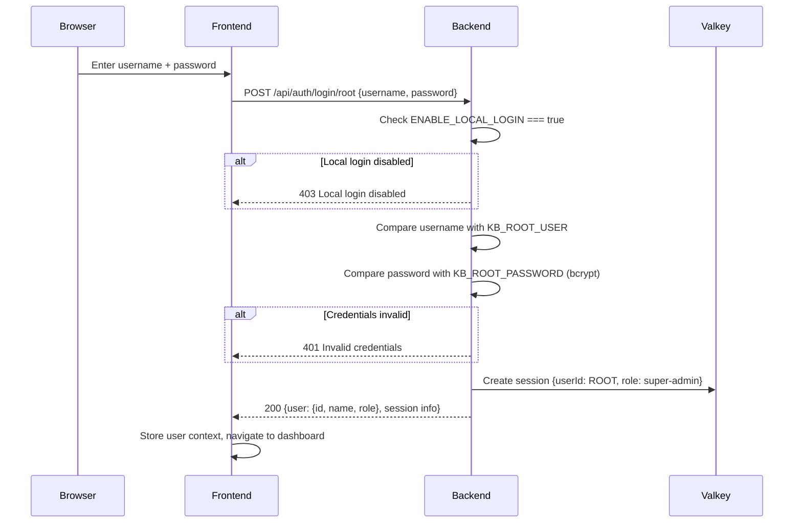
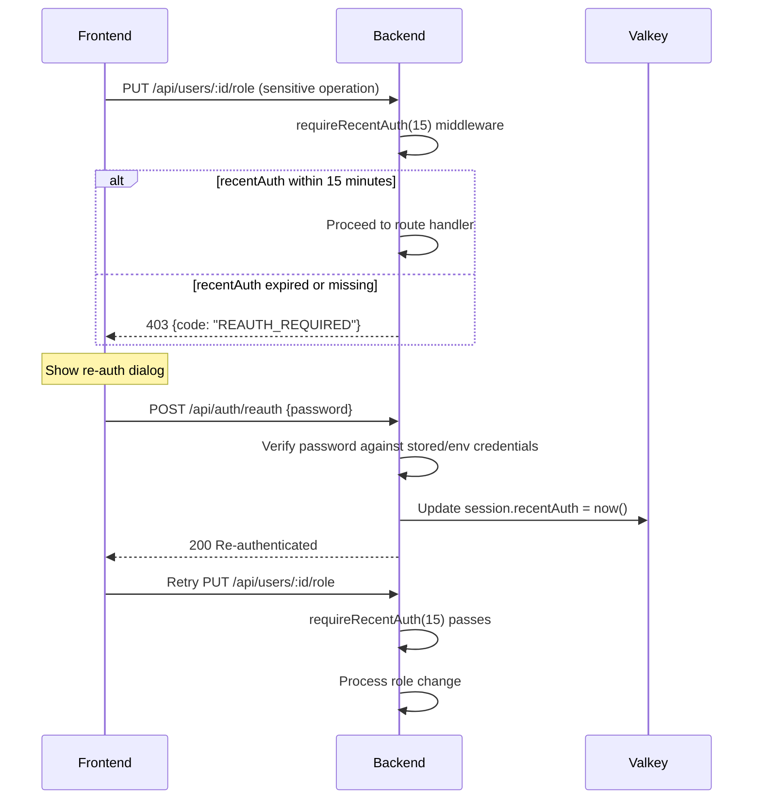
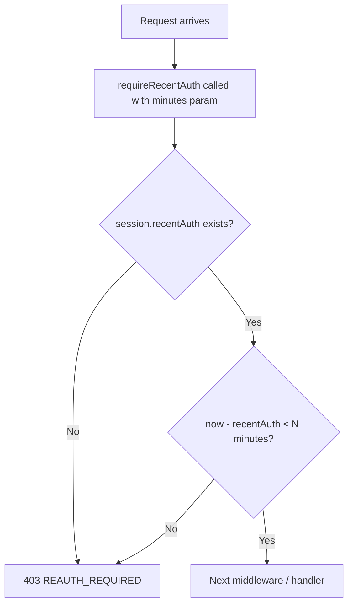
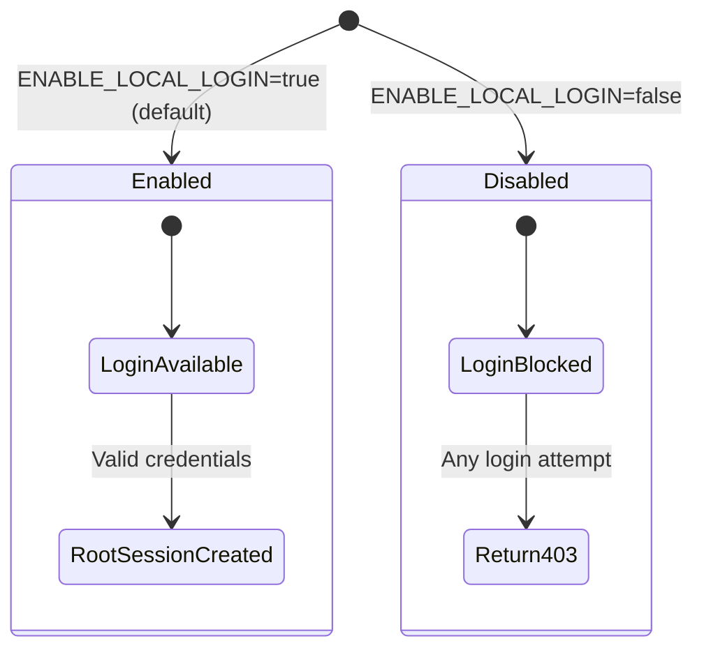

# Auth: Local Root Login

## Overview

Local root login provides a built-in admin account for initial setup and emergency access. Credentials are defined via environment variables (`KB_ROOT_USER`, `KB_ROOT_PASSWORD`). This feature is controlled by the `ENABLE_LOCAL_LOGIN` flag.

## Login Flow



## Re-Authentication Flow

Sensitive operations require recent authentication proof. The re-auth flow verifies the user's password again and updates a timestamp in the session.



## requireRecentAuth Middleware



| Parameter | Default | Description |
|-----------|---------|-------------|
| `minutes` | 15 | Maximum age of re-auth timestamp |

### Operations Requiring Re-Auth

| Operation | Endpoint | Reason |
|-----------|----------|--------|
| Change user role | `PUT /api/users/:id/role` | Privilege escalation risk |
| Delete user | `DELETE /api/users/:id` | Irreversible action |
| Change permissions | `PUT /api/users/:id/permissions` | Access control modification |
| Manage system settings | `PUT /api/settings/system` | System-wide impact |

## ENABLE_LOCAL_LOGIN Feature Flag



| Flag Value | Behavior |
|------------|----------|
| `true` (default) | Local root login enabled, login form shown |
| `false` | Local login endpoint returns 403, login form hidden |

### Production Recommendation

- Set `ENABLE_LOCAL_LOGIN=false` in production after Azure AD is configured
- Root account should only be used for initial setup
- All regular users should authenticate via Azure AD SSO

## Session Structure (Root User)

```
{
  userId: "root",
  role: "super-admin",
  activeOrg: "<default-org-id>",
  recentAuth: "2026-03-21T10:30:00Z",
  loginMethod: "local",
  createdAt: "2026-03-21T10:00:00Z"
}
```

## Key Files

| File | Purpose |
|------|---------|
| `be/src/modules/auth/auth.controller.ts` | `POST /login/root`, `POST /reauth` handlers |
| `be/src/modules/auth/auth.service.ts` | Credential validation, session management |
| `be/src/shared/middleware/auth.middleware.ts` | `requireRecentAuth(minutes)` middleware |
| `be/.env` | `KB_ROOT_USER`, `KB_ROOT_PASSWORD`, `ENABLE_LOCAL_LOGIN` |
