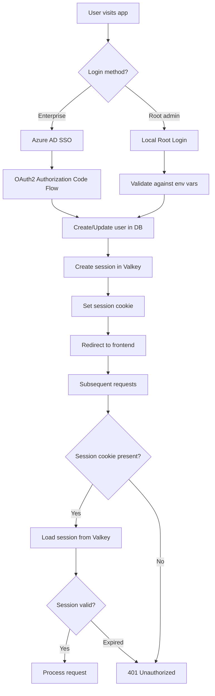
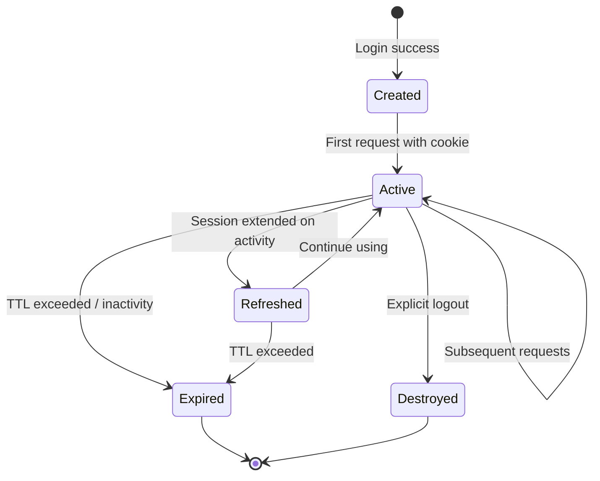
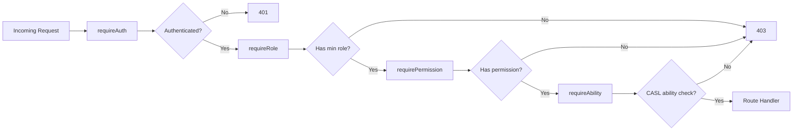
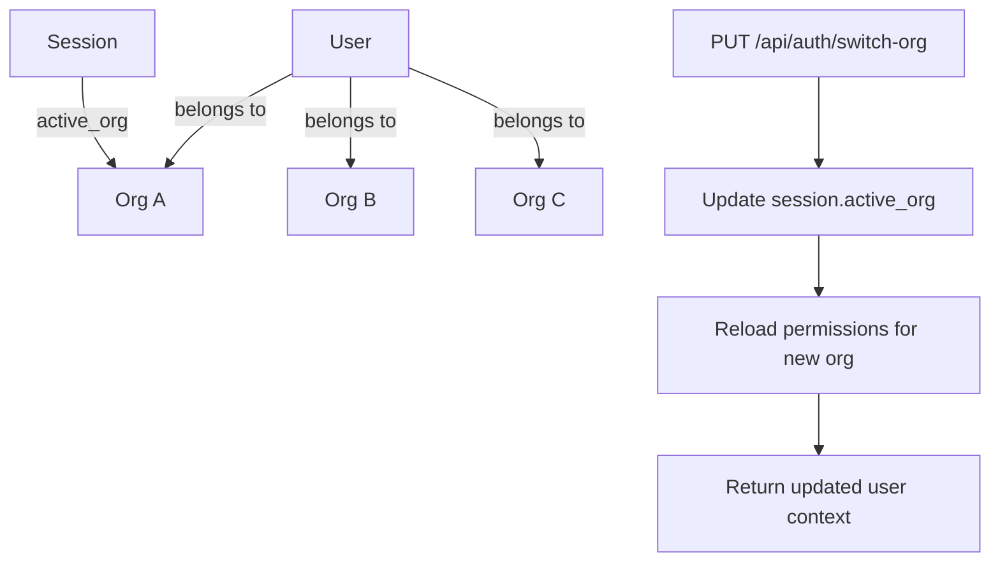

# Auth System Overview

## Overview

B-Knowledge supports two authentication methods: Azure AD SSO for enterprise users and Local Root login for initial setup/administration. Sessions are stored in Valkey (Redis-compatible) and accessed via secure cookies.

## Authentication Flow

## Session Lifecycle

| Phase | Description |
|-------|-------------|
| **Created** | Session object stored in Valkey with TTL |
| **Active** | Cookie sent on each request, session loaded from Valkey |
| **Refreshed** | Rolling expiry extended on activity |
| **Expired** | TTL exceeded, Valkey auto-deletes key |
| **Destroyed** | `POST /api/auth/logout` deletes session from Valkey |

## Permission Resolution Chain

Each middleware layer adds progressively finer checks:

1. **requireAuth** - Validates session exists and is not expired
2. **requireRole** - Checks user role meets minimum level (e.g., admin+)
3. **requirePermission** - Checks explicit permission flags (e.g., `manage_users`)
4. **requireAbility** - CASL-based check for action + subject + conditions (ABAC)

## Multi-Organization Support

- A user can belong to multiple organizations (tenants)
- The session stores the currently active organization
- `switch-org` endpoint changes `session.activeOrg` and reloads role/permissions
- All data queries are scoped to the active organization via tenant isolation

## Key Files

| File | Purpose |
|------|---------|
| `be/src/modules/auth/` | Auth module (controller, service, routes) |
| `be/src/shared/middleware/auth.middleware.ts` | requireAuth, requireRole, requirePermission, requireAbility |
| `be/src/shared/config/rbac.js` | Role hierarchy and permission definitions |
| `be/src/modules/auth/auth.controller.ts` | Login, logout, callback, switch-org endpoints |
| `be/src/modules/auth/auth.service.ts` | Session creation, Azure AD token exchange |
