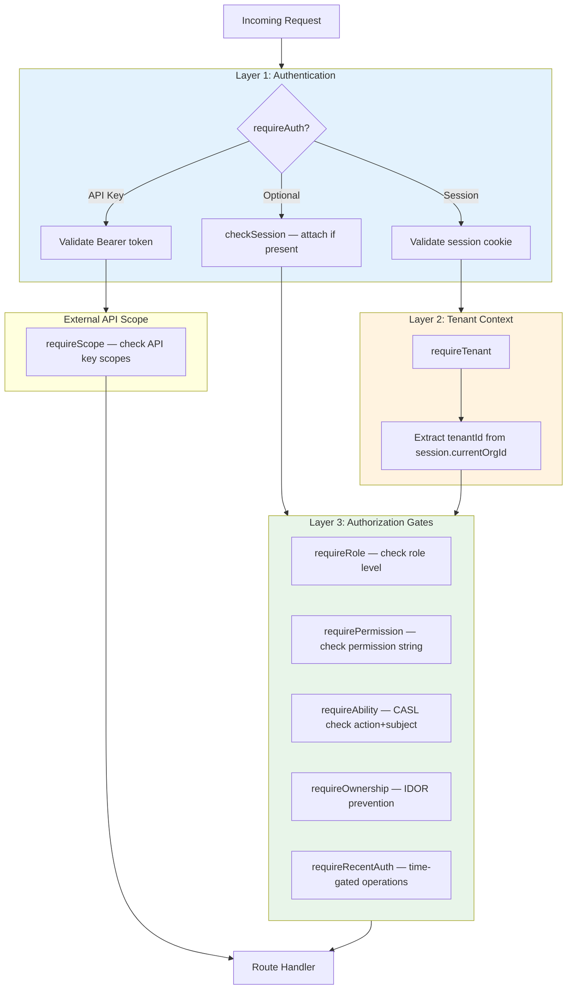
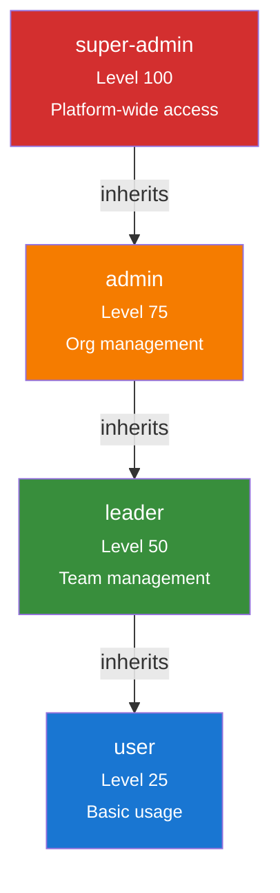
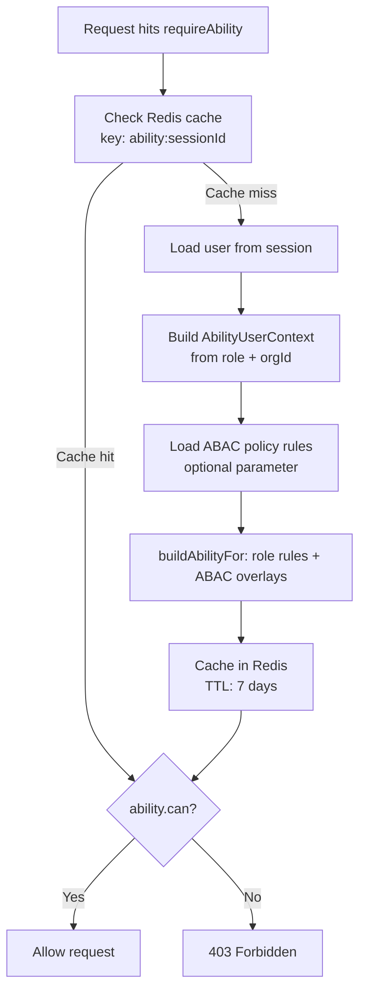

# RBAC & ABAC: Comprehensive Authorization Reference

## Overview

B-Knowledge implements a multi-layered authorization system combining Role-Based Access Control (RBAC) with Attribute-Based Access Control (ABAC) via the CASL library. This document provides a complete reference of every feature's authorization requirements.

## Authorization Layers



## Role Hierarchy



| Role | Level | Scope | Can Assign Roles |
|------|-------|-------|-----------------|
| `super-admin` | 100 | All organizations | Any role |
| `admin` | 75 | Own organization | leader, user |
| `leader` | 50 | Own teams | None |
| `user` | 25 | Self only | None |

## Permission Definitions

### Role-Permission Matrix

| Permission | super-admin | admin | leader | user |
|-----------|:-:|:-:|:-:|:-:|
| `view_chat` | Y | Y | Y | Y |
| `view_search` | Y | Y | Y | Y |
| `view_history` | Y | Y | Y | Y |
| `manage_users` | Y | Y | Y | - |
| `manage_system` | Y | Y | - | - |
| `manage_knowledge_base` | Y | Y | - | - |
| `manage_storage` | Y | Y | - | - |
| `view_analytics` | Y | Y | Y | - |
| `view_system_tools` | Y | Y | Y | - |
| `manage_datasets` | Y | Y | Y | - |
| `manage_model_providers` | Y | Y | - | - |
| `storage:read` | Y | Y | - | - |
| `storage:write` | Y | Y | - | - |
| `storage:delete` | Y | Y | - | - |

## CASL Ability Rules

### Subject Types

```typescript
type Subjects = 'Dataset' | 'Document' | 'ChatAssistant' | 'SearchApp' |
                'User' | 'AuditLog' | 'Policy' | 'Org' | 'Project' |
                'Agent' | 'Memory'
```

> **Note:** `Policy` and `Org` are defined as subjects but have no ability rules assigned and are not used by any route middleware. `Project` is used in route middleware (`requireAbility('read', 'Project')`) but has no rules assigned for non-super-admin roles in the ability builder — access for admin/leader/user roles depends on ABAC policies being passed externally.

### Action Types

```typescript
type Actions = 'manage' | 'create' | 'read' | 'update' | 'delete'
// 'manage' is a CASL wildcard that grants all actions
```

### Ability Rules by Role

| Role | Subjects | Actions | Conditions |
|------|----------|---------|-----------|
| **super-admin** | `all` | `manage` | None (unrestricted) |
| **admin** | User, Dataset, Document, ChatAssistant, SearchApp, Agent, Memory | `manage` | `{ tenant_id: currentOrgId }` |
| **admin** | AuditLog | `read` | `{ tenant_id: currentOrgId }` |
| **leader** | Dataset | `create`, `update`, `delete` | `{ tenant_id: currentOrgId }` |
| **leader** | Document, ChatAssistant, SearchApp, Agent, Memory | `manage` | `{ tenant_id: currentOrgId }` |
| **user** | Dataset, Document | `read` | `{ tenant_id: currentOrgId }` |

### Ability Resolution Flow



> **Implementation note:** The ability builder (`buildAbilityFor` in `ability.service.ts`) does NOT load user-specific or team-specific permissions from the database. It builds CASL rules purely from the user's role and optional ABAC policy rules passed as a parameter. The middleware extracts role and org context from the session.

### Permission Sources

1. **Role permissions** — Base permissions from role hierarchy (always applied)
2. **ABAC policies** — Conditional rules with field-level conditions (optional overlay, passed as parameter)

## ABAC Policy Rules

### Policy Rule Structure

```typescript
interface AbacPolicyRule {
  id: string
  effect: 'allow' | 'deny'
  action: string        // 'read', 'create', 'manage', etc.
  subject: string       // 'Dataset', 'Document', etc.
  conditions: Record<string, unknown>
  description?: string
}
```

### Supported Condition Operators

| Operator | Description | Example |
|----------|-------------|---------|
| `$eq` | Equals | `{ "status": { "$eq": "active" } }` |
| `$ne` | Not equals | `{ "role": { "$ne": "guest" } }` |
| `$in` | In array | `{ "dept": { "$in": ["eng", "ops"] } }` |
| `$nin` | Not in array | `{ "tag": { "$nin": ["secret"] } }` |
| `$gt` / `$lt` | Greater/less than | `{ "level": { "$gt": 2 } }` |

### ABAC-to-OpenSearch Translation

ABAC rules are translated to OpenSearch filters for search-time enforcement:
- **Allow rules** → `should` clauses (OR logic)
- **Deny rules** → `must_not` clauses
- **tenant_id** → Always added as mandatory `filter` clause

---

## Feature-by-Feature Authorization Matrix

### 1. Authentication Module

| Endpoint | Method | Auth | Middleware | Notes |
|----------|--------|------|-----------|-------|
| `/api/auth/config` | GET | None | — | Public auth config (login methods) |
| `/api/auth/login` | GET | None | Rate limit 20/15min | Azure AD redirect (initiates OAuth flow) |
| `/api/auth/callback` | GET | None | Rate limit 20/15min | Azure AD OAuth callback |
| `/api/auth/login/root` | POST | None | — | Root local login |
| `/api/auth/logout` | POST | requireAuth | — | Destroy session |
| `/api/auth/me` | GET | None | — | Current user info (no auth middleware; returns null if no session) |
| `/api/auth/abilities` | GET | requireAuth | — | Frontend CASL rules |
| `/api/auth/orgs` | GET | requireAuth | — | User's organizations |
| `/api/auth/switch-org` | POST | requireAuth | — | Switch active org |
| `/api/auth/reauth` | POST | requireAuth | — | Re-authenticate for sensitive ops |
| `/api/auth/refresh-token` | POST | requireAuth | — | Refresh session token |
| `/api/auth/token-status` | GET | requireAuth | — | Check token expiry status |

### 2. Agents Module

| Endpoint | Method | Auth | CASL | Tenant | Notes |
|----------|--------|------|------|--------|-------|
| `/api/agents` | GET | requireAuth | read Agent | requireTenant | List root agents |
| `/api/agents` | POST | requireAuth | manage Agent | requireTenant | Create agent |
| `/api/agents/:id` | GET | requireAuth | read Agent | requireTenant | Get detail |
| `/api/agents/:id` | PUT | requireAuth | manage Agent | requireTenant | Update |
| `/api/agents/:id` | DELETE | requireAuth | manage Agent | requireTenant | Delete cascade |
| `/api/agents/:id/duplicate` | POST | requireAuth | manage Agent | requireTenant | Clone |
| `/api/agents/:id/export` | GET | requireAuth | read Agent | requireTenant | Export JSON |
| `/api/agents/:id/versions` | GET | requireAuth | — | requireTenant | List versions |
| `/api/agents/:id/versions` | POST | requireAuth | — | requireTenant | Save version |
| `/api/agents/:id/versions/:vid/restore` | POST | requireAuth | — | requireTenant | Restore |
| `/api/agents/:id/versions/:vid` | DELETE | requireAuth | — | requireTenant | Delete version |
| `/api/agents/:id/run` | POST | requireAuth | read Agent | requireTenant | Start run |
| `/api/agents/:id/run/:rid/stream` | GET | requireAuth | read Agent | requireTenant | SSE stream |
| `/api/agents/:id/run/:rid/cancel` | POST | requireAuth | manage Agent | requireTenant | Cancel |
| `/api/agents/:id/runs` | GET | requireAuth | read Agent | requireTenant | Run history |
| `/api/agents/:id/debug` | POST | requireAuth | — | requireTenant | Start debug |
| `/api/agents/:id/debug/:rid/step` | POST | requireAuth | — | requireTenant | Debug step |
| `/api/agents/:id/debug/:rid/continue` | POST | requireAuth | — | requireTenant | Debug continue |
| `/api/agents/:id/debug/:rid/breakpoint` | POST | requireAuth | — | requireTenant | Add breakpoint |
| `/api/agents/:id/debug/:rid/breakpoint/:nid` | DELETE | requireAuth | — | requireTenant | Remove breakpoint |
| `/api/agents/:id/debug/:rid/steps/:nid` | GET | requireAuth | — | requireTenant | Get step details |
| `/api/agents/tools/credentials` | GET | requireAuth | — | requireTenant | List creds |
| `/api/agents/tools/credentials` | POST | requireAuth | — | requireTenant | Create cred |
| `/api/agents/tools/credentials/:id` | PUT | requireAuth | — | requireTenant | Update cred |
| `/api/agents/tools/credentials/:id` | DELETE | requireAuth | — | requireTenant | Delete cred |
| `/api/agents/templates` | GET | requireAuth | — | requireTenant | List templates |
| `/api/agents/:id/embed-token` | POST | requireAuth | — | requireTenant | Create embed token |
| `/api/agents/:id/embed-tokens` | GET | requireAuth | — | requireTenant | List embed tokens |
| `/api/agents/embed-tokens/:tid` | DELETE | requireAuth | — | requireTenant | Revoke embed token |
| `/agents/webhook/:agentId` | POST | **None** | — | — | Public, rate-limited 100/15min |
| `/api/agents/embed/:token/:id/*` | GET/POST | **Token** | — | — | Embed widget |

> **Note:** Version, debug, tool credential, template, and embed token routes only use `requireAuth + requireTenant` — they do NOT apply `requireAbility` middleware despite the CASL subject definition existing for Agent.

**Who can do what:**
| Role | List/View | Create/Edit/Delete | Run | Debug | Webhook |
|------|:-:|:-:|:-:|:-:|:-:|
| super-admin | Y | Y | Y | Y | Public |
| admin | Y | Y | Y | Y | Public |
| leader | Y | Y | Y | Y | Public |
| user | Y (read only) | - | Y | - | Public |

### 3. Memory Module

| Endpoint | Method | Auth | CASL | Tenant | Notes |
|----------|--------|------|------|--------|-------|
| `/api/memory` | POST | requireAuth | manage Memory | requireTenant | Create pool |
| `/api/memory` | GET | requireAuth | manage Memory | requireTenant | List pools |
| `/api/memory/:id` | GET | requireAuth | manage Memory | requireTenant | Get pool |
| `/api/memory/:id` | PUT | requireAuth | manage Memory | requireTenant | Update pool |
| `/api/memory/:id` | DELETE | requireAuth | manage Memory | requireTenant | Delete pool |
| `/api/memory/:id/messages` | GET | requireAuth | manage Memory | requireTenant | List messages |
| `/api/memory/:id/messages` | POST | requireAuth | manage Memory | requireTenant | Insert message |
| `/api/memory/:id/messages/:mid` | DELETE | requireAuth | manage Memory | requireTenant | Delete message |
| `/api/memory/:id/search` | POST | requireAuth | manage Memory | requireTenant | Hybrid search |
| `/api/memory/:id/messages/:mid/forget` | PUT | requireAuth | manage Memory | requireTenant | Forget (one-way) |
| `/api/memory/:id/import` | POST | requireAuth | manage Memory | requireTenant | Import history |

**Who can do what:**
| Role | All Operations |
|------|:-:|
| super-admin | Y |
| admin | Y |
| leader | Y |
| user | **No access** |

> Memory uses a single `manage Memory` ability for all operations. The `user` role lacks this ability entirely.

### 4. Chat Module

#### Conversations

| Endpoint | Method | Auth | Permission | Notes |
|----------|--------|------|-----------|-------|
| `/api/chat/conversations` | POST | requireAuth | — | Create conversation |
| `/api/chat/conversations` | GET | requireAuth | — | List own conversations |
| `/api/chat/conversations/:id` | GET | requireAuth | — | Get conversation |
| `/api/chat/conversations/:id` | PATCH | requireAuth | — | Rename (owner only at service level) |
| `/api/chat/conversations` | DELETE | requireAuth | — | Bulk delete |
| `/api/chat/conversations/:id/completion` | POST | requireAuth | — | Stream chat (SSE) |
| `/api/chat/conversations/:id/feedback` | POST | requireAuth | — | Thumbs up/down |
| `/api/chat/tts` | POST | requireAuth | — | Text-to-speech |

#### Assistants

| Endpoint | Method | Auth | Permission | Notes |
|----------|--------|------|-----------|-------|
| `/api/chat/assistants` | GET | requireAuth | — | List (RBAC-filtered) |
| `/api/chat/assistants/:id` | GET | requireAuth | — | Get detail |
| `/api/chat/assistants` | POST | requireAuth | manage_users | Admin only |
| `/api/chat/assistants/:id` | PUT | requireAuth | manage_users | Admin only |
| `/api/chat/assistants/:id` | DELETE | requireAuth | manage_users | Admin only |
| `/api/chat/assistants/:id/access` | GET | requireAuth | manage_users | Get ACL |
| `/api/chat/assistants/:id/access` | PUT | requireAuth | manage_users | Set ACL |

**Who can do what:**
| Role | Use Chat | View Assistants | Manage Assistants | Set ACL |
|------|:-:|:-:|:-:|:-:|
| super-admin | Y | Y | Y | Y |
| admin | Y | Y | Y | Y |
| leader | Y | Y | - | - |
| user | Y | Y (filtered) | - | - |

### 5. Search Module

#### Search Apps

| Endpoint | Method | Auth | Permission | Notes |
|----------|--------|------|-----------|-------|
| `/api/search/apps` | GET | requireAuth | — | List apps |
| `/api/search/apps/:id` | GET | requireAuth | — | Get detail |
| `/api/search/apps` | POST | requireAuth | manage_users | Create app |
| `/api/search/apps/:id` | PUT | requireAuth | manage_users | Update app |
| `/api/search/apps/:id` | DELETE | requireAuth | manage_users | Delete app |
| `/api/search/apps/:id/search` | POST | requireAuth | — | Execute search |
| `/api/search/apps/:id/ask` | POST | requireAuth | — | AI summary (SSE) |
| `/api/search/apps/:id/related-questions` | POST | requireAuth | — | Related questions |
| `/api/search/apps/:id/mindmap` | POST | requireAuth | — | Mind map |
| `/api/search/apps/:id/retrieval-test` | POST | requireAuth | — | Test retrieval |
| `/api/search/apps/:id/feedback` | POST | requireAuth | — | Submit feedback |
| `/api/search/apps/:id/access` | GET/PUT | requireAuth | manage_users | ACL management |

#### Embed

| Endpoint | Method | Auth | Notes |
|----------|--------|------|-------|
| `/api/search/apps/:id/embed-tokens` | POST | manage_users | Create token |
| `/api/search/apps/:id/embed-tokens` | GET | manage_users | List tokens |
| `/api/search/embed-tokens/:id` | DELETE | manage_users | Revoke token |
| `/api/search/embed/:token/info` | GET | **None** | Public (token validated by controller) |
| `/api/search/embed/:token/ask` | POST | **None** | Public (token validated by controller, SSE) |

**Who can do what:**
| Role | Search/Ask | Manage Apps | Manage Embeds | Set ACL |
|------|:-:|:-:|:-:|:-:|
| super-admin | Y | Y | Y | Y |
| admin | Y | Y | Y | Y |
| leader | Y | - | - | - |
| user | Y | - | - | - |

### 6. Datasets / RAG Module

| Endpoint | Method | Auth | Permission | Notes |
|----------|--------|------|-----------|-------|
| `/api/rag/datasets` | GET | requireAuth | — | List datasets |
| `/api/rag/datasets` | POST | requireAuth | manage_datasets | Create dataset |
| `/api/rag/datasets/:id` | GET | requireAuth | — | Get detail |
| `/api/rag/datasets/:id` | PUT | requireAuth | manage_datasets | Update |
| `/api/rag/datasets/:id` | DELETE | requireAuth | manage_datasets | Delete |
| `/api/rag/datasets/:id/access` | GET/PUT | requireAuth | manage_datasets | ACL |
| `/api/rag/datasets/:id/settings` | GET | requireAuth | — | Get settings |
| `/api/rag/datasets/:id/settings` | PUT | requireAuth | manage_datasets | Update settings |
| `/api/rag/datasets/:id/documents` | GET | requireAuth | — | List documents |
| `/api/rag/datasets/:id/documents` | POST | requireAuth | manage_datasets | Upload |
| `/api/rag/datasets/:id/documents/:docId/parse` | POST | requireAuth | manage_datasets | Parse |
| `/api/rag/datasets/:id/chunks` | POST/PUT/DELETE | requireAuth | manage_datasets | Chunk CRUD |
| `/api/rag/datasets/:id/search` | POST | requireAuth | — | Search chunks |
| `/api/rag/datasets/:id/graphrag` | POST | requireAuth | manage_datasets | Build graph |
| `/api/rag/datasets/:id/raptor` | POST | requireAuth | manage_datasets | Run RAPTOR |
| `/api/rag/datasets/:id/documents/:docId/keywords` | POST | requireAuth | manage_datasets | Extract keywords |
| `/api/rag/datasets/:id/documents/:docId/questions` | POST | requireAuth | manage_datasets | Generate Q&A |

**Who can do what:**
| Role | View/Search | Create/Edit/Delete | Manage Docs | Advanced RAG |
|------|:-:|:-:|:-:|:-:|
| super-admin | Y | Y | Y | Y |
| admin | Y | Y | Y | Y |
| leader | Y | Y | Y | Y |
| user | Y | - | - | - |

### 7. Projects Module

| Endpoint | Method | Auth | CASL | Role | Notes |
|----------|--------|------|------|------|-------|
| `/api/projects` | GET | requireAuth | read Project | — | List projects |
| `/api/projects` | POST | requireAuth | manage Project | — | Create |
| `/api/projects/:id` | GET | requireAuth | read Project | — | Get detail |
| `/api/projects/:id` | PUT | requireAuth | manage Project | — | Update |
| `/api/projects/:id` | DELETE | requireAuth | manage Project | — | Delete |
| `/api/projects/:id/permissions` | GET/POST/DELETE | requireAuth | read/manage Project | — | Permissions |
| `/api/projects/:id/members` | GET | requireAuth | read Project | — | List members |
| `/api/projects/:id/members` | POST/DELETE | requireAuth | — | admin, leader | Add/remove |
| `/api/projects/:id/datasets/bind` | POST/DELETE | requireAuth | — | admin, leader | Bind datasets |
| `/api/projects/:id/categories` | GET/POST/PUT/DELETE | requireAuth | read/manage Project | — | Categories |
| `/api/projects/:id/activity` | GET | requireAuth | — | — | Activity feed |

### 8. Users Module

| Endpoint | Method | Auth | Permission | CASL | Additional |
|----------|--------|------|-----------|------|-----------|
| `/api/users` | GET | requireAuth | — | — | List users |
| `/api/users` | POST | requireAuth | manage_users | — | Create user |
| `/api/users/:id` | PUT | requireAuth | manage_users | — | Update profile |
| `/api/users/:id` | DELETE | requireAuth | manage_users | — | **requireRecentAuth(15)** |
| `/api/users/:id/role` | PUT | requireAuth | — | manage User | **requireRecentAuth(15)** + requireTenant |
| `/api/users/:id/permissions` | PUT | requireAuth | manage_users | — | Update permissions |
| `/api/users/ip-history` | GET | requireAuth | manage_users | — | All IP history |
| `/api/users/:id/ip-history` | GET | requireAuth | manage_users | — | User IP history |

> **Sensitive operations** (role change, user deletion) require re-authentication within 15 minutes via `requireRecentAuth(15)`.

### 9. Teams Module

All endpoints require `requirePermission('manage_users')`:

| Endpoint | Method | Notes |
|----------|--------|-------|
| `/api/teams` | GET | List teams |
| `/api/teams` | POST | Create team |
| `/api/teams/:id` | PUT | Update team |
| `/api/teams/:id` | DELETE | Delete team |
| `/api/teams/:id/members` | GET | List members |
| `/api/teams/:id/members` | POST | Add members |
| `/api/teams/:id/members/:uid` | DELETE | Remove member |
| `/api/teams/:id/permissions` | POST | Grant permissions |

### 10. Admin Module

| Endpoint | Method | Auth | Role/Permission |
|----------|--------|------|----------------|
| `/api/admin/dashboard/stats` | GET | requireAuth | requireRole('admin', 'leader') |
| `/api/admin/dashboard/analytics/queries` | GET | requireAuth + requireTenant | requireRole('admin', 'super-admin') |
| `/api/admin/dashboard/analytics/feedback` | GET | requireAuth + requireTenant | requireRole('admin', 'super-admin') |
| `/api/admin/history/chat` | GET | requireAuth | requireRole('admin', 'leader') |
| `/api/admin/history/chat/:sid` | GET | requireAuth | requireRole('admin', 'leader') |
| `/api/admin/history/search` | GET | requireAuth | requireRole('admin', 'leader') |
| `/api/admin/history/search/:sid` | GET | requireAuth | requireRole('admin', 'leader') |
| `/api/admin/history/system-chat` | GET | requireAuth | requireRole('admin', 'leader') |

### 11. Audit Module

All endpoints require `requireAuth + requireRole('admin')`:

| Endpoint | Method | Notes |
|----------|--------|-------|
| `/api/audit` | GET | Query audit logs (paginated, filtered) |
| `/api/audit/actions` | GET | List action types |
| `/api/audit/resource-types` | GET | List resource types |

### 12. LLM Providers

All endpoints require `requirePermission('manage_model_providers')`:

| Endpoint | Method | Notes |
|----------|--------|-------|
| `/api/llm-providers` | GET | List providers |
| `/api/llm-providers` | POST | Add provider |
| `/api/llm-providers/:id` | PUT | Update provider |
| `/api/llm-providers/:id` | DELETE | Remove provider |

### 13. Glossary

| Endpoint | Method | Auth | Role |
|----------|--------|------|------|
| `/api/glossary/search` | GET | requireAuth | — |
| `/api/glossary/generate-prompt` | POST | requireAuth | — |
| `/api/glossary/keywords` | GET | requireAuth | — |
| `/api/glossary/keywords` | POST | requireAuth | admin, leader |
| `/api/glossary/keywords/:id` | PUT | requireAuth | admin, leader |
| `/api/glossary/keywords/:id` | DELETE | requireAuth | admin, leader |
| `/api/glossary/keywords/bulk-import` | POST | requireAuth | admin, leader |
| `/api/glossary/bulk-import` | POST | requireAuth | admin, leader |
| `/api/glossary/tasks` | GET | requireAuth | — |
| `/api/glossary/tasks/:id` | GET | requireAuth | — |
| `/api/glossary/tasks` | POST | requireAuth | admin, leader |
| `/api/glossary/tasks/:id` | PUT | requireAuth | admin, leader |
| `/api/glossary/tasks/:id` | DELETE | requireAuth | admin, leader |

### 14. Broadcast Messages

| Endpoint | Method | Auth | Permission |
|----------|--------|------|-----------|
| `/api/broadcast-messages/active` | GET | **None** | Public |
| `/api/broadcast-messages/:id/dismiss` | POST | **Optional** | — |
| `/api/broadcast-messages` | GET | requireAuth | manage_system |
| `/api/broadcast-messages` | POST | requireAuth | manage_system |
| `/api/broadcast-messages/:id` | PUT | requireAuth | manage_system |
| `/api/broadcast-messages/:id` | DELETE | requireAuth | manage_system |

### 15. Sync Connectors

| Endpoint | Method | Auth | Permission |
|----------|--------|------|-----------|
| `/api/sync/connectors` | GET | requireAuth | — |
| `/api/sync/connectors/:id` | GET | requireAuth | — |
| `/api/sync/connectors` | POST | requireAuth | manage_knowledge_base |
| `/api/sync/connectors/:id` | PUT | requireAuth | manage_knowledge_base |
| `/api/sync/connectors/:id` | DELETE | requireAuth | manage_knowledge_base |
| `/api/sync/connectors/:id/sync` | POST | requireAuth | manage_knowledge_base |

### 16. External API

Two separate API systems exist:

#### External Evaluation API (API Key Auth)

All endpoints require `requireApiKey + requireScope(scope)`:

| Endpoint | Method | Scope | Notes |
|----------|--------|-------|-------|
| `/api/v1/external/chat` | POST | `chat` | External chat API |
| `/api/v1/external/search` | POST | `search` | External search API |
| `/api/v1/external/retrieval` | POST | `retrieval` | External RAG retrieval |

#### OpenAI-Compatible Embed API (Token Auth)

These endpoints authenticate via embed token (validated internally by the controller, no middleware):

| Endpoint | Method | Auth | Notes |
|----------|--------|------|-------|
| `/api/v1/chat/completions` | POST | Embed token | OpenAI-compatible chat |
| `/api/v1/search/completions` | POST | Embed token | OpenAI-compatible search |

### 16b. External API Key Management

| Endpoint | Method | Auth | Notes |
|----------|--------|------|-------|
| `/api/external/api-keys` | GET | requireAuth | List API keys |
| `/api/external/api-keys` | POST | requireAuth | Create API key |
| `/api/external/api-keys/:id` | PUT | requireAuth | Update API key |
| `/api/external/api-keys/:id` | DELETE | requireAuth | Delete API key |

### 16c. LLM Provider Public Routes

| Endpoint | Method | Auth | Notes |
|----------|--------|------|-------|
| `/api/models` | GET | requireAuth | List available models (no admin permission) |

### 17. Feedback

| Endpoint | Method | Auth | Notes |
|----------|--------|------|-------|
| `/api/feedback` | POST | requireAuth | Submit feedback |

### 18. System Tools

| Endpoint | Method | Auth | Permission |
|----------|--------|------|-----------|
| `/api/system-tools` | GET | requireAuth | view_system_tools |
| `/api/system-tools/health` | GET | requireAuth | view_system_tools |
| `/api/system-tools/:id/run` | POST | requireAuth | manage_system |

### 19. User History

All endpoints require `requireAuth` only (users access their own history):

| Endpoint | Method | Notes |
|----------|--------|-------|
| `/api/user/history` | GET | List own history |
| `/api/user/history/:id` | GET | Get history detail |
| `/api/user/history/:id` | DELETE | Delete history entry |
| `/api/user/history` | DELETE | Bulk delete |

### 20. Chat Embed & Chat File

#### Chat Embed Token Management (Admin)

| Endpoint | Method | Auth | Permission |
|----------|--------|------|-----------|
| `/api/chat/assistants/:id/embed-tokens` | POST | requireAuth | manage_users |
| `/api/chat/assistants/:id/embed-tokens` | GET | requireAuth | manage_users |
| `/api/chat/embed-tokens/:id` | DELETE | requireAuth | manage_users |

#### Chat Embed Public Endpoints

| Endpoint | Method | Auth | Notes |
|----------|--------|------|-------|
| `/api/chat/embed/:token/*` | GET/POST | **Token** | Public embed widget |

#### Chat File Routes

| Endpoint | Method | Auth | Notes |
|----------|--------|------|-------|
| `/api/chat/conversations/:id/files` | POST | requireAuth | Upload file |
| `/api/chat/conversations/:id/files/:fid` | GET | requireAuth | Download file |

### 21. Preview

| Endpoint | Method | Auth | Permission |
|----------|--------|------|-----------|
| `/api/preview/*` | GET | requireAuth | view_search |

---

## Middleware Reference

### `requireAuth` (Session-Based)
- **File**: `be/src/shared/middleware/auth.middleware.ts:47`
- Validates session cookie in Valkey store
- Attaches `req.user` and `req.session.user`
- Returns **401 Unauthorized** if no valid session

### `requireRole(...roles)`
- **File**: `be/src/shared/middleware/auth.middleware.ts:198`
- Checks `req.user.role` against allowed roles list
- Returns **403 Forbidden** if role not matched

### `requirePermission(permission)`
- **File**: `be/src/shared/middleware/auth.middleware.ts:140`
- Checks role's permission array via `hasPermission()`
- Also checks explicit `user.permissions` array
- Returns **403 Forbidden** if permission not found

### `requireAbility(action, subject)`
- **File**: `be/src/shared/middleware/auth.middleware.ts:346`
- Loads CASL ability from Redis cache (key: `ability:{sessionId}`)
- Builds fresh if cache miss using `buildAbilityFor(userContext, abacPolicies?)` — role-based rules with optional ABAC overlays
- Checks `ability.can(action, subject)`
- Attaches ability to `req.ability`
- Returns **403 Forbidden** if denied
- Cache TTL: 7 days (matches session TTL)

### `requireOwnership(userIdParam, options)`
- **File**: `be/src/shared/middleware/auth.middleware.ts:239`
- Compares `req.user.id` with URL parameter value
- `allowAdminBypass: true` lets admin/leader roles bypass
- Returns **403 Forbidden** for non-owners

### `requireRecentAuth(maxAgeMinutes)`
- **File**: `be/src/shared/middleware/auth.middleware.ts:65`
- Checks `lastAuthAt` or `lastReauthAt` within time window
- Used for sensitive operations (role changes, user deletion)
- Returns **401 REAUTH_REQUIRED** error code

### `requireTenant`
- **File**: `be/src/shared/middleware/tenant.middleware.ts:22`
- Extracts `session.currentOrgId`
- Attaches to `req.tenantId`
- Returns **403 Forbidden** if no org selected

### `requireApiKey` (External API)
- **File**: `be/src/shared/middleware/external-auth.middleware.ts:41`
- Validates `Authorization: Bearer {token}`
- In-memory cache for validated keys
- Returns **401** with OpenAI-compatible error format

### `requireScope(scope)` (External API)
- **File**: `be/src/shared/middleware/external-auth.middleware.ts:82`
- Checks `req.apiKey.scopes` includes required scope
- Returns **403** for insufficient scope

### `checkSession` (Optional Auth)
- **File**: `be/src/shared/middleware/auth.middleware.ts:110`
- Attaches user to request if session exists
- Does NOT enforce authentication
- Used for mixed-auth routes (embed endpoints)

## Frontend CASL Integration

### Provider Setup

```typescript
// fe/src/lib/ability.tsx
// Fetches rules from GET /api/auth/abilities on mount
// Provides AbilityContext to entire app
```

### Usage Patterns

```typescript
// Declarative (component)
<Can I="manage" a="Agent">
  <CreateAgentButton />
</Can>

// Imperative (hook)
const ability = useAppAbility()
if (ability.can('manage', 'User')) {
  // show admin controls
}
```

### UI Elements Using CASL

| Location | Check | Effect |
|----------|-------|--------|
| Sidebar navigation | `can('create', 'Dataset')` | Show/hide DataStudio |
| Sidebar navigation | `can('manage', 'User')` | Show/hide IAM section |
| Sidebar navigation | `can('read', 'AuditLog')` | Show/hide Administrators |
| User management page | `can('manage', 'User')` | Redirect to access denied |
| Audit log page | `can('read', 'AuditLog')` | Redirect to access denied |
| Agent canvas | `can('manage', 'Agent')` | Show/hide edit controls |
| Memory list | `can('manage', 'Memory')` | Feature visibility |

## Ability Invalidation

Abilities are invalidated (Redis cache cleared) on:
- **Role change**: When a user's role is updated
- **Org switch**: When a user switches active organization
- **Permission update**: When explicit user permissions change
- **Platform-wide**: `invalidateAllAbilities()` using Redis SCAN

## Resource-Level ABAC (Grantee Model)

Resources like datasets, chat assistants, and search apps use a grantee-based ACL:

| Field | Values | Description |
|-------|--------|-------------|
| `grantee_type` | `user`, `team` | Who receives the permission |
| `grantee_id` | UUID | User or team identifier |
| `permission` | `view`, `edit`, `manage` | Access level granted |

This is checked at the **service level** (not middleware) after RBAC/CASL gates pass.

## Key Files

| File | Purpose |
|------|---------|
| `be/src/shared/config/rbac.ts` | Role hierarchy, permission definitions |
| `be/src/shared/middleware/auth.middleware.ts` | All auth middleware (8 functions) |
| `be/src/shared/middleware/external-auth.middleware.ts` | API key auth |
| `be/src/shared/middleware/tenant.middleware.ts` | Org isolation |
| `be/src/shared/services/ability.service.ts` | CASL ability builder + cache |
| `be/src/modules/auth/auth.controller.ts` | Ability endpoints, org switching |
| `fe/src/lib/ability.tsx` | Frontend CASL provider + hooks |
