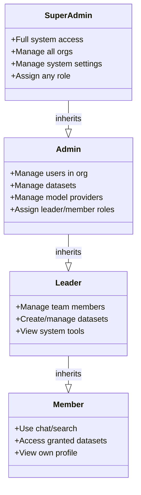
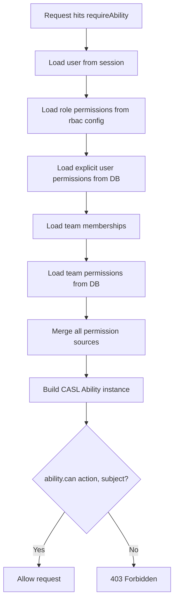
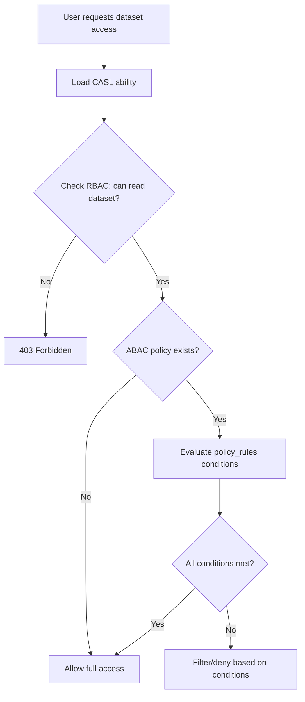
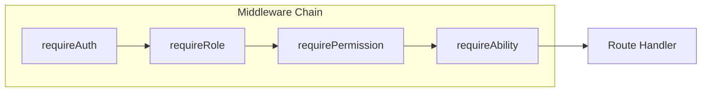

# Auth: RBAC & ABAC Permission Model

## Overview

B-Knowledge uses a layered permission system combining Role-Based Access Control (RBAC) for coarse-grained access and Attribute-Based Access Control (ABAC) via CASL for fine-grained, conditional permissions.

## Role Hierarchy



| Role | Level | Can Assign | Scope |
|------|-------|-----------|-------|
| `super-admin` | 4 | Any role | All organizations |
| `admin` | 3 | leader, member | Own organization |
| `leader` | 2 | - | Own teams |
| `member` | 1 | - | Self only |

## RBAC Permissions

| Permission | super-admin | admin | leader | member |
|------------|:-----------:|:-----:|:------:|:------:|
| `manage_users` | Y | Y | - | - |
| `manage_datasets` | Y | Y | Y | - |
| `manage_model_providers` | Y | Y | - | - |
| `manage_system` | Y | - | - | - |
| `view_system_tools` | Y | Y | Y | - |
| `use_chat` | Y | Y | Y | Y |
| `use_search` | Y | Y | Y | Y |

## CASL Ability Resolution



### Permission Source Priority

Sources are merged in order. Later sources can override earlier ones:

1. **Role permissions** - Base permissions from role hierarchy
2. **User permissions** - Explicit grants/denials per user
3. **Team permissions** - Inherited from team memberships
4. **ABAC policies** - Conditional rules with field-level conditions

## ABAC: Dataset-Level Policies

ABAC policies allow field-level conditions on resources. Used primarily for dataset access control.



### Policy Rule Structure

```
policy_rules: [
  {
    action: "read",
    subject: "Dataset",
    conditions: {
      "department": { "$eq": "engineering" },
      "classification": { "$in": ["public", "internal"] }
    }
  }
]
```

| Field | Description |
|-------|-------------|
| `action` | CRUD action: create, read, update, delete |
| `subject` | Resource type: Dataset, Document, Project |
| `conditions` | Field-value conditions using MongoDB-style operators |

### Supported Condition Operators

| Operator | Description | Example |
|----------|-------------|---------|
| `$eq` | Equals | `{"status": {"$eq": "active"}}` |
| `$ne` | Not equals | `{"role": {"$ne": "guest"}}` |
| `$in` | In array | `{"dept": {"$in": ["eng", "ops"]}}` |
| `$gt` / `$lt` | Greater/less than | `{"level": {"$gt": 2}}` |

## Permission Checking Order



| Step | Middleware | Checks | Failure |
|------|-----------|--------|---------|
| 1 | `requireAuth` | Valid session in Valkey | 401 |
| 2 | `requireRole('admin')` | User role >= specified level | 403 |
| 3 | `requirePermission('manage_users')` | Role has named permission | 403 |
| 4 | `requireAbility('update', 'User')` | CASL ability allows action on subject | 403 |

Not all routes use every middleware. Simple authenticated routes may only use `requireAuth`. Admin routes add `requireRole`. Resource-specific routes add `requireAbility`.

## Project Entity Permissions

Beyond datasets, ABAC also governs project-level entities:

| Entity | Actions | Conditions |
|--------|---------|------------|
| Dataset | read, update, delete, manage | owner, department, tags |
| Document | read, upload, delete | dataset membership, classification |
| Conversation | read, delete | owner, project membership |
| Model Provider | read, configure | organization, tier |

## Key Files

| File | Purpose |
|------|---------|
| `be/src/shared/config/rbac.js` | Role hierarchy, permission definitions |
| `be/src/shared/middleware/auth.middleware.ts` | All auth middleware functions |
| `be/src/modules/auth/auth.service.ts` | CASL ability builder |
| `be/src/modules/auth/index.ts` | Module barrel export |
