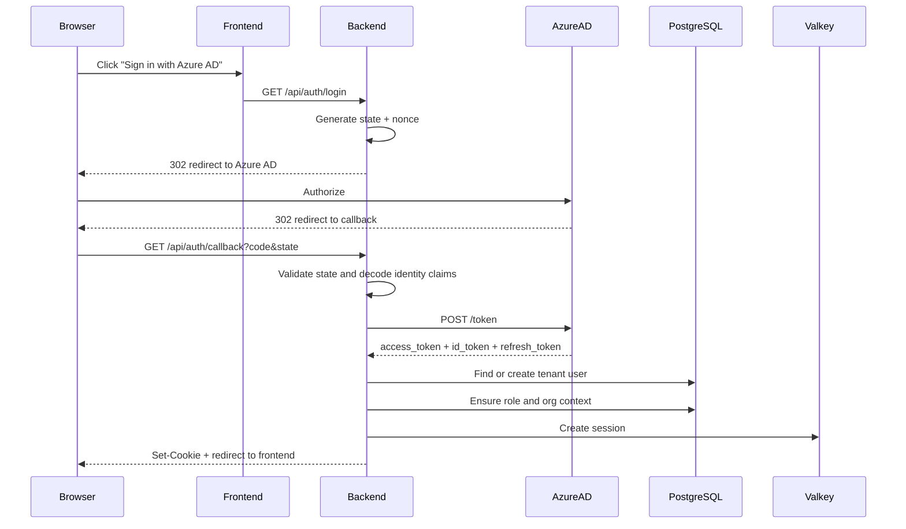
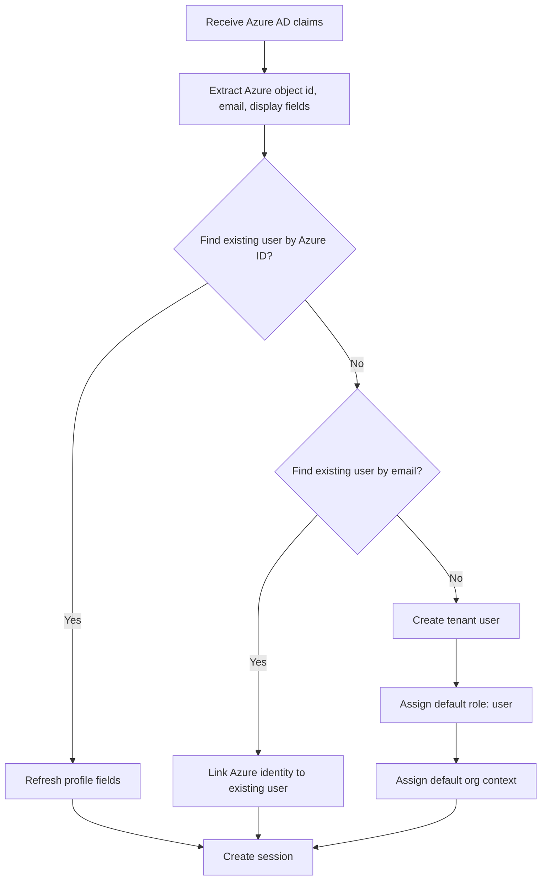
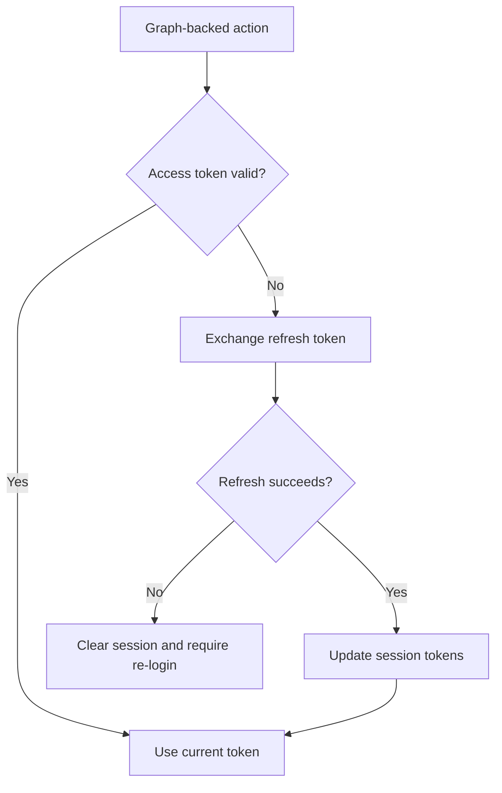

# Auth: Azure AD OAuth2 Flow

> Azure AD sign-in flow and its handoff into the current permission-era role model.

## 1. Overview

Azure AD authentication uses the OAuth2 Authorization Code flow. The backend acts as the confidential client, exchanges the authorization code for tokens, upserts the tenant user record, assigns the live default role when needed, and creates the application session used by the permission system.

This page focuses on sign-in and user provisioning. For permission resolution after login, see [RBAC & ABAC Permission Model](/detail-design/auth/rbac-abac) and `/detail-design/auth/permission-maintenance-guide`.

## 2. Sequence Diagram

## 3. User Provisioning Rules

The current role vocabulary is:

| Role | Meaning |
|------|---------|
| `super-admin` | Platform operator |
| `admin` | Tenant admin |
| `leader` | Tenant operator |
| `user` | Baseline tenant user |

Azure AD provisioning should be documented against this set only. New tenant users should not be described as landing on older legacy role names.

## 4. Token Handling

| Token | Storage | Purpose |
|-------|---------|---------|
| `access_token` | Session-backed server storage | Microsoft Graph or downstream Azure calls |
| `id_token` | Decoded during callback | Identity claims for user upsert |
| `refresh_token` | Session-backed server storage | Access-token renewal |

## 5. Post-Login Authorization Handoff

After Azure AD login succeeds, authorization is driven by the same runtime permission stack as any other authenticated session:

1. Session resolves the active tenant organization.
2. `buildAbilityFor()` builds the user ability from `role_permissions`, `user_permission_overrides`, and `resource_grants`.
3. Backend routes enforce `requirePermission` or `requireAbility`.
4. Frontend gates hydrate through `AbilityProvider`, `PermissionCatalogProvider`, `useHasPermission`, and `<Can>`.

That means Azure AD is only the identity entry point. It is not a separate authorization model.

## 6. Error Handling

| Error scenario | Result |
|----------------|--------|
| Invalid OAuth `state` | Reject callback and restart login |
| Token exchange failure | Reject callback and surface login error |
| User disabled or tenant access missing | Deny session creation |
| Refresh token failure | Clear session and force fresh login |

## 7. Key Files

| File | Purpose |
|------|---------|
| `be/src/modules/auth/auth.controller.ts` | `/login`, `/callback`, `/logout`, and related auth endpoints |
| `be/src/modules/auth/auth.service.ts` | Azure token exchange, user upsert, and session creation |
| `be/src/shared/config/rbac.ts` | Current live role constants including default role `user` |
| `be/src/shared/services/ability.service.ts` | Runtime authorization handoff after sign-in |

## 8. Related Docs

- [Auth System Overview](/detail-design/auth/overview)
- [RBAC & ABAC Permission Model](/detail-design/auth/rbac-abac)
- `/detail-design/auth/permission-maintenance-guide` for operational maintenance steps
