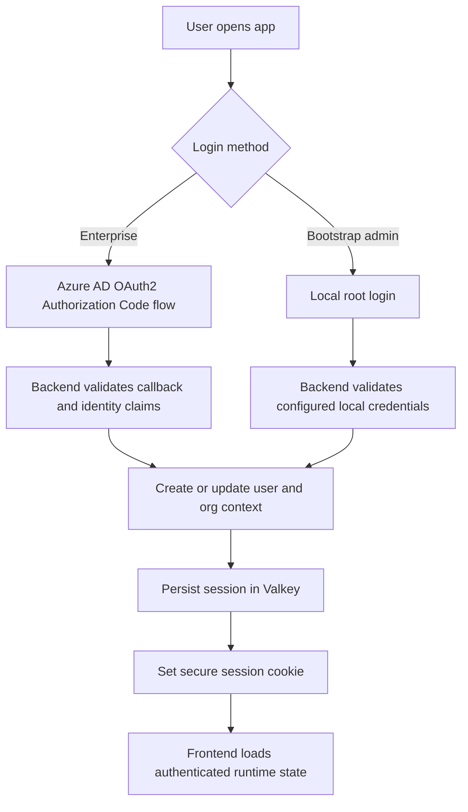
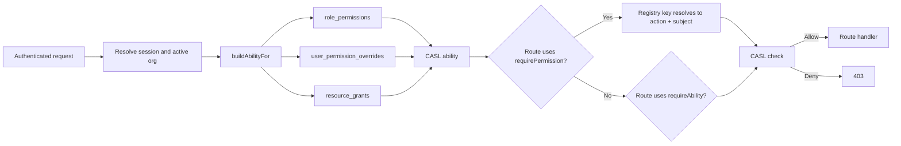

# Auth System Overview

> Entry point for the current authentication and authorization stack in B-Knowledge.

## 1. Overview

B-Knowledge authenticates users through Azure AD SSO or the local root-login bootstrap path, then authorizes requests through the permission-system overhaul delivered in this milestone. The live authorization path is no longer a static role map first; it is a registry-backed, database-synced, CASL-driven system that feeds both backend middleware and frontend gates.

This page is the high-level map. For the permission architecture, read [RBAC & ABAC Permission Model](/detail-design/auth/rbac-abac). For the fuller contract reference, read [RBAC & ABAC: Comprehensive Authorization Reference](/detail-design/auth/rbac-abac-comprehensive). For operational maintenance, use the `permission-maintenance-guide` path at `/detail-design/auth/permission-maintenance-guide` once that guide is published in this phase.

## 2. Authentication Flow

## 3. Authorization Resolution Chain

The canonical backend path is:

1. `definePermissions()` registers permission keys in code.
2. Boot sync reconciles the registry with the `permissions` catalog table.
3. `buildAbilityFor()` composes role defaults, active overrides, and row-scoped grants.
4. Route middleware enforces either `requirePermission('<feature>.<action>')` or `requireAbility(action, subject, idParam?)`.
5. The frontend consumes the same model through `PermissionCatalogProvider`, `useHasPermission`, `AbilityProvider`, and `<Can>`.

## 4. Current Role Model

The active tenant role set is:

| Role | Purpose |
|------|---------|
| `super-admin` | Platform-wide operator with unrestricted access |
| `admin` | Tenant administrator |
| `leader` | Tenant operator with broader management access than standard users |
| `user` | Baseline authenticated tenant user |

The default role for newly provisioned tenant users is `user`. Historical aliases and older role labels are not the maintained model.

## 5. Canonical Files

| File | Why it matters |
|------|----------------|
| `be/src/shared/permissions/registry.ts` | Canonical in-code permission registry |
| `be/src/shared/permissions/sync.ts` | Boot-time registry-to-catalog reconciliation |
| `be/src/shared/services/ability.service.ts` | CASL ability construction and OpenSearch access filters |
| `be/src/shared/middleware/auth.middleware.ts` | `requireAuth`, `requirePermission`, `requireAbility`, and compatibility gates |
| `be/src/shared/config/rbac.ts` | Compatibility shim and role hierarchy, not the primary extension surface |
| `be/src/modules/permissions/routes/permissions.routes.ts` | `/api/permissions/*` admin and catalog API |
| `fe/src/lib/permissions.tsx` | Runtime catalog provider and `useHasPermission` |
| `fe/src/lib/ability.tsx` | Frontend CASL provider and `<Can>` |

## 6. Related Docs

- [Auth: Azure AD OAuth2 Flow](/detail-design/auth/azure-ad-flow)
- [RBAC & ABAC Permission Model](/detail-design/auth/rbac-abac)
- [RBAC & ABAC: Comprehensive Authorization Reference](/detail-design/auth/rbac-abac-comprehensive)
- `/detail-design/auth/permission-maintenance-guide` for the operational “add or maintain a permission” workflow
