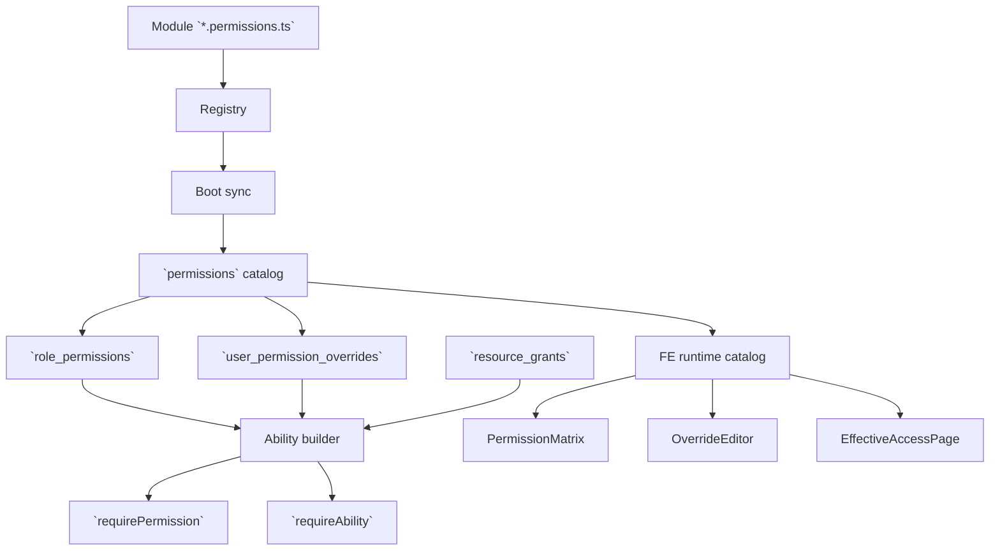

# Permission Matrix System

> End-to-end maintainer guide for the current permission matrix, override, grant, and effective-access workflow.

## 1. Overview

This page is the practical onboarding document for new team members who need to maintain the permission matrix system.

The current implementation is a **registry-backed permission system** with four main layers:

1. backend permission registration
2. database catalog and assignment tables
3. backend authorization and admin APIs
4. frontend admin tools for matrix, overrides, grants, and effective-access inspection

If you are new to the codebase, read this page before changing anything in `permissions`, `users`, `teams`, `knowledge-base`, or auth middleware.

## 2. What "Permission Matrix" Means in This Codebase

In B-Knowledge, the permission matrix is not a single database table and not a single frontend screen.

It is the combination of:

- the `permissions` catalog, which defines every available permission row
- the `role_permissions` table, which stores the baseline role-by-role matrix
- the `PermissionMatrix` UI, which lets admins replace a role's full permission set
- `user_permission_overrides`, which stores user-specific allow/deny exceptions
- `resource_grants`, which stores row-scoped sharing for KB/category resources
- `who-can-do`, which lets admins inspect the resulting effective access

That split is important. New maintainers often expect one place to edit permissions. In practice, you choose the right layer depending on the business problem.

## 3. Mental Model for New Maintainers

Use this decision tree:

| Need | Correct tool |
|------|--------------|
| Add a brand-new capability to the product | Add a backend registry permission |
| Change default access for a role like `leader` | Update the role matrix (`role_permissions`) |
| Give one specific user extra or reduced access | Create an override |
| Share one KB/category with a user or team | Create a resource grant |
| Understand why a user can or cannot do something | Use effective-access inspection |

## 4. Runtime Architecture

## 5. Database Objects and Their Responsibilities

### 5.1 `permissions`

Purpose:

- defines every valid permission row in the system
- groups rows by `feature`
- maps each key to canonical `(action, subject)` values

New member rule:

- never manually invent frontend-only permission rows
- if the key is not in the registry and catalog, it is not part of the real permission system

### 5.2 `role_permissions`

Purpose:

- stores the baseline role matrix
- answers "what should `admin` get by default in this tenant?"

Important behavior:

- the frontend saves this table as a **full replacement per role**
- the backend route is `PUT /api/permissions/roles/:role`
- `tenant_id = NULL` means global default; non-null rows are tenant overlays

### 5.3 `user_permission_overrides`

Purpose:

- lets admins add one-user exceptions without inventing extra roles

Important behavior:

- `allow` grants extra access
- `deny` removes access even if the role default would otherwise allow it
- deny wins because the ability builder emits deny rules last

### 5.4 `resource_grants`

Purpose:

- supports row-scoped access such as sharing a knowledge base or a document category

Important behavior:

- `actions[]` is the active source of truth
- grants can target a `user` or a `team`
- the ability builder reads these rows and emits instance-scoped CASL rules

## 6. Backend Surfaces

### 6.1 Registry and boot sync

Primary files:

- `be/src/shared/permissions/registry.ts`
- `be/src/shared/permissions/index.ts`
- `be/src/shared/permissions/sync.ts`
- feature-local files such as `be/src/modules/users/users.permissions.ts`

Responsibility:

- define canonical keys like `users.view`
- define canonical CASL action/subject pairs
- sync those definitions into the `permissions` catalog at boot

### 6.2 Ability construction

Primary file:

- `be/src/shared/services/ability.service.ts`

Effective rule order:

1. super-admin shortcut
2. role defaults from `role_permissions`
3. resource grants from `resource_grants`
4. KB to category read cascade
5. allow overrides
6. ABAC compatibility overlay
7. deny overrides last

This order is the core reason the system behaves predictably when multiple layers overlap.

### 6.3 Admin API routes

Primary file:

- `be/src/modules/permissions/routes/permissions.routes.ts`

Current admin endpoints:

| Endpoint | Purpose |
|---------|---------|
| `GET /api/permissions/catalog` | Return current registry-backed catalog |
| `GET /api/permissions/roles/:role` | Load current matrix column for one role |
| `PUT /api/permissions/roles/:role` | Replace one role's permission set |
| `GET /api/permissions/users/:userId/overrides` | Load per-user exceptions |
| `POST /api/permissions/users/:userId/overrides` | Add one allow/deny override |
| `DELETE /api/permissions/overrides/:id` | Remove an override row |
| `GET /api/permissions/grants` | List resource grants |
| `POST /api/permissions/grants` | Create a resource grant |
| `DELETE /api/permissions/grants/:id` | Remove a grant |
| `GET /api/permissions/who-can-do` | Inspect effective access for one `(action, subject)` pair |

Access control:

- reads require `permissions.view`
- mutations require `permissions.manage`

## 7. Frontend Admin Surfaces

### 7.1 `PermissionMatrix`

Primary file:

- `fe/src/features/permissions/components/PermissionMatrix.tsx`

What it does:

- renders permission rows from the generated/runtime catalog
- renders role columns for `super-admin`, `admin`, `leader`, `user`
- tracks dirty edits in memory
- saves one `PUT /api/permissions/roles/:role` request per dirty role

What to remember:

- this screen edits **role defaults only**
- it does not show user-specific exceptions
- it is grouped by permission feature prefix

### 7.2 `OverrideEditor`

Primary file:

- `fe/src/features/permissions/components/OverrideEditor.tsx`

What it does:

- shows allow and deny lists for one user
- adds new rows through `PermissionKeyPicker`
- removes rows individually
- shows merged effective permissions to help verify the result

What to remember:

- use this when the request is "only for this user"
- do not change the global role matrix for a one-user business exception

### 7.3 `ResourceGrantEditor`

Primary role:

- maintain KB/category sharing entries that later influence effective access

What to remember:

- this is not a universal editor for every catalog key
- it is focused on the current resource-sharing workflow

### 7.4 `EffectiveAccessPage`

Primary file:

- `fe/src/features/permissions/pages/EffectiveAccessPage.tsx`

What it does:

- lets admins select one permission key
- resolves the canonical `(action, subject)` from the catalog snapshot
- calls `who-can-do`
- shows the users who currently have that access
- deep-links into the user detail permission tab

What to remember:

- this is the fastest way to debug "who can do X?"
- it is query-driven, not a full matrix of every user against every key

## 8. Typical Maintenance Workflows

### 8.1 Add a new permission

1. Add the permission to the owning backend module `*.permissions.ts`.
2. Make sure it is imported into the registry barrel.
3. Confirm boot sync exposes it through the catalog.
4. Regenerate FE permission keys if the committed snapshot changes.
5. Gate backend routes with `requirePermission` or `requireAbility`.
6. Gate frontend UI with `useHasPermission` or `<Can>`.
7. Confirm it appears in matrix, override picker, and effective-access views where appropriate.

### 8.2 Change default access for a role

1. Open the permission matrix.
2. Update the role column.
3. Save the role.
4. Confirm backend invalidates cached abilities.
5. Verify with effective-access inspection for one expected user.

### 8.3 Handle a one-off business exception

1. Open the target user detail page.
2. Go to the permissions tab.
3. Add an allow or deny override.
4. Verify through the effective permissions panel or effective-access page.

### 8.4 Share one resource

1. Open the KB/category sharing flow.
2. Create a resource grant.
3. Verify the target user or team now appears in effective-access or can load the resource.

## 9. Common Failure Modes

| Failure | What it usually means |
|--------|------------------------|
| New key does not appear in matrix | Registry file not imported or catalog snapshot not refreshed |
| Backend route still denies after matrix save | Wrong middleware type, stale ability cache, or row-scoped check requires a grant |
| User can still access after a deny override | Session cache not refreshed yet or the route is using a legacy compatibility path |
| Maintainer edits `rbac.ts` only | Wrong layer; that file is compatibility scaffolding, not the primary authoring surface |
| Maintainer adds a one-user role variant | Usually the wrong solution; use overrides instead |

## 10. New Member Checklist

For a new contributor taking ownership of the permission system:

1. Read [Database Design: Core Tables](/basic-design/database/database-design-core).
2. Read [Security Architecture](/basic-design/system-infra/security-architecture).
3. Read [User Management Overview](/detail-design/user-team/user-management-overview).
4. Read [Permission Maintenance Guide](/detail-design/auth/permission-maintenance-guide).
5. Inspect these source files:
   `be/src/shared/services/ability.service.ts`
   `be/src/modules/permissions/routes/permissions.routes.ts`
   `fe/src/features/permissions/components/PermissionMatrix.tsx`
   `fe/src/features/permissions/components/OverrideEditor.tsx`
   `fe/src/features/permissions/pages/EffectiveAccessPage.tsx`

## 11. Related Docs

- [Auth System Overview](/detail-design/auth/overview)
- [Permission Maintenance Guide](/detail-design/auth/permission-maintenance-guide)
- [SRS: User & Team Management](/srs/core-platform/fr-user-team-management)
- [Database Design: Core Tables](/basic-design/database/database-design-core)
