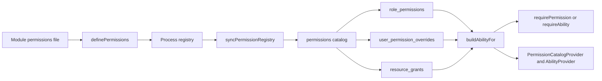

# Auth: RBAC & ABAC Permission Model

> Concise current-state summary of the registry-backed permission system.

## 1. Overview

B-Knowledge now uses a registry-backed authorization model that combines role defaults, per-user overrides, row-scoped resource grants, and CASL ability checks. The primary extension path is no longer a hardcoded role map. New permissions enter the system through the backend permission registry and then propagate through sync, middleware, frontend catalog hydration, and admin tooling.

Use this page for the mental model. Use [RBAC & ABAC: Comprehensive Authorization Reference](/detail-design/auth/rbac-abac-comprehensive) for the full contracts, [Permission Matrix System](/detail-design/auth/permission-matrix-system) for maintainer onboarding, and [Permission Maintenance Guide](/detail-design/auth/permission-maintenance-guide) for the operational workflow.

## 2. Canonical Permission Flow

## 3. Backend Components

| Component | Current role |
|-----------|--------------|
| `be/src/shared/permissions/registry.ts` | Declares permission keys and their `action` / `subject` mapping |
| `be/src/shared/permissions/sync.ts` | Reconciles the in-code registry into the `permissions` table at boot |
| `role_permissions` | Stores role-default grants |
| `user_permission_overrides` | Stores per-user allow and deny exceptions |
| `resource_grants` | Stores row-scoped grants such as Knowledge Base and DocumentCategory access |
| `be/src/shared/services/ability.service.ts` | Builds CASL abilities from the catalog-backed data model |
| `be/src/shared/middleware/auth.middleware.ts` | Enforces flat key checks with `requirePermission` and row checks with `requireAbility` |

## 4. Middleware Contract

- `requirePermission('<feature>.<action>')`
  Uses the registry key, resolves it to `(action, subject)`, and asks CASL whether the current user can perform that class-level action.
- `requireAbility(action, subject, idParam?)`
  Uses CASL directly for subject checks that can be row-scoped through `{ tenant_id, id }`.

The live ability builder order is:

1. super-admin shortcut
2. `role_permissions`
3. `resource_grants`
4. Knowledge Base to `DocumentCategory` read cascade
5. allow rows from `user_permission_overrides`
6. ABAC policy overlays where they still exist
7. deny rows from `user_permission_overrides` last so deny wins

## 5. Frontend Consumption

| Surface | Purpose |
|---------|---------|
| `fe/src/lib/permissions.tsx` | `PermissionCatalogProvider` and `useHasPermission` for registry-key checks |
| `fe/src/lib/ability.tsx` | `AbilityProvider`, `useAppAbility`, and `<Can>` for CASL checks |
| `fe/src/features/permissions/components/PermissionMatrix.tsx` | Role x permission admin matrix |
| `fe/src/features/permissions/components/OverrideEditor.tsx` | Per-user override management |
| `fe/src/features/permissions/components/ResourceGrantEditor.tsx` | Resource-grant management UI |

Decision rule:

- Use `useHasPermission` when the UI is keyed to a named registry permission.
- Use `<Can>` or `useAppAbility()` when the UI needs subject-level or row-aware checks.

## 6. Compatibility Note

`be/src/shared/config/rbac.ts` still exists because some compatibility surfaces and legacy gates remain. It preserves role hierarchy helpers and a cached role-permission shim, but it is not the source of truth for adding or maintaining permissions.

## 7. Related Docs

- [Auth System Overview](/detail-design/auth/overview)
- [Permission Matrix System](/detail-design/auth/permission-matrix-system)
- [RBAC & ABAC: Comprehensive Authorization Reference](/detail-design/auth/rbac-abac-comprehensive)
- [Permission Maintenance Guide](/detail-design/auth/permission-maintenance-guide)
