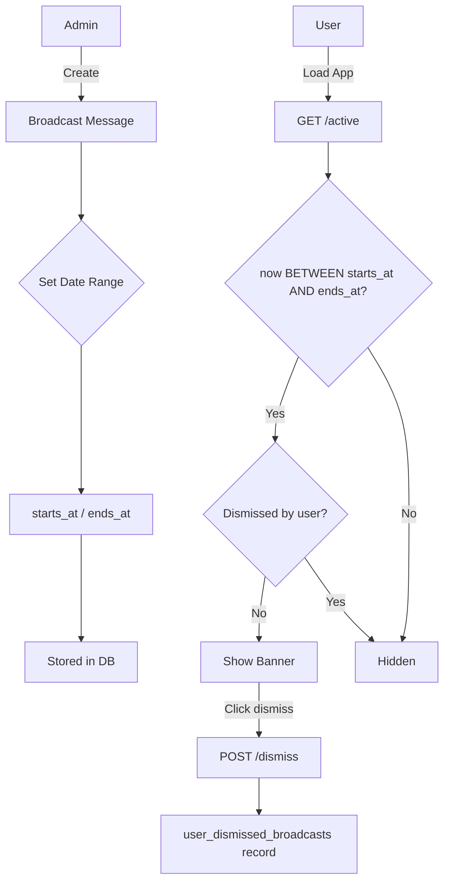
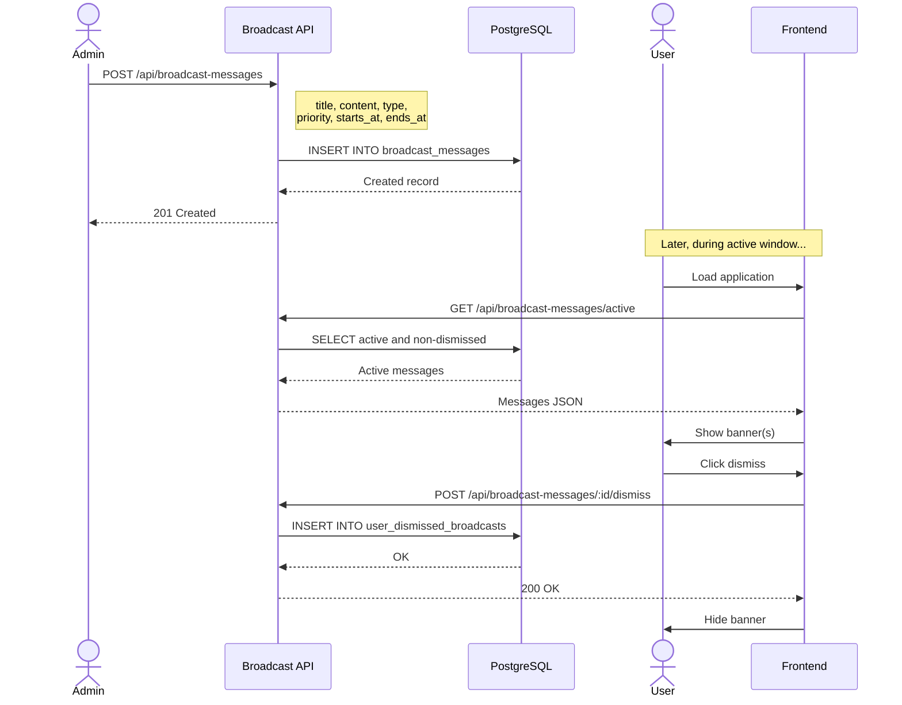

# Broadcast Messages Detail Design

## Overview

The Broadcast module allows administrators to create time-bound messages displayed to all users. Messages appear during a configured active window and can be individually dismissed by each user.

## Architecture



## Data Model

### broadcast_messages

| Field | Type | Description |
|-------|------|-------------|
| id | UUID | Primary key |
| title | string | Message title |
| content | text | Message body (supports markdown) |
| type | enum | `info`, `warning`, `error` |
| priority | enum | `low`, `medium`, `high` |
| starts_at | timestamp | Start of active window |
| ends_at | timestamp | End of active window |
| created_by | UUID | Admin who created |
| tenant_id | UUID | Owning tenant |
| created_at | timestamp | Creation time |
| updated_at | timestamp | Last update |

### user_dismissed_broadcasts

| Field | Type | Description |
|-------|------|-------------|
| id | UUID | Primary key |
| user_id | UUID | User who dismissed |
| broadcast_id | UUID | Dismissed message |
| dismissed_at | timestamp | When dismissed |

## API Endpoints

### Management (requires `manage_system` permission)

| Method | Path | Description |
|--------|------|-------------|
| POST | `/api/broadcast-messages` | Create broadcast |
| GET | `/api/broadcast-messages` | List all broadcasts (paginated) |
| GET | `/api/broadcast-messages/:id` | Get single broadcast |
| PUT | `/api/broadcast-messages/:id` | Update broadcast |
| DELETE | `/api/broadcast-messages/:id` | Delete broadcast |

### User-Facing

| Method | Path | Description |
|--------|------|-------------|
| GET | `/api/broadcast-messages/active` | Get active, non-dismissed broadcasts |
| POST | `/api/broadcast-messages/:id/dismiss` | Dismiss a broadcast |

## Active Broadcasts Query

`GET /api/broadcast-messages/active` returns messages matching:

```sql
SELECT bm.*
FROM broadcast_messages bm
WHERE bm.starts_at <= NOW()
  AND bm.ends_at >= NOW()
  AND bm.tenant_id = :tenantId
  AND bm.id NOT IN (
    SELECT broadcast_id
    FROM user_dismissed_broadcasts
    WHERE user_id = :userId
  )
ORDER BY bm.priority DESC, bm.starts_at DESC
```

Messages are sorted by priority (high first) then by start date.

## Lifecycle Sequence



## Message Types and Display

| Type | Color | Use Case |
|------|-------|----------|
| `info` | Blue | General announcements, new features |
| `warning` | Yellow/Orange | Upcoming maintenance, deprecations |
| `error` | Red | Outages, critical issues |

## Priority Behavior

| Priority | Behavior |
|----------|----------|
| `high` | Displayed at top, cannot be auto-collapsed |
| `medium` | Displayed prominently, can collapse |
| `low` | Shown in secondary position |

## Key Files

| File | Purpose |
|------|---------|
| `be/src/modules/broadcast/` | Module root |
| `be/src/modules/broadcast/broadcast.controller.ts` | Route handlers |
| `be/src/modules/broadcast/broadcast.service.ts` | Business logic |
| `be/src/modules/broadcast/broadcast.model.ts` | Knex model |
| `fe/src/features/broadcast/` | Frontend feature |
