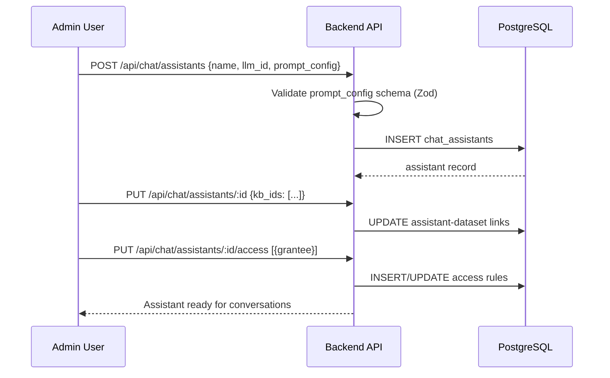
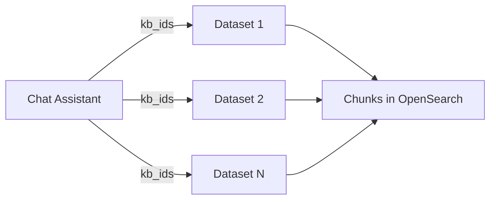
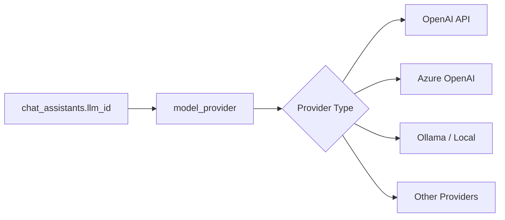
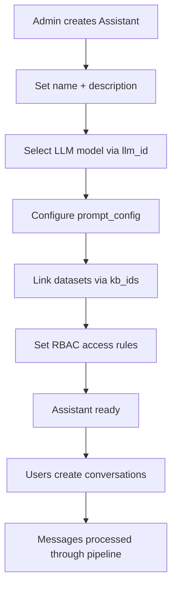

# Chat Assistant Configuration — Detail Design

## Overview

Chat assistants are the central configuration unit for conversations. Each assistant defines its LLM, prompt behavior, linked knowledge bases, and RBAC access rules. Admins create and configure assistants; users interact with them through conversations.

## Assistant Creation Flow



## Complete PromptConfig Reference

| Field | Type | Default | [OPT] | Description |
|-------|------|---------|-------|-------------|
| `system` | string | `""` | | System prompt prepended to all requests |
| `prologue` | string | `""` | | Welcome message for new conversations |
| `quote` | bool | `true` | | Include citation markers in responses |
| `empty_response` | string | `""` | | Reply when no relevant chunks are found |
| `refine_multiturn` | bool | `false` | OPT | Condense multi-turn history into a single refined query |
| `cross_languages` | string | `""` | OPT | Target languages for query expansion (comma-separated codes) |
| `keyword` | bool | `false` | OPT | Extract keywords from query for BM25 boost |
| `top_n` | number | `6` | | Maximum chunks included in LLM context |
| `similarity_threshold` | number | `0.2` | | Minimum hybrid score to include a chunk |
| `vector_similarity_weight` | number | `0.5` | | Vector vs BM25 balance (0=BM25 only, 1=vector only) |
| `allow_rbac_datasets` | bool | `false` | OPT | Expand retrieval to all datasets the user can access |
| `use_kg` | bool | `false` | OPT | Enable knowledge graph-augmented retrieval |
| `reasoning` | bool | `false` | OPT | Enable deep research with recursive decomposition |
| `tavily_api_key` | string | `""` | OPT | Tavily key to enable web search augmentation |
| `rerank_id` | string | `""` | OPT | Model ID for dedicated reranker (empty = no reranking) |
| `toc_enhance` | bool | `false` | OPT | Inject table-of-contents context into retrieval |
| `temperature` | number | `0.7` | | LLM sampling temperature |
| `top_p` | number | — | | Nucleus sampling probability |
| `max_tokens` | number | — | | Maximum response token count |
| `tts` | bool | `false` | OPT | Enable text-to-speech for responses |
| `language` | string | `""` | | Instruction language for response generation |
| `field_map` | object | — | OPT | SQL retrieval field mapping for structured data KBs |

## Assistant-Dataset Linking



The `kb_ids` array on the assistant references one or more datasets. During retrieval (Step 7), the pipeline searches all linked datasets using hybrid search.

**Endpoint:** `PUT /api/chat/assistants/:id`
```json
{
  "kb_ids": ["dataset-uuid-1", "dataset-uuid-2"]
}
```

## RBAC Access Control

**Endpoint:** `PUT /api/chat/assistants/:id/access`

```json
[
  { "grantee_type": "user", "grantee_id": "user-uuid-1", "permission": "use" },
  { "grantee_type": "team", "grantee_id": "team-uuid-1", "permission": "use" },
  { "grantee_type": "user", "grantee_id": "user-uuid-2", "permission": "manage" }
]
```

| Grantee Type | Description |
|-------------|-------------|
| `user` | Individual user access |
| `team` | All members of the specified team |

| Permission | Capabilities |
|-----------|-------------|
| `use` | Create conversations, send messages |
| `manage` | Use + edit config, link datasets, manage access |

## LLM Selection

The `llm_id` field references the `model_provider` table, which stores configured LLM connections.



Admins configure model providers at the tenant level. Each assistant selects one model for chat completion and optionally a separate model for reranking (`rerank_id`).

## Full Configuration Diagram



## Key Files

| File | Purpose |
|------|---------|
| `be/src/modules/chat/controllers/assistant.controller.ts` | Assistant CRUD endpoints |
| `be/src/modules/chat/services/assistant.service.ts` | Business logic |
| `be/src/modules/chat/validators/` | Zod schemas for prompt_config |
