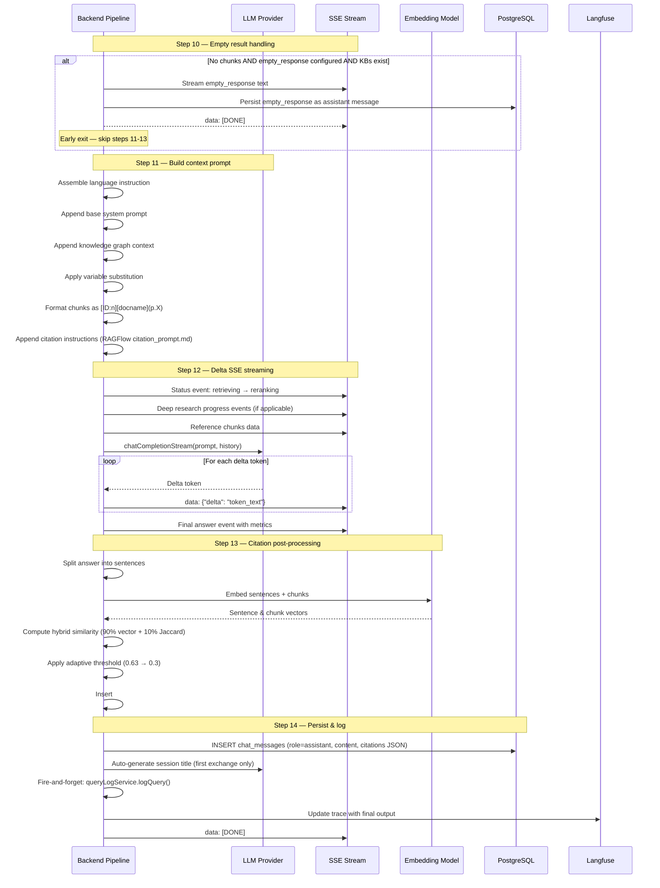
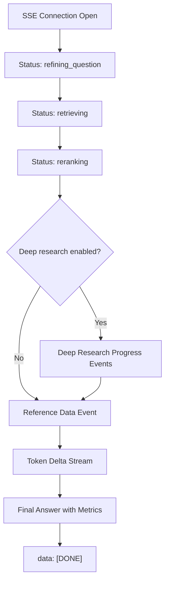
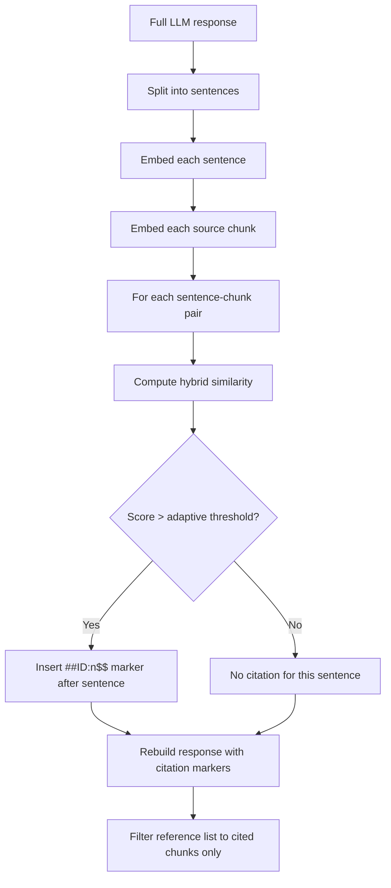
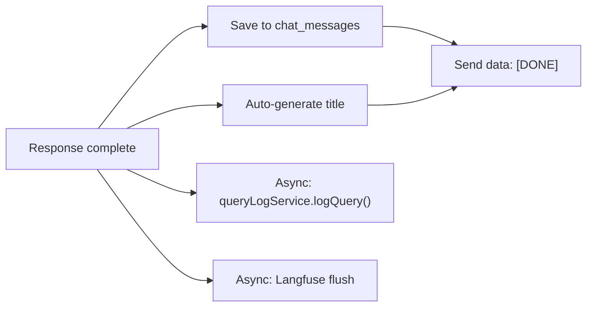

# Chat Completion — Response Generation & Streaming (Steps 10-14) — Detail Design

## Overview

After retrieval and reranking (covered in `chat-completion-retrieval.md`), the pipeline builds the final context prompt, streams LLM tokens via SSE, performs citation post-processing, persists the assistant message, and logs query analytics. This document covers steps 10 through 14 of the 14-step chat completion pipeline.

## Generation Pipeline



## Step 10 — Handle Empty Results

| Aspect | Detail |
|--------|--------|
| Trigger | No chunks found after retrieval + reranking |
| Conditions | `empty_response` is configured AND knowledge bases exist |
| Behavior | Stream `empty_response` text directly to client |
| Short-circuit | Skips steps 11-13, jumps to step 14 (persist) |
| Default | If `empty_response` is empty string, proceed with LLM (no context) |
| Langfuse span | `empty_result_handling` |

When no chunks survive retrieval and reranking, the pipeline checks whether the assistant has an `empty_response` message configured. If so, that message is streamed verbatim to the client and persisted as the assistant reply. This avoids an LLM call that would produce a hallucinated answer with no grounding.

## Step 11 — Build Context Prompt

The final prompt is assembled from multiple components in strict order:

| Order | Component | Source | Example |
|-------|-----------|--------|---------|
| 1 | Language instruction | `prompt_config.language` | "Please respond in Japanese." |
| 2 | Base system prompt | `prompt_config.system` | "You are a helpful assistant..." |
| 3 | Knowledge graph context | Step 8a output | "Related entities: Project Alpha ..." |
| 4 | Retrieved knowledge | Steps 7-9 output | Formatted chunks (see below) |
| 5 | Citation instructions | RAGFlow `citation_prompt.md` | "Cite sources using ##ID:n$$ markers" |

### Variable Substitution

Runtime variables are replaced in the system prompt before assembly:

| Variable | Value |
|----------|-------|
| `{date}` | Current date |
| `{user_name}` | Authenticated user's display name |
| `{language}` | Configured response language |

### Chunk Formatting

Each chunk is formatted with a reference ID for citation tracking:

```
[ID:0] [Annual Report 2025] (p.12)
Revenue increased by 15% in Q3...

[ID:1] [Product Guide] (p.5)
The configuration requires setting...
```

Format: `[ID:n] [document_name] (p.X)\nContent` — where `n` is the chunk index and `X` is the source page number when available.

### Final Prompt Structure

```
[Language instruction]
[System prompt with variables substituted]
[Knowledge graph context]
---
Retrieved Knowledge:
[ID:0] [docname] (p.X)
chunk content...

[ID:1] [docname] (p.Y)
chunk content...
---
[Citation instructions from RAGFlow citation_prompt.md]
```

## Step 12 — Delta SSE Streaming

| Aspect | Detail |
|--------|--------|
| Protocol | Server-Sent Events (SSE) |
| Content-Type | `text/event-stream` |
| Token format | Delta tokens only (NOT accumulated) |
| LLM call | `llmClientService.chatCompletionStream()` |
| Langfuse span | `llm_streaming` |

### SSE Event Flow



### Event Catalog

| Event Type | Format | When |
|------------|--------|------|
| Status update | `data: {"status": "retrieving"}\n\n` | Pipeline phase changes |
| Reference data | `data: {"reference": [{chunk}...]}\n\n` | Before token streaming begins |
| Token delta | `data: {"delta": "token_text"}\n\n` | Each token from LLM |
| Final answer | `data: {"answer": "...", "metrics": {...}}\n\n` | After all tokens sent |
| Done | `data: [DONE]\n\n` | Stream complete |
| Error | `data: {"error": "message"}\n\n` | On failure |

### Status Events

Status events inform the frontend of which pipeline phase is executing:

| Status Value | Phase |
|--------------|-------|
| `refining_question` | Multi-turn query refinement (Step 4) |
| `retrieving` | Hybrid retrieval from knowledge bases (Step 7) |
| `reranking` | Chunk reranking (Step 9) |
| `deep_research` | Deep research mode active (Step 8b) |

### Deep Research Sub-Events

When deep research is active, additional progress events are emitted:

| Sub-Event | Payload | Description |
|-----------|---------|-------------|
| `subquery_start` | `{ query: string }` | New sub-query being researched |
| `subquery_result` | `{ query: string, count: number }` | Sub-query retrieval complete |
| `budget_warning` | `{ remaining_tokens: number }` | Token budget below 20% |
| `budget_exhausted` | `{}` | Budget fully consumed, research stops |
| `sufficiency_check` | `{ sufficient: boolean }` | Context sufficiency evaluation result |

### Token Streaming

Delta tokens are sent individually as they arrive from the LLM. The client accumulates them into the full response. Each delta event contains only the new token text, not the accumulated response.

## Step 13 — Citation Post-Processing

After the full response is generated, citations are inserted to link answer segments back to source chunks. Two processing paths exist.

### Primary Method: Embedding-Based



#### Hybrid Similarity Formula

```
hybridScore = 0.9 * cosineSimilarity(sentenceVec, chunkVec)
            + 0.1 * jaccardSimilarity(sentenceTokens, chunkTokens)
```

| Parameter | Value | Description |
|-----------|-------|-------------|
| Vector weight | 90% | Embedding cosine similarity |
| Keyword weight | 10% | Jaccard similarity on tokenized text |
| Initial threshold | 0.63 | Starting similarity threshold |
| Decay rate | 20% per iteration | Threshold reduction when too few citations |
| Min threshold | 0.3 | Adaptive floor — never goes below this |

#### Adaptive Threshold Logic

If the initial threshold (0.63) produces fewer citations than expected, the threshold is progressively reduced by 20% per iteration. This continues until either sufficient citations are found or the floor (0.3) is reached. This prevents over-aggressive filtering from producing uncited answers.

### Fallback Method: Regex-Based

When embedding-based citation fails or is disabled, a regex fallback extracts existing citation patterns from the LLM response:

1. Scan response for patterns: `##ID:n$$`, `[ID:n]`, `(ID:n)`
2. Normalize all matches to the canonical `##ID:n$$` format
3. Validate that referenced IDs map to actual chunks
4. Rebuild the reference list with only cited chunks

### Reference Rebuild

After citation insertion (either method), the reference list is filtered to include only chunks that were actually cited. This prevents sending unused references to the frontend.

## Step 14 — Persist & Log

| Action | Detail |
|--------|--------|
| Save message | INSERT into `chat_messages` with `session_id`, `role='assistant'`, `content` (with citation markers), `citations` JSON |
| Session title | If first user-assistant exchange, LLM generates a concise title from the Q+A pair |
| Query log | Fire-and-forget: `queryLogService.logQuery()` — async, never blocks the response |
| Langfuse trace | Update trace with final output, token counts, and span durations |
| SSE close | Send `data: [DONE]\n\n` and close connection |

### Persist Flow



Title generation only runs on the first user-assistant exchange in a session. The LLM receives the question and answer and produces a concise 5-10 word title.

### Performance Metrics

The following metrics are tracked per completion and included in the final SSE event and Langfuse trace:

| Metric | Unit | Description |
|--------|------|-------------|
| `refinement_ms` | ms | Time spent on query refinement (Step 4) |
| `retrieval_ms` | ms | Time spent on hybrid retrieval + web search (Steps 7-8) |
| `generation_ms` | ms | Time spent on LLM token generation (Step 12) |
| `chunks_retrieved` | count | Total chunks returned by retrieval |
| `chunks_cited` | count | Chunks that received citation markers |

## Key Files

| File | Purpose |
|------|---------|
| `be/src/modules/chat/services/chat-conversation.service.ts` | Pipeline orchestrator (steps 10-14) |
| `be/src/modules/rag/services/rag-citation.service.ts` | Citation post-processing (step 13) |
| `be/src/modules/rag/services/query-log.service.ts` | Query analytics logging (step 14) |
| `fe/src/features/chat/hooks/useChatStream.ts` | SSE consumer — parses delta events |
| `fe/src/features/chat/components/ChatMessage.tsx` | Renders streamed content with citations |
| `fe/src/features/chat/components/ChatReferencePanel.tsx` | Renders citation reference panel |
| `fe/src/features/chat/components/DeepResearchProgress.tsx` | Deep research progress UI |
