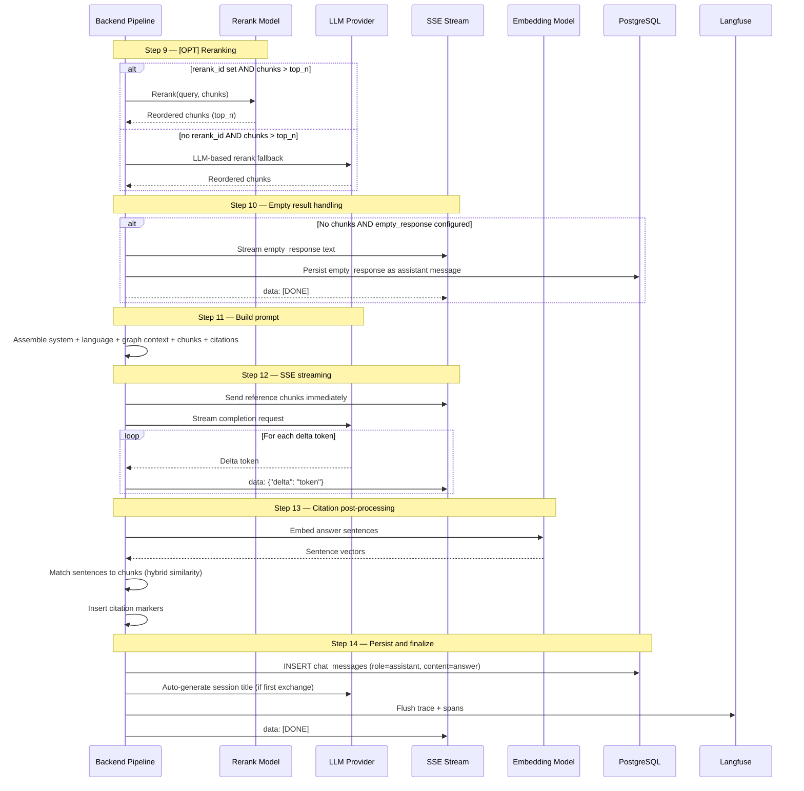
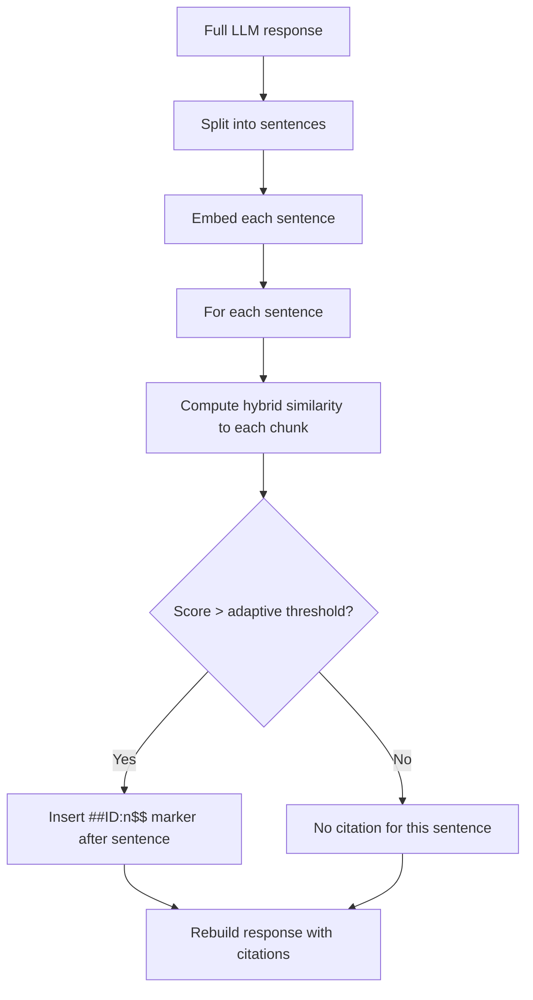
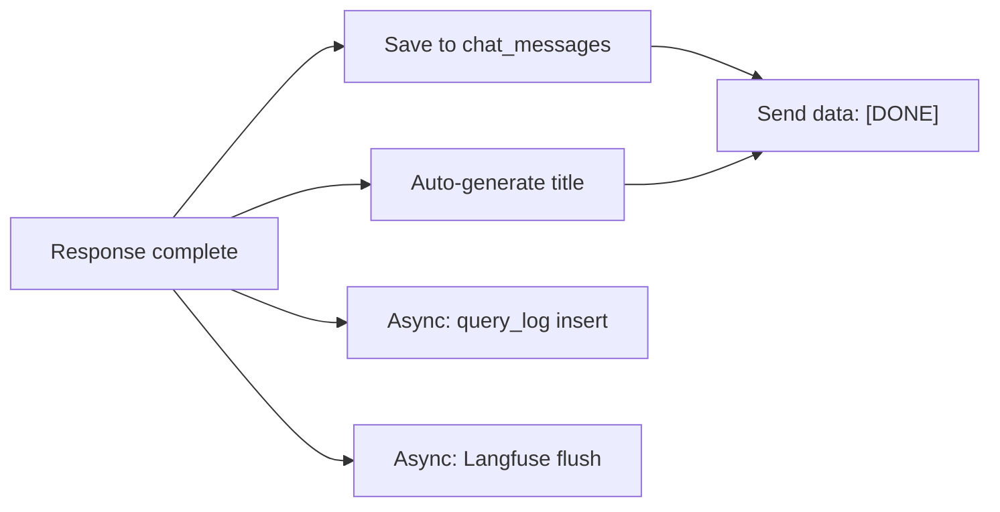

# Chat Completion Generation (Steps 9-14) — Detail Design

## Overview

Steps 9 through 14 take the retrieved chunks, optionally rerank them, build the final prompt, stream the LLM response, post-process citations, and persist the result. This is the output half of the chat pipeline.

## Generation Sequence



## Step 9 — [OPT] Reranking

| Aspect | Detail |
|--------|--------|
| Trigger | Chunk count exceeds `top_n` |
| Primary | Dedicated rerank model via `rerank_id` (e.g., Cohere, BGE-reranker) |
| Fallback | LLM-based reranking — ask LLM to score relevance of each chunk |
| Output | Top `top_n` chunks reordered by relevance score |
| Langfuse span | `reranking` |

When `rerank_id` is set, the dedicated model receives (query, chunk) pairs and returns relevance scores. Chunks are re-sorted by score and truncated to `top_n`.

When no `rerank_id` is set but chunks exceed `top_n`, an LLM-based fallback asks the chat model to rank chunks by relevance and select the top results.

## Step 10 — Empty Result Handling

| Aspect | Detail |
|--------|--------|
| Trigger | No chunks after retrieval + reranking |
| Behavior | If `empty_response` is configured, stream it directly |
| Short-circuit | Skips steps 11-13, goes directly to step 14 (persist) |
| Default | If `empty_response` is empty string, proceed with LLM (no context) |
| Langfuse span | `empty_result_handling` |

## Step 11 — Build Prompt

The final prompt is assembled from multiple components in order:

| Component | Source | Example |
|-----------|--------|---------|
| System prompt | `prompt_config.system` | "You are a helpful assistant..." |
| Language instruction | `prompt_config.language` | "Please respond in Japanese." |
| Graph context | Step 8a output | "Related entities: ..." |
| Formatted chunks | Steps 7-9 output | `[ID:0][DocName](p.3) chunk text` |
| Citation instructions | Built-in | "Cite sources using ##ID:n$$ markers" |
| Variable substitution | Runtime | `{date}`, `{user_name}`, etc. |

### Chunk Formatting

Each chunk is formatted with a reference ID for citation tracking:

```
[ID:0][Annual Report 2025](p.12) Revenue increased by 15% in Q3...
[ID:1][Product Guide](p.5) The configuration requires setting...
```

The format includes: chunk index, document name, page number (if available), and chunk text.

## Step 12 — SSE Streaming

| Aspect | Detail |
|--------|--------|
| Protocol | Server-Sent Events (SSE) |
| First event | Reference chunks sent immediately before LLM starts |
| Token format | Delta tokens only (NOT accumulated) |
| Content-Type | `text/event-stream` |
| Langfuse span | `llm_streaming` |

### SSE Event Format

| Event | Format | When |
|-------|--------|------|
| Reference | `data: {"reference": [{chunk}...]}\n\n` | Before streaming starts |
| Delta token | `data: {"delta": "token"}\n\n` | Each token from LLM |
| Sub-query start | `data: {"event": "subquery_start", "query": "..."}\n\n` | Deep research only |
| Sub-query result | `data: {"event": "subquery_result", "count": N}\n\n` | Deep research only |
| Done | `data: [DONE]\n\n` | Stream complete |
| Error | `data: {"error": "message"}\n\n` | On failure |

Delta tokens are sent individually as they arrive from the LLM — the client accumulates them into the full response.

## Step 13 — Citation Post-Processing

After the full response is generated, citations are inserted to link answer segments back to source chunks.

### Primary Method: Embedding-Based



| Parameter | Value | Description |
|-----------|-------|-------------|
| Vector weight | 90% | Embedding cosine similarity |
| Keyword weight | 10% | Jaccard similarity on tokens |
| Initial threshold | 0.63 | Starting similarity threshold |
| Min threshold | 0.3 | Adaptive floor (lowers if too few citations) |
| Adaptive step | -0.03 | Threshold reduction per iteration |

**Adaptive threshold logic:** If the initial threshold (0.63) produces fewer than expected citations, the threshold is progressively lowered by 0.03 until either sufficient citations are found or the floor (0.3) is reached.

### Fallback Method: Regex-Based

When embedding-based citation fails or is disabled:

1. Scan response for patterns: `[ID:n]`, `(ID:n)`, `ref n`, `source n`
2. Normalize all matches to `##ID:n$$` format
3. Rebuild reference list with only cited chunks

### Reference Rebuild

After citation insertion, the reference list is filtered to include only chunks that were actually cited. This prevents sending unused references to the frontend.

## Step 14 — Persist and Finalize

| Action | Detail |
|--------|--------|
| Save message | INSERT into `chat_messages` (role=assistant, content with citations) |
| Session title | If first exchange, LLM generates a short title from Q+A |
| Query log | Async insert into `query_log` for analytics |
| Langfuse flush | Send complete trace with all spans and token counts |
| SSE close | Send `data: [DONE]\n\n` and close connection |



Title generation only runs on the first user-assistant exchange in a conversation. The LLM receives the question and answer and produces a concise 5-10 word title.

## Key Files

| File | Purpose |
|------|---------|
| `be/src/modules/chat/services/chat-conversation.service.ts` | Pipeline orchestrator (steps 9-14) |
| `be/src/modules/chat/services/` | Step-specific service files |
| `be/src/modules/chat/controllers/chat.controller.ts` | SSE endpoint handler |
