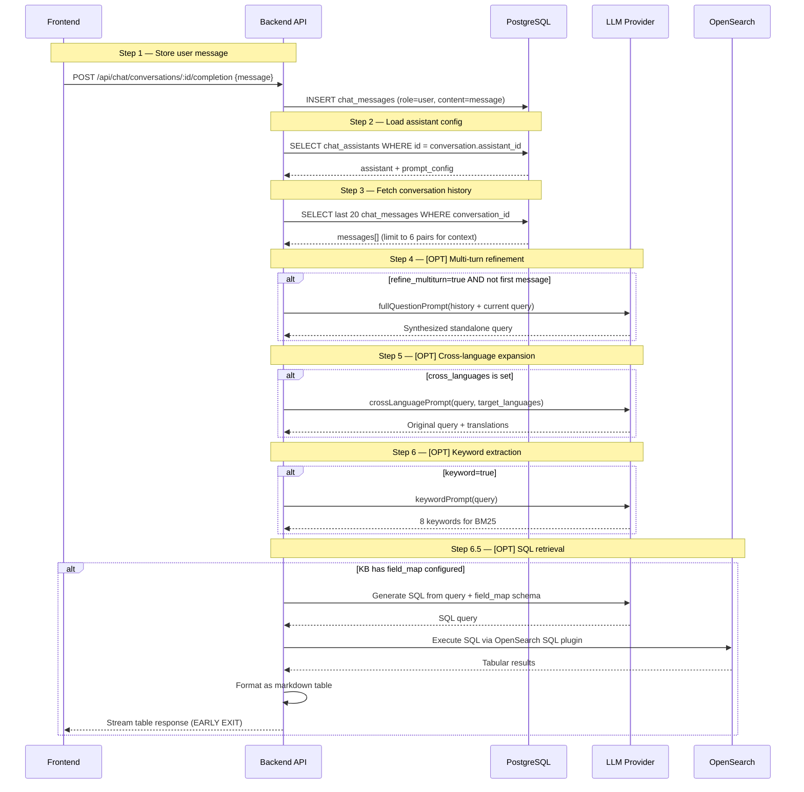

# Chat Completion Input Processing (Steps 1-6) — Detail Design

## Overview

Steps 1 through 6 prepare the user's raw message for retrieval. The pipeline stores the message, loads configuration, gathers history, and optionally refines, expands, and extracts keywords from the query. Step 6.5 (SQL retrieval) can short-circuit the entire pipeline.

## Input Processing Sequence



## Step Details

### Step 1 — Store User Message

| Aspect | Detail |
|--------|--------|
| Input | Raw user message string |
| Output | Persisted `chat_messages` row with `role=user` |
| Table | `chat_messages` (id, conversation_id, role, content, created_at) |
| Langfuse span | `store_message` |

### Step 2 — Load Assistant Config

| Aspect | Detail |
|--------|--------|
| Input | `conversation.assistant_id` |
| Output | Full `prompt_config` object + `llm_id` + `kb_ids` |
| Cache | Config is loaded fresh per request (no stale config) |
| Langfuse span | `load_config` |

### Step 3 — Fetch Conversation History

| Aspect | Detail |
|--------|--------|
| Input | `conversation_id` |
| Query | Last 20 messages ordered by `created_at` |
| Output | Trimmed to 6 user-assistant pairs (12 messages max) |
| Rationale | Limits context window usage while preserving recent context |
| Langfuse span | `fetch_history` |

### Step 4 — [OPT] Multi-turn Refinement

| Aspect | Detail |
|--------|--------|
| Trigger | `refine_multiturn=true` AND conversation has prior messages |
| Skip | First message in conversation (no history to refine against) |
| Prompt | `fullQuestionPrompt` — instructs LLM to combine history + current query into standalone question |
| Input | Conversation history + current user query |
| Output | Single synthesized query replacing the original |
| Error fallback | On LLM failure, use original query unchanged |
| Langfuse span | `multiturn_refinement` |

### Step 5 — [OPT] Cross-Language Expansion

| Aspect | Detail |
|--------|--------|
| Trigger | `cross_languages` is non-empty (e.g., `"en,ja,vi"`) |
| Prompt | `crossLanguagePrompt` — instructs LLM to translate query into specified languages |
| Input | Current query (possibly refined) + target language codes |
| Output | Original query + translated variants, used for parallel retrieval |
| Error fallback | On LLM failure, search with original language only |
| Langfuse span | `cross_language_expansion` |

### Step 6 — [OPT] Keyword Extraction

| Aspect | Detail |
|--------|--------|
| Trigger | `keyword=true` |
| Prompt | `keywordPrompt` — instructs LLM to extract top 8 keywords |
| Input | Current query (possibly refined and expanded) |
| Output | Array of 8 keywords used to boost BM25 matching |
| Error fallback | On LLM failure, skip keyword boost |
| Langfuse span | `keyword_extraction` |

### Step 6.5 — [OPT] SQL Retrieval (Early Exit)

| Aspect | Detail |
|--------|--------|
| Trigger | Any linked KB has `field_map` configured |
| Process | LLM generates SQL from natural language using the field schema |
| Execution | SQL runs on OpenSearch SQL plugin against the KB index |
| Output | Tabular data formatted as markdown table |
| Behavior | **Skips steps 7-13 entirely** — streams the table directly |
| Error fallback | On SQL error, fall through to normal retrieval pipeline |
| Langfuse span | `sql_retrieval` |

## Langfuse Tracing

Each step creates a Langfuse span under the parent `chat_completion` trace:

```
chat_completion
├── store_message
├── load_config
├── fetch_history
├── multiturn_refinement    [OPT]
├── cross_language_expansion [OPT]
├── keyword_extraction       [OPT]
└── sql_retrieval            [OPT]
```

## Key Files

| File | Purpose |
|------|---------|
| `be/src/modules/chat/services/chat-conversation.service.ts` | Pipeline orchestrator |
| `be/src/modules/chat/services/` | Step-specific service implementations |
| `be/src/modules/chat/prompts/` | Prompt templates for steps 4-6.5 |
