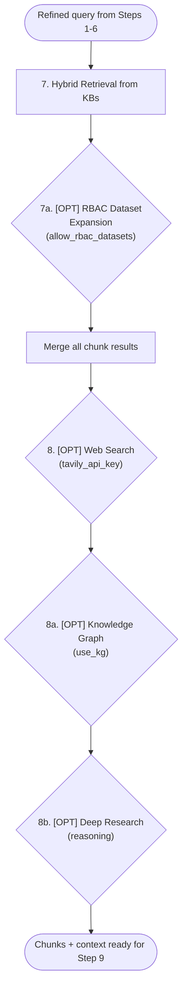
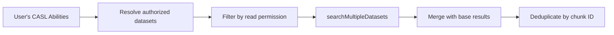
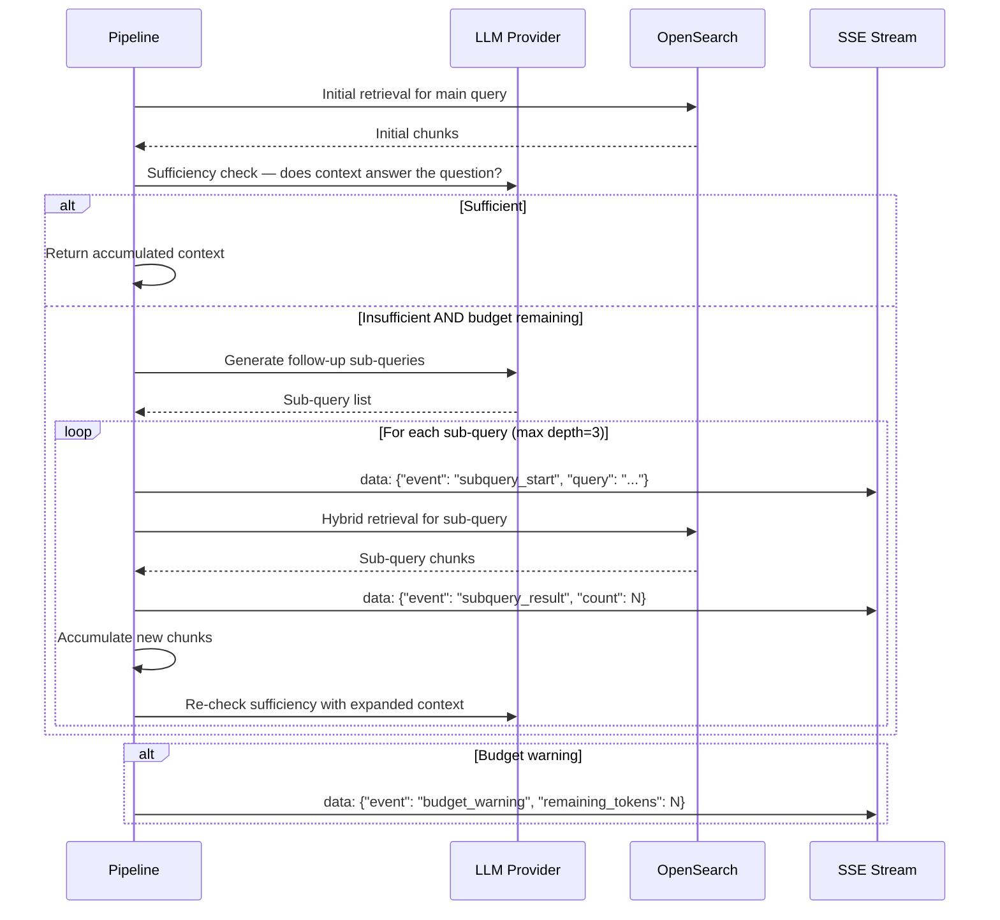

# Chat Completion Retrieval (Steps 7-8b) — Detail Design

## Overview

Steps 7 through 8b gather context for the LLM response. The pipeline performs hybrid retrieval from linked knowledge bases, optionally expands via RBAC, augments with web search and knowledge graph data, and may enter deep research mode for complex questions.

## Retrieval Pipeline



## Step 7 — Hybrid Retrieval

For each linked knowledge base, the pipeline embeds the query and runs a hybrid search combining vector similarity with BM25 text matching.

### Score Formula

```
weightedScore = (1 - vectorWeight) * textScore + vectorWeight * semanticScore
```

Where `vectorWeight` is `prompt_config.vector_similarity_weight` (default 0.5).

### BM25 Boost Factors

| Field | Boost | Source |
|-------|-------|--------|
| `important_kwd` | 30x | Keyword enrichment |
| `question_tks` | 20x | Q&A generation enrichment |
| `title_tks` | 10x | Document title tokens |
| `pagerank_fea` | variable | Recency / importance score |

### Query Filters

All hybrid queries include these mandatory filters:

| Filter | Purpose |
|--------|---------|
| `available_int=1` | Only enabled chunks |
| `tenant_id={tenantId}` | Tenant isolation |
| `kb_id IN [...]` | Scope to linked datasets |

### Parameters from PromptConfig

| Parameter | Default | Effect |
|-----------|---------|--------|
| `top_n` | 6 | Max chunks returned per KB |
| `similarity_threshold` | 0.2 | Minimum score to include |
| `vector_similarity_weight` | 0.5 | Vector vs BM25 balance |

## Step 7a — [OPT] RBAC Dataset Expansion

| Aspect | Detail |
|--------|--------|
| Trigger | `allow_rbac_datasets=true` |
| Process | Resolve user's CASL abilities for dataset resources |
| Expansion | Find all datasets the user has read permission on |
| Search | Call `searchMultipleDatasets()` across all authorized datasets |
| Merge | Combine results with base KB results, deduplicate by chunk ID |
| Langfuse span | `rbac_dataset_expansion` |



## Step 8 — [OPT] Web Search

| Aspect | Detail |
|--------|--------|
| Trigger | `tavily_api_key` is non-empty |
| API | Tavily Search API |
| Max results | 3 |
| Output | Results converted to `ChunkResult` format |
| Merge | Appended to KB results with source marked as `web` |
| Error fallback | On API failure, skip web results silently |
| Langfuse span | `web_search` |

Web search results are formatted as chunks with:
- `content_ltks` = Tavily result snippet
- `doc_name` = Page title
- `source_url` = Original URL (used for citation linking)

## Step 8a — [OPT] Knowledge Graph Retrieval

| Aspect | Detail |
|--------|--------|
| Trigger | `use_kg=true` |
| Process | Query OpenSearch for entities, relations, and communities matching the query |
| LLM call | Synthesize graph context from matched triples and community summaries |
| Output | Graph context string appended to system prompt |
| Langfuse span | `knowledge_graph_retrieval` |

Knowledge graph data is stored in separate OpenSearch indices:
- `{tenant}_{kb}_entities` — Named entities with descriptions
- `{tenant}_{kb}_relations` — Entity-to-entity relationships
- `{tenant}_{kb}_communities` — Clustered entity groups with summaries

## Step 8b — [OPT] Deep Research

| Aspect | Detail |
|--------|--------|
| Trigger | `reasoning=true` |
| Process | Recursive question decomposition with sufficiency checking |
| Budget | Max 50K tokens, 15 LLM calls, 3 recursion depth levels |
| Output | Accumulated context from all sub-query retrievals |
| Langfuse span | `deep_research` |

### Deep Research Recursion



### Budget Limits

| Resource | Limit | Purpose |
|----------|-------|---------|
| Token budget | 50,000 | Prevent excessive LLM cost |
| LLM call budget | 15 | Limit total API calls |
| Recursion depth | 3 | Prevent infinite decomposition |

### SSE Progress Events

| Event | Payload | When |
|-------|---------|------|
| `subquery_start` | `{ query: string }` | Before each sub-query retrieval |
| `subquery_result` | `{ query: string, count: number }` | After sub-query results received |
| `budget_warning` | `{ remaining_tokens: number }` | When budget drops below 20% |

### Sufficiency Check

The LLM evaluates whether the accumulated context is sufficient to answer the original question:
- If yes, research stops and context is returned
- If no, the LLM generates 1-3 focused follow-up sub-queries
- Each sub-query goes through its own retrieval cycle
- New chunks are deduplicated against existing context

## Key Files

| File | Purpose |
|------|---------|
| `be/src/modules/chat/services/chat-conversation.service.ts` | Pipeline orchestrator |
| `be/src/modules/chat/services/` | Retrieval step implementations |
| `advance-rag/rag/svr/` | OpenSearch query builders |
