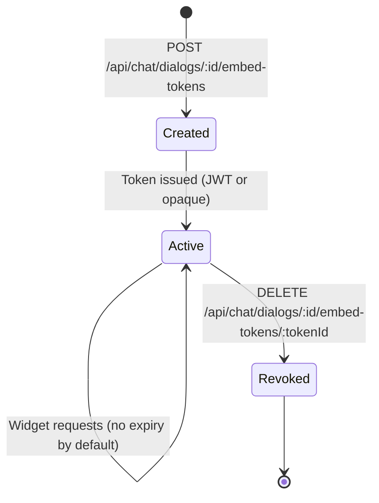
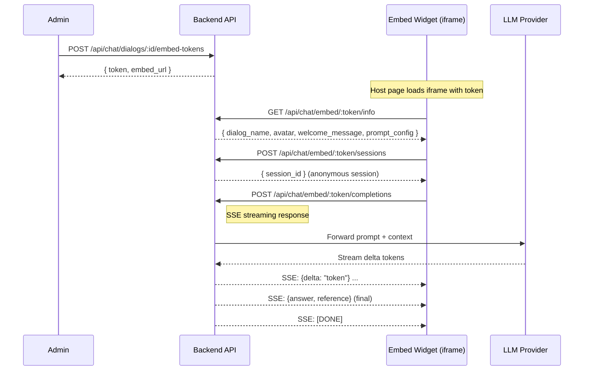
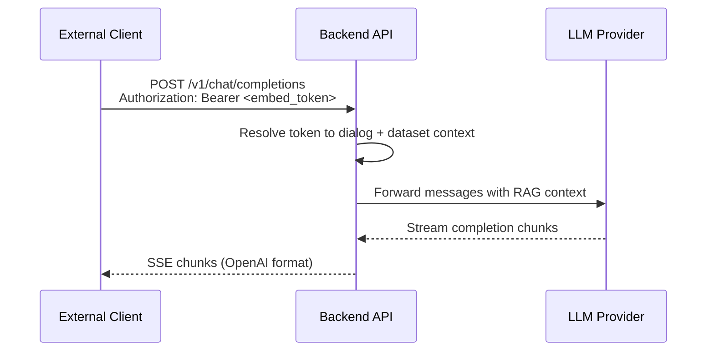

# Chat Embed Widget - Detail Design

## Overview

The chat embed widget allows external websites to embed a B-Knowledge chat dialog as an iframe-based widget. Authentication uses embed tokens instead of user sessions, enabling anonymous public access. An OpenAI-compatible endpoint is also exposed for programmatic integrations.

## Token Lifecycle



- **Create**: Admin generates a token scoped to a specific dialog.
- **Active**: Token authorizes all embed endpoints. No user session required.
- **Revoke**: Admin deletes the token; subsequent requests return 401.

## End-to-End Sequence



## Public API Endpoints

All embed endpoints bypass session authentication. The embed token is the sole credential.

| Method | Endpoint | Purpose |
|--------|----------|---------|
| GET | `/api/chat/embed/:token/info` | Retrieve dialog metadata and prompt config |
| POST | `/api/chat/embed/:token/sessions` | Create an anonymous chat session |
| POST | `/api/chat/embed/:token/completions` | Send message and receive SSE streaming response |
| DELETE | `/api/chat/dialogs/:id/embed-tokens/:tokenId` | Revoke a token (admin, session required) |

## OpenAI-Compatible Endpoint



- **Auth**: `Authorization: Bearer <embed_token>` header.
- **Request body**: Follows OpenAI chat completions schema (`model`, `messages`, `stream`).
- **Response**: OpenAI-compatible SSE chunks with `choices[].delta.content`.

## Widget Integration

### IIFE Bundle

The widget ships as a self-contained IIFE JavaScript bundle. Host pages include it via a `<script>` tag:

```html
<script src="https://your-domain/embed/chat-widget.iife.js"></script>
<script>
  BKnowledgeChat.init({
    token: 'embed_token_value',
    containerId: 'chat-container'
  });
</script>
```

### iframe Embedding

Alternatively, embed directly as an iframe:

```html
<iframe
  src="https://your-domain/embed/chat?token=embed_token_value"
  width="400" height="600"
  style="border:none;">
</iframe>
```

### CORS and Security

- **frame-ancestors**: CSP `frame-ancestors` is relaxed for embed endpoints to allow cross-origin iframe embedding.
- **CORS**: Embed routes return permissive CORS headers (`Access-Control-Allow-Origin: *`).
- **Rate limiting**: Token-scoped rate limits prevent abuse of public endpoints.

## Key Files

| File | Purpose |
|------|---------|
| `be/src/modules/chat/controllers/chat-embed.controller.ts` | Embed endpoint handlers |
| `be/src/modules/chat/services/chat-embed.service.ts` | Token management and session logic |
| `be/src/modules/chat/routes/chat-embed.routes.ts` | Route definitions for embed API |
