# Chat System Overview — Detail Design

## Overview

The chat completion pipeline processes a user message through up to 14 steps, from storage through retrieval and generation to final persistence. Steps marked [OPT] are controlled by the assistant's `prompt_config` and only execute when their corresponding flag or field is set.

## Entry Points

| Endpoint | Purpose |
|----------|---------|
| `POST /api/chat/conversations/:id/completion` | Primary chat endpoint (SSE streaming) |
| `POST /v1/chat/completions` | OpenAI-compatible API endpoint |

## Full 14-Step Pipeline

```mermaid
flowchart TD
    START([User sends message]) --> S1[1. Store user message]
    S1 --> S2[2. Load assistant config]
    S2 --> S3[3. Fetch conversation history]
    S3 --> S4{"4. [OPT] Multi-turn\nrefinement\n(refine_multiturn)"}
    S4 --> S5{"5. [OPT] Cross-language\nexpansion\n(cross_languages)"}
    S5 --> S6{"6. [OPT] Keyword\nextraction\n(keyword)"}
    S6 --> S6B{"6.5 [OPT] SQL\nretrieval\n(field_map)"}
    S6B -->|SQL hit → early exit| S14
    S6B -->|No field_map| S7[7. Hybrid retrieval\nfrom KBs]
    S7 --> S7A{"7a. [OPT] RBAC dataset\nexpansion\n(allow_rbac_datasets)"}
    S7A --> S8{"8. [OPT] Web search\n(tavily_api_key)"}
    S8 --> S8A{"8a. [OPT] Knowledge\ngraph retrieval\n(use_kg)"}
    S8A --> S8B{"8b. [OPT] Deep\nresearch\n(reasoning)"}
    S8B --> S9{"9. [OPT] Reranking\n(rerank_id)"}
    S9 --> S10[10. Empty result\nhandling]
    S10 --> S11[11. Build prompt\nwith citations]
    S11 --> S12[12. SSE streaming\ndelta tokens]
    S12 --> S13[13. Post-process\ncitations]
    S13 --> S14[14. Persist &\nfinalize]
    S14 --> END([Response complete])
```

## Step Summary

| Step | Name | Trigger | Description |
|------|------|---------|-------------|
| 1 | Store message | Always | Save user message to `chat_messages` |
| 2 | Load config | Always | Read `prompt_config` from `chat_assistants` |
| 3 | History | Always | Fetch last 20 messages, limit 6 pairs |
| 4 | Multi-turn | `refine_multiturn=true` | LLM synthesizes conversation into single query |
| 5 | Cross-language | `cross_languages` set | LLM translates query to target languages |
| 6 | Keywords | `keyword=true` | LLM extracts 8 keywords for BM25 boost |
| 6.5 | SQL retrieval | KB has `field_map` | LLM generates SQL, executes on OpenSearch, early exit |
| 7 | Hybrid retrieval | Always (if KBs linked) | Vector + BM25 search across knowledge bases |
| 7a | RBAC expansion | `allow_rbac_datasets=true` | Expand search to all user-authorized datasets |
| 8 | Web search | `tavily_api_key` set | Tavily API search, max 3 results |
| 8a | Knowledge graph | `use_kg=true` | Entity/relation/community retrieval from OpenSearch |
| 8b | Deep research | `reasoning=true` | Recursive question decomposition with budget |
| 9 | Reranking | `rerank_id` set | Dedicated rerank model or LLM fallback |
| 10 | Empty handling | No chunks found | Stream `empty_response` if configured |
| 11 | Build prompt | Always | Assemble system + context + citations + instructions |
| 12 | SSE streaming | Always | Stream delta tokens via Server-Sent Events |
| 13 | Citations | Always | Embedding-based or regex-based citation insertion |
| 14 | Persist | Always | Save response, generate title, log analytics |

## PromptConfig Fields

| Field | Type | Default | [OPT] | Description |
|-------|------|---------|-------|-------------|
| `system` | string | "" | | System prompt prepended to every request |
| `prologue` | string | "" | | Opening message shown to new conversations |
| `quote` | bool | true | | Enable citation references in responses |
| `empty_response` | string | "" | | Message when no relevant chunks found |
| `refine_multiturn` | bool | false | OPT | Synthesize multi-turn into single query |
| `cross_languages` | string | "" | OPT | Comma-separated target language codes |
| `keyword` | bool | false | OPT | Extract keywords for BM25 boosting |
| `top_n` | number | 6 | | Max chunks to include in context |
| `similarity_threshold` | number | 0.2 | | Minimum score to include a chunk |
| `vector_similarity_weight` | number | 0.5 | | Balance: 0=pure BM25, 1=pure vector |
| `allow_rbac_datasets` | bool | false | OPT | Search all user-authorized datasets |
| `use_kg` | bool | false | OPT | Enable knowledge graph retrieval |
| `reasoning` | bool | false | OPT | Enable deep research mode |
| `tavily_api_key` | string | "" | OPT | Tavily API key for web search |
| `rerank_id` | string | "" | OPT | Reranker model ID |
| `toc_enhance` | bool | false | OPT | Use table of contents for context |
| `temperature` | number | 0.7 | | LLM sampling temperature |
| `top_p` | number | — | | LLM nucleus sampling |
| `max_tokens` | number | — | | Max response tokens |
| `tts` | bool | false | OPT | Enable text-to-speech |
| `language` | string | "" | | Response language instruction |

## Key Files

| File | Purpose |
|------|---------|
| `be/src/modules/chat/services/chat-conversation.service.ts` | Main pipeline orchestrator |
| `be/src/modules/chat/controllers/chat.controller.ts` | HTTP endpoint handlers |
| `be/src/modules/chat/services/` | Step-specific service files |
