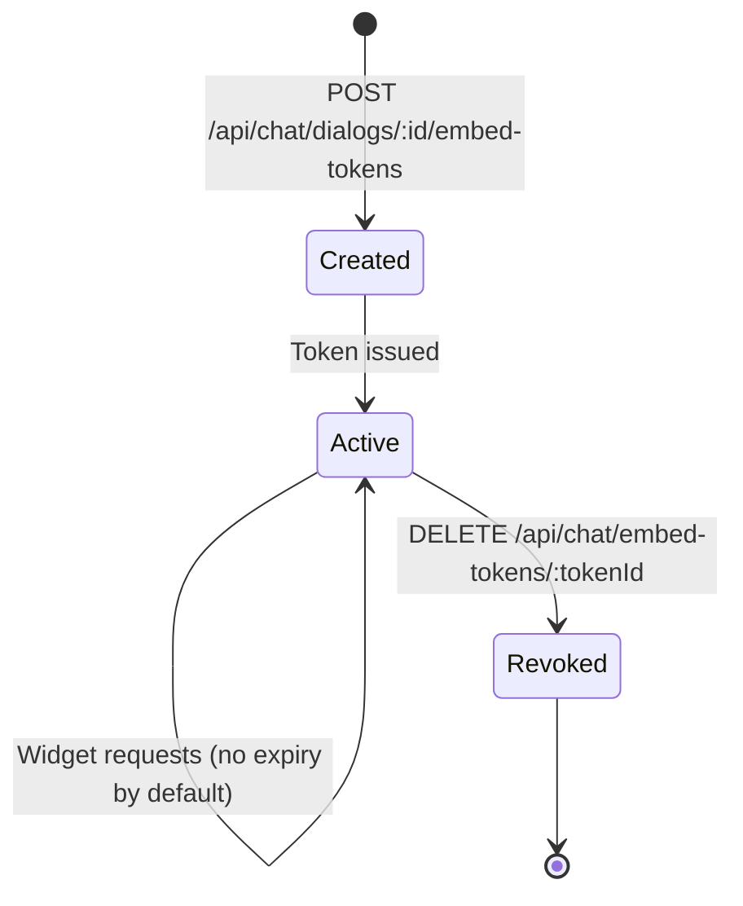
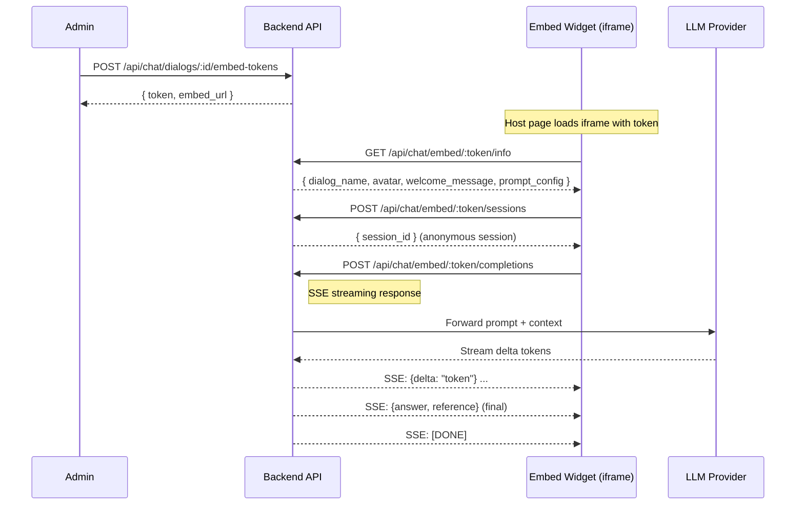

# Chat Embed Widget - Detail Design

## Overview

The current chat embed implementation exposes token-authenticated public endpoints for dialog info, anonymous session creation, and streamed completions. It is public-access oriented, but the source code documents public API routes rather than a standalone IIFE bundle.

## Token Lifecycle

- **Create**: Admin generates a token scoped to a specific dialog.
- **Active**: Token authorizes all embed endpoints. No user session required.
- **Revoke**: Admin deletes the token; subsequent requests return 401.

## End-to-End Sequence

## Public API Endpoints

All embed endpoints bypass session authentication. The embed token is the sole credential.

| Method | Endpoint | Purpose |
|--------|----------|---------|
| GET | `/api/chat/embed/:token/info` | Retrieve dialog metadata and prompt config |
| POST | `/api/chat/embed/:token/sessions` | Create an anonymous chat session |
| POST | `/api/chat/embed/:token/completions` | Send message and receive SSE streaming response |
| DELETE | `/api/chat/dialogs/:id/embed-tokens/:tokenId` | Revoke a token (admin, session required) |

## Public Client Integration

The implemented public surface is:

- `GET /api/chat/embed/:token/info`
- `POST /api/chat/embed/:token/sessions`
- `POST /api/chat/embed/:token/completions`

The frontend or host page is responsible for calling these routes with the token in the URL. The current source does not expose a documented standalone IIFE bundle in this docs set.

### Security Notes

- Public access is token-based, not session-based.
- Admin token creation and revocation still require authenticated permissions.
- Streaming responses are delivered over SSE.

## Key Files

| File | Purpose |
|------|---------|
| `be/src/modules/chat/controllers/chat-embed.controller.ts` | Embed endpoint handlers |
| `be/src/modules/chat/services/chat-embed.service.ts` | Token management and session logic |
| `be/src/modules/chat/routes/chat-embed.routes.ts` | Route definitions for embed API |
