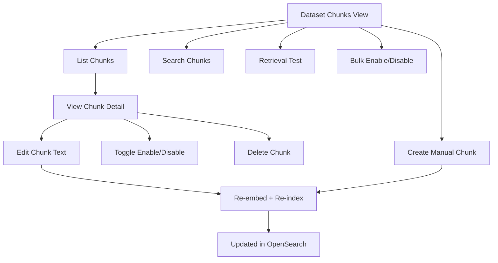
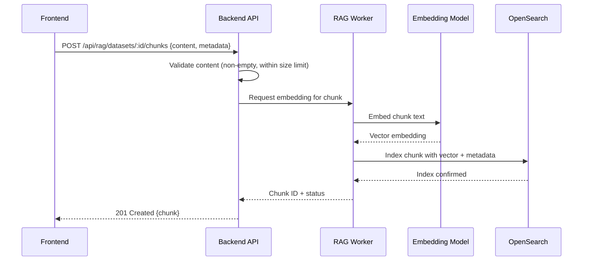
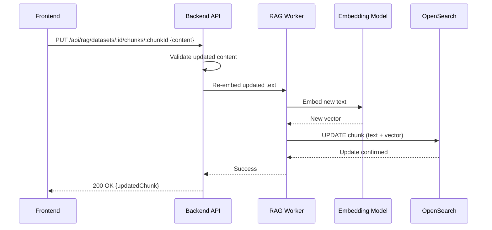

# Chunk Management — Detail Design

## Overview

After documents are parsed and indexed, users can manage individual chunks: list, view, edit, create, toggle availability, delete, and test retrieval quality. Edits automatically re-embed and re-index the chunk.

## Chunk Operations Flow



## Endpoints

| Method | Endpoint | Description |
|--------|----------|-------------|
| GET | `/api/rag/datasets/:id/chunks` | List chunks with pagination and filters |
| POST | `/api/rag/datasets/:id/chunks` | Create a manual (user-authored) chunk |
| PUT | `/api/rag/datasets/:id/chunks/:chunkId` | Edit chunk text content |
| DELETE | `/api/rag/datasets/:id/chunks/:chunkId` | Remove chunk from OpenSearch and DB |
| POST | `/api/rag/datasets/:id/chunks/bulk-switch` | Enable or disable multiple chunks |
| POST | `/api/rag/datasets/:id/search` | Search within dataset chunks |
| POST | `/api/rag/datasets/:id/retrieval-test` | Test retrieval quality without LLM |

## Manual Chunk Creation



### Request Body

```json
{
  "content": "The chunk text content authored by the user.",
  "important_kwd": ["optional", "keywords"],
  "question_tks": ["Optional question this chunk answers?"]
}
```

## Chunk Edit Flow



Editing a chunk automatically triggers re-embedding. The old vector is replaced in-place in OpenSearch.

## Chunk Availability Toggle

The `available_int` field controls whether a chunk participates in retrieval:

| Value | Meaning | Retrieval Behavior |
|-------|---------|-------------------|
| 1 | Enabled | Included in search results |
| 0 | Disabled | Excluded from all queries |

### Bulk Toggle

**Endpoint:** `POST /api/rag/datasets/:id/chunks/bulk-switch`

```json
{
  "chunk_ids": ["id1", "id2", "id3"],
  "available_int": 0
}
```

Updates `available_int` for all specified chunks in a single OpenSearch bulk request.

## Search Within Dataset

**Endpoint:** `POST /api/rag/datasets/:id/search`

```json
{
  "query": "search terms",
  "top_k": 10,
  "similarity_threshold": 0.2
}
```

Performs hybrid search (vector + BM25) scoped to the specified dataset. Returns ranked chunks with similarity scores.

## Retrieval Test

**Endpoint:** `POST /api/rag/datasets/:id/retrieval-test`

```json
{
  "query": "test question",
  "top_n": 6,
  "similarity_threshold": 0.2,
  "vector_similarity_weight": 0.5
}
```

Tests search quality without invoking the LLM. Returns:
- Matched chunks with scores
- Vector similarity and BM25 scores separately
- Highlights showing matched terms

Useful for tuning retrieval parameters before deploying an assistant.

## Chunk Data Model

| Field | Type | Description |
|-------|------|-------------|
| `id` | string | Chunk ID (OpenSearch document ID) |
| `content_ltks` | text | Chunk text content (analyzed) |
| `content_sm_ltks` | text | Content for fine-grained tokenization |
| `important_kwd` | text[] | Enriched keywords (30x boost) |
| `question_tks` | text[] | Generated Q&A pairs (20x boost) |
| `title_tks` | text | Document title tokens (10x boost) |
| `available_int` | integer | 1=enabled, 0=disabled |
| `kb_id` | string | Parent dataset ID |
| `doc_id` | string | Parent document ID |
| `tenant_id` | string | Tenant isolation |
| `q_vec` | dense_vector | Embedding vector |

## Key Files

| File | Purpose |
|------|---------|
| `be/src/modules/rag/controllers/chunk.controller.ts` | Chunk endpoint handlers |
| `be/src/modules/rag/services/chunk.service.ts` | Business logic for chunk operations |
| `advance-rag/rag/embedder/` | Embedding on edit/create |
