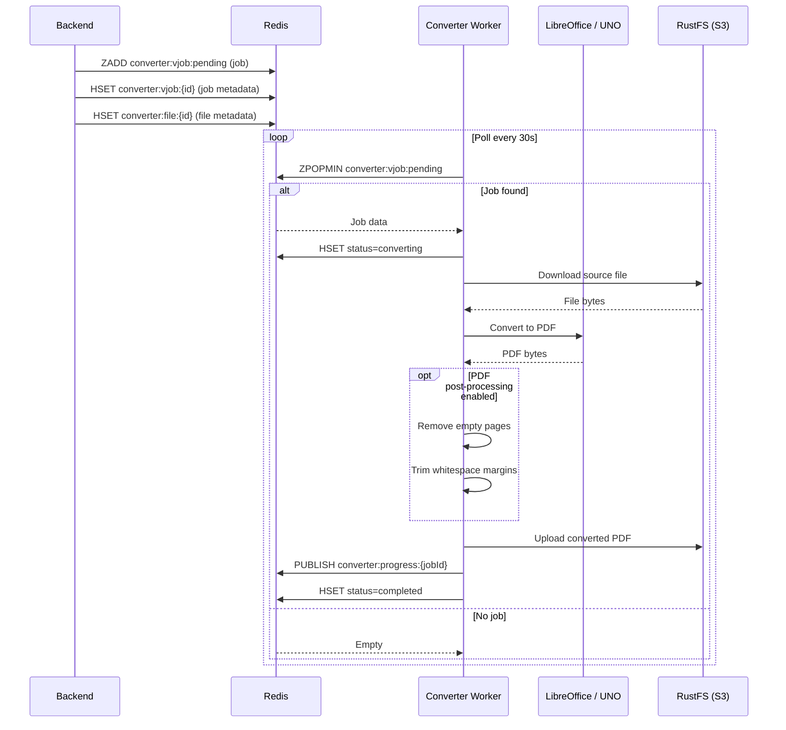
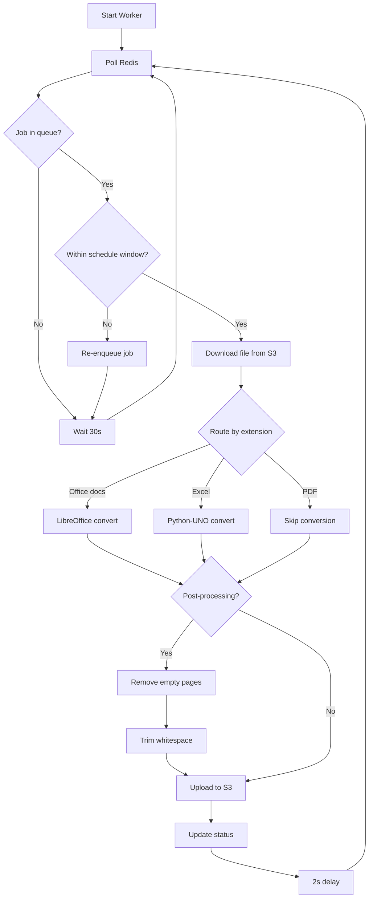
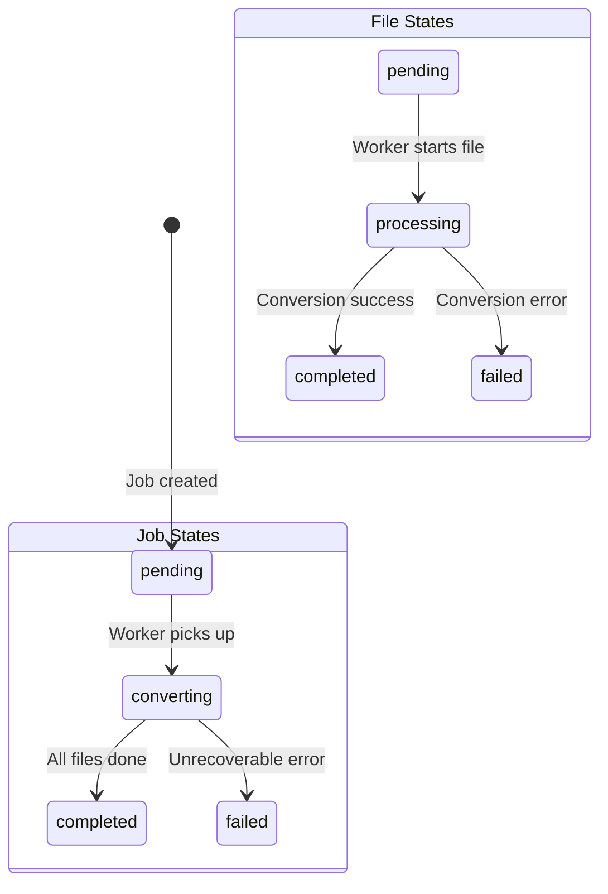

# Document Converter Detail Design

## Overview

The Converter is a Python worker that transforms office documents into PDF format. It polls a Redis sorted set for jobs, converts files via LibreOffice or Python-UNO, optionally post-processes the PDFs, and uploads results to S3-compatible storage.

## Conversion Pipeline

## Conversion Routes

| Input Extension | Method | Notes |
|----------------|--------|-------|
| `.doc`, `.docx` | `soffice --convert-to pdf` | LibreOffice headless |
| `.ppt`, `.pptx` | `soffice --convert-to pdf` | LibreOffice headless |
| `.xls`, `.xlsx` | Python-UNO bridge | More control over sheet layout |
| `.pdf` | Copy / pass-through | Only post-processing if enabled |
| `.txt`, `.csv` | `soffice --convert-to pdf` | Simple text conversion |

## Worker Loop

## PDF Post-Processing

### Remove Empty Pages (Optional)

Uses pdfminer to analyze content on each page. Pages with no extractable text and no significant graphical elements are removed. This handles blank pages inserted by LibreOffice during conversion.

### Trim Whitespace (Optional)

Adjusts the CropBox of each PDF page to remove excessive whitespace margins. A configurable margin (default 10pt) is preserved around the content bounding box.

## Redis Data Structures

### Job Hash: `converter:vjob:{id}`

| Field | Type | Description |
|-------|------|-------------|
| id | string | Job ID |
| status | string | `pending`, `converting`, `completed`, `failed` |
| tenant_id | string | Owning tenant |
| total_files | number | Files in this job |
| completed_files | number | Processed count |
| created_at | string | ISO timestamp |

### Pending Queue: `converter:vjob:pending`

Redis sorted set. Score is the job creation timestamp (priority ordering). Workers use `ZPOPMIN` for atomic dequeue.

### File Hash: `converter:file:{id}`

| Field | Type | Description |
|-------|------|-------------|
| id | string | File ID |
| job_id | string | Parent job |
| source_key | string | S3 key of source file |
| target_key | string | S3 key of converted PDF |
| status | string | `pending`, `processing`, `completed`, `failed` |
| error | string | Error message if failed |

## State Transitions

## Progress Reporting

The worker publishes progress via Redis pub/sub on channel `converter:progress:{jobId}`. The backend subscribes and bridges updates to the frontend via Socket.IO.

## Key Files

| File | Purpose |
|------|---------|
| `converter/src/worker.py` | Main worker loop and polling |
| `converter/src/converter.py` | Conversion routing and LibreOffice invocation |
| `converter/src/pdf_processor.py` | Post-processing (empty page removal, trimming) |
| `converter/src/redis_client.py` | Redis operations |
| `converter/src/s3_client.py` | S3 upload/download |
