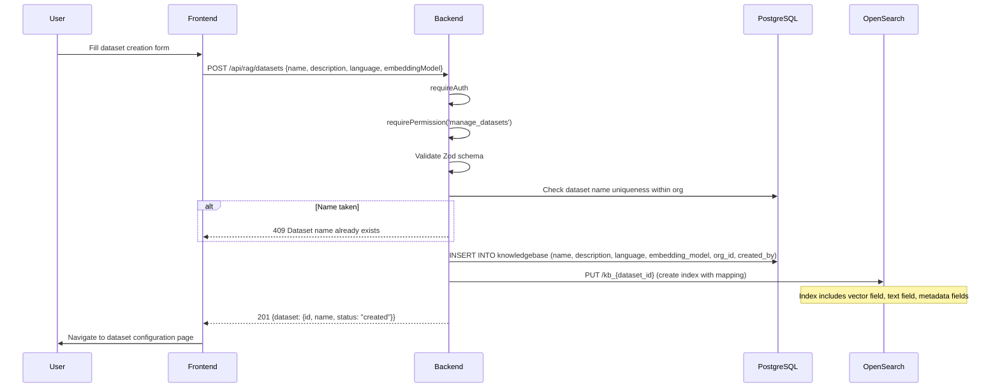
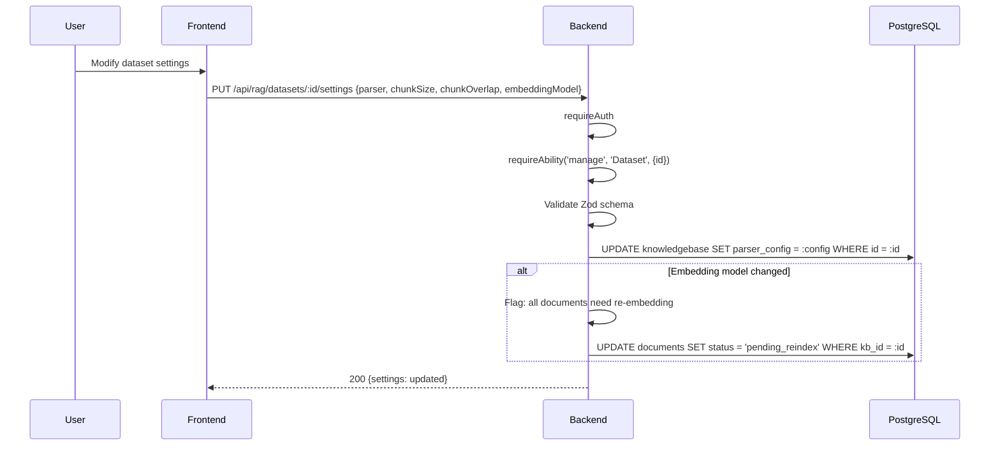
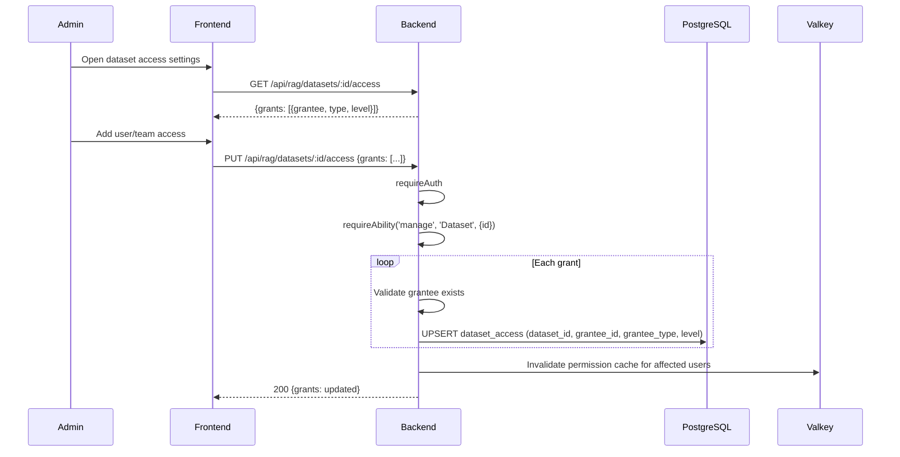
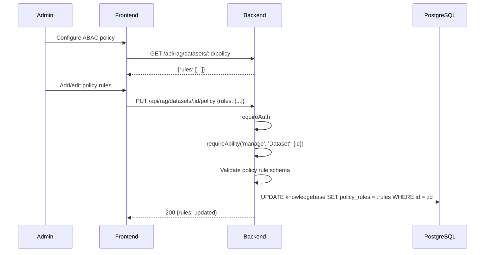
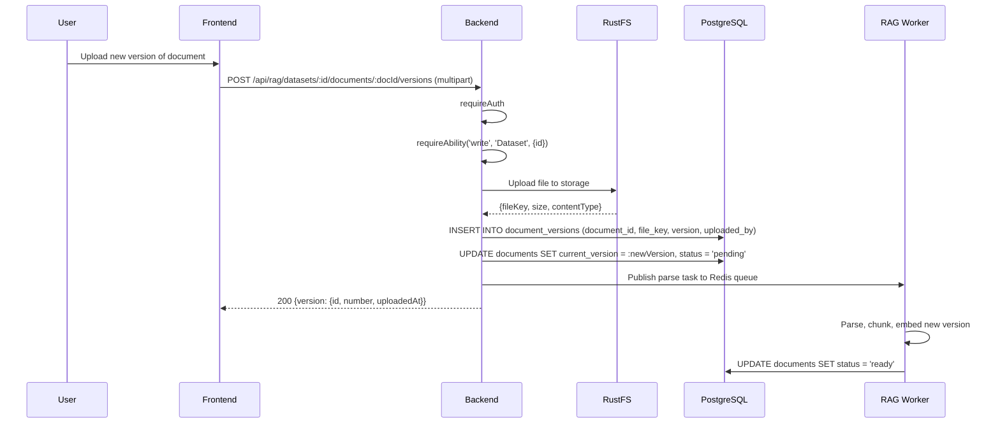
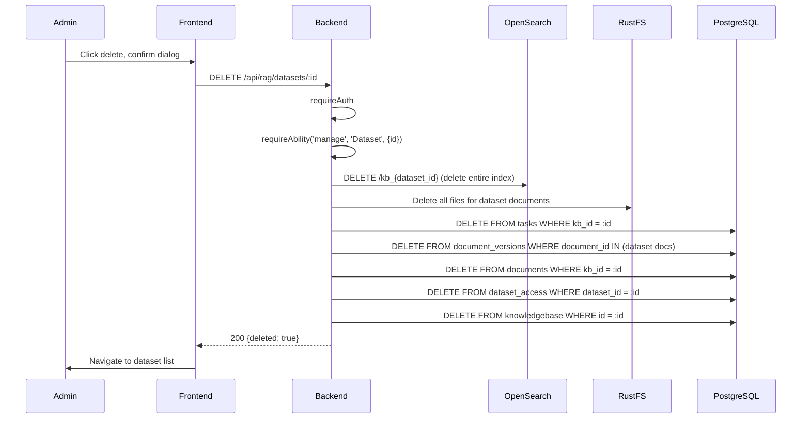

# Dataset CRUD: Step-by-Step Detail

## Overview

Detailed sequence flows for dataset creation, configuration, access control, ABAC policies, versioning, and deletion.

## Create Dataset



### OpenSearch Index Mapping

| Field | Type | Purpose |
|-------|------|---------|
| `chunk_id` | keyword | Unique chunk identifier |
| `content` | text | Chunk text for keyword search |
| `embedding` | knn_vector | Vector for similarity search |
| `document_id` | keyword | Parent document reference |
| `metadata` | object | Custom metadata fields |
| `created_at` | date | Indexing timestamp |

## Update Settings



### Settings Schema

| Field | Type | Validation |
|-------|------|-----------|
| `parser` | enum | naive, recursive, semantic |
| `chunkSize` | number | 64-2048 |
| `chunkOverlap` | number | 0 to chunkSize/2 |
| `embeddingModel` | string | Must exist in org's configured models |
| `language` | enum | en, vi, ja |
| `separators` | string[] | Optional custom separators |

## Access Control Management



### Access Grant Structure

| Field | Type | Values |
|-------|------|--------|
| `grantee_id` | UUID | User or Team ID |
| `grantee_type` | enum | `user`, `team` |
| `level` | enum | `read`, `write`, `manage` |

## ABAC Policy Management



### Policy Rule Schema

```
{
  "rules": [
    {
      "action": "read",
      "subject": "Document",
      "conditions": {
        "department": {"$eq": "engineering"},
        "classification": {"$in": ["public", "internal"]}
      },
      "description": "Engineering team can read public and internal docs"
    }
  ]
}
```

## Document Versioning



## Delete Dataset



### Cascade Deletion Order

| Step | Resource | Action |
|------|----------|--------|
| 1 | OpenSearch index | Delete `kb_{id}` index with all chunks |
| 2 | RustFS files | Delete all stored document files |
| 3 | `tasks` | Delete all processing tasks |
| 4 | `document_versions` | Delete version history |
| 5 | `documents` | Delete document records |
| 6 | `dataset_access` | Delete access grants |
| 7 | `knowledgebase` | Delete dataset record |

## API Summary

| Operation | Method | Endpoint | Auth |
|-----------|--------|----------|------|
| Create dataset | POST | `/api/rag/datasets` | requirePermission('manage_datasets') |
| List datasets | GET | `/api/rag/datasets` | requireAuth |
| Get dataset | GET | `/api/rag/datasets/:id` | requireAbility('read') |
| Update settings | PUT | `/api/rag/datasets/:id/settings` | requireAbility('manage') |
| Get access | GET | `/api/rag/datasets/:id/access` | requireAbility('manage') |
| Set access | PUT | `/api/rag/datasets/:id/access` | requireAbility('manage') |
| Get policy | GET | `/api/rag/datasets/:id/policy` | requireAbility('manage') |
| Set policy | PUT | `/api/rag/datasets/:id/policy` | requireAbility('manage') |
| Upload version | POST | `/api/rag/datasets/:id/documents/:docId/versions` | requireAbility('write') |
| Delete dataset | DELETE | `/api/rag/datasets/:id` | requireAbility('manage') |

## Key Files

| File | Purpose |
|------|---------|
| `be/src/modules/rag/services/rag-core.service.ts` | Core dataset CRUD and lifecycle |
| `be/src/modules/rag/controllers/` | Route handlers for dataset endpoints |
| `be/src/modules/rag/routes/` | Route definitions with middleware |
| `advance-rag/` | Python worker for parse/chunk/embed pipeline |
