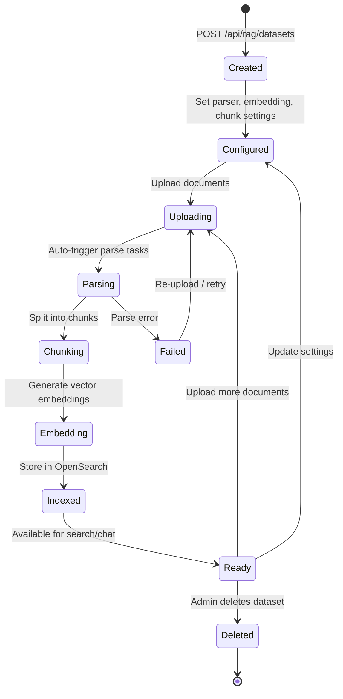
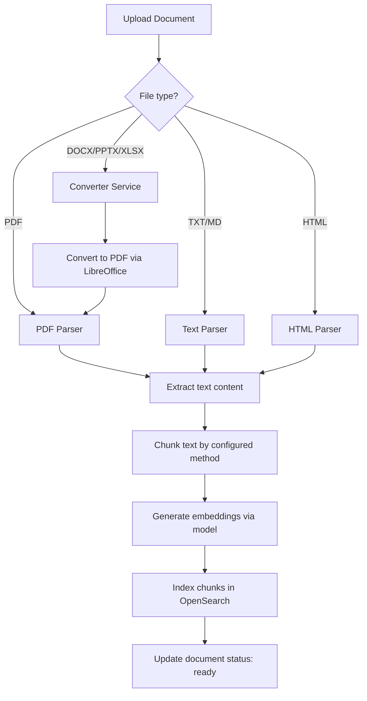
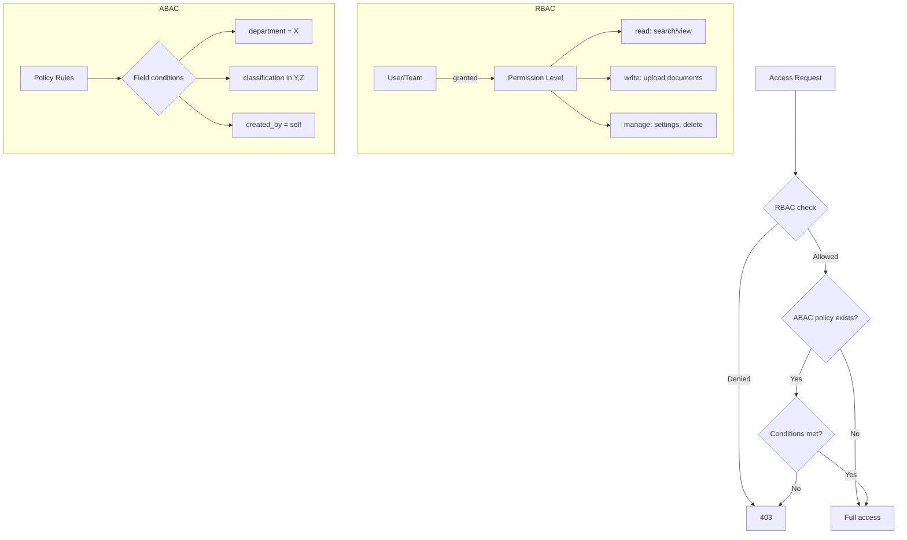
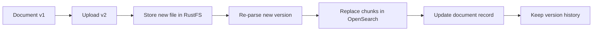
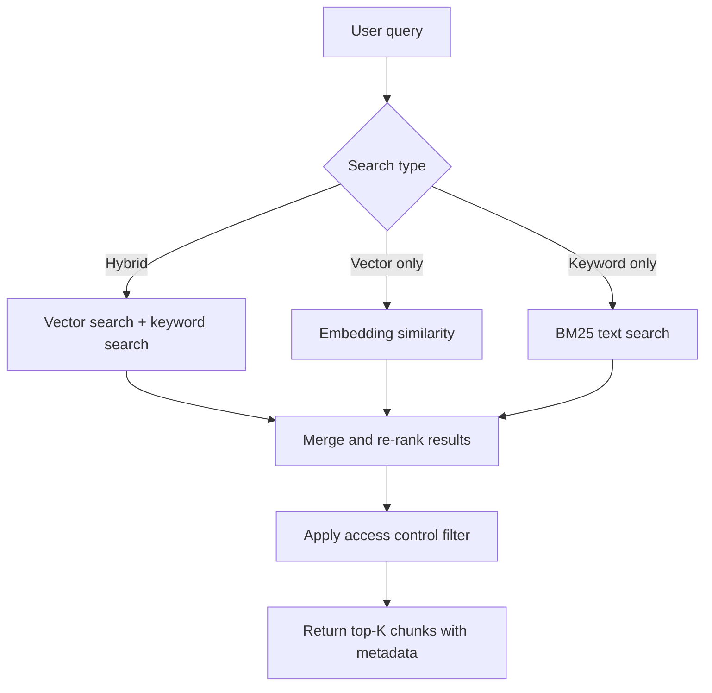

# Dataset Lifecycle Overview

## Overview

A Dataset (backed by the `knowledgebase` table) is the primary knowledge-base container in B-Knowledge. The current source supports dataset CRUD, access control, version uploads, per-document parser overrides, field-map generation for structured data, retrieval tests, enrichment tasks, metadata editing, graph tasks, logs, and bulk document operations.

## Dataset Lifecycle

## Dataset = Knowledge Base

| Concept | Implementation | Description |
|---------|---------------|-------------|
| Dataset | `knowledgebase` table | Container for related documents |
| Document | `document` table | Individual uploaded file |
| Chunk | OpenSearch `knowledge_{tenant}` index | Parsed text segment with embedding |
| Task | `task` table | Background processing job |

## Configuration Options

| Setting | Description | Default |
|---------|-------------|---------|
| **Embedding Model** | Model used for vector embeddings | Org default |
| **Parser Type** | Document parsing strategy | Auto-detect |
| **Chunk Size** | Max tokens per chunk | 512 |
| **Chunk Overlap** | Overlap between chunks | 64 |
| **Language** | Primary language for parsing | en |
| **Separator** | Custom chunk separators | Newline-based |
| **Field Map** | Structured-data column map for SQL fallback | none |
| **Tag KB IDs** | Tag datasets used for rank boosting | none |

## Document Processing Pipeline

## Access Control Model

### Permission Levels

| Level | Abilities |
|-------|-----------|
| `read` | Search, view documents, view chunks |
| `write` | Upload documents, trigger re-parse |
| `manage` | Change settings, delete dataset, manage access |

### Access Grant Sources

| Source | How | Example |
|--------|-----|---------|
| Role | Inherited from RBAC role | Admin gets manage on all datasets |
| User grant | Explicit per-user assignment | User X gets read on Dataset A |
| Team grant | Via team membership | Team Y gets write on Dataset B |
| ABAC policy | Conditional rules | Dept=eng gets read on tagged datasets |

## Versioning

- Upload a new file to an existing document entry to create a new version
- Previous versions are tracked in version history
- Chunks from old version are replaced with new version's chunks
- Version history includes: file reference, upload timestamp, uploader

## Search Flow (Once Ready)

## Current Route Surface

The dataset module currently exposes:

- Dataset CRUD and access control
- Version uploads and listing
- Dataset settings and parser config updates
- Manual chunk CRUD and bulk chunk switch
- Retrieval test
- Document CRUD, parse, status stream, download, parser change
- Bulk document parse/toggle/delete
- Web crawl ingestion
- Document enrichment for keywords, questions, tags, metadata
- GraphRAG / RAPTOR / mindmap task triggers and status
- Metadata read/write, logs, overview, graph data, image serving
- Auto-detect field map for structured datasets
- Bulk metadata updates and tag aggregations

## Key Files

| File | Purpose |
|------|---------|
| `be/src/modules/rag/` | RAG module (datasets, documents, search) |
| `be/src/modules/rag/routes/rag.routes.ts` | Dataset/document/chunk route surface |
| `advance-rag/` | Python RAG worker (parsing, chunking, embedding) |
| `converter/` | Office-to-PDF conversion service |
