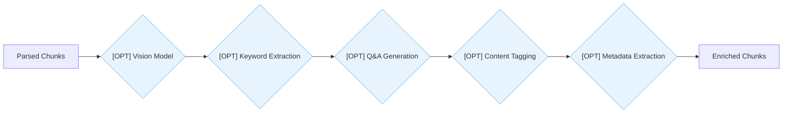
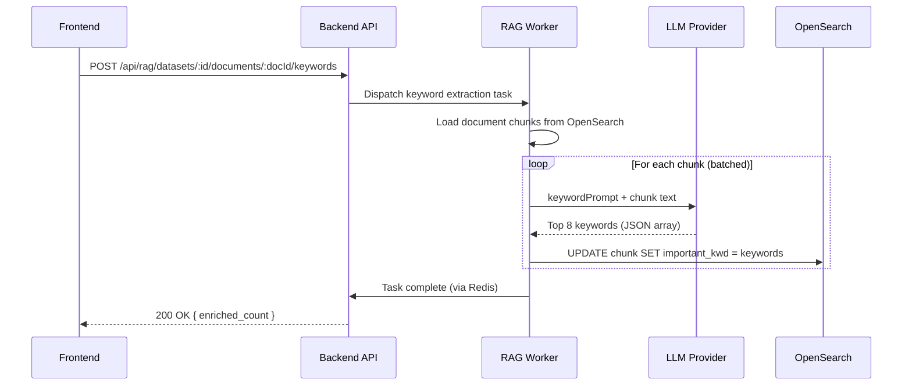

# Document Enrichment — Detail Design

## Overview

Document enrichment applies LLM-based post-processing to parsed chunks. All enrichment steps are **optional** and triggered manually per document. Enrichments improve search quality by adding keywords, generated Q&A pairs, tags, and structured metadata.

## Enrichment Pipeline

Each enrichment is independent — any combination can be applied in any order.

## Enrichment Summary

| Enrichment | Endpoint | Field Updated | Search Boost | Prompt Template |
|-----------|----------|--------------|-------------|-----------------|
| Keywords | `POST .../documents/:docId/keywords` | `important_kwd` | 30x | `keywordPrompt` |
| Q&A | `POST .../documents/:docId/questions` | `question_tks` | 20x | `questionPrompt` |
| Tags | `POST .../documents/:docId/tags` | `metadata.tags` | — | `contentTaggingPrompt` |
| Metadata | `POST .../documents/:docId/metadata` | `metadata.*` | — | `metadataPrompt` |

## Keyword Extraction

Extracts the most important keywords from each chunk to boost BM25 text search relevance.

**Keyword prompt behavior:**
- Input: Chunk text content (truncated to token limit)
- Output: JSON array of up to 8 keywords
- Storage: `important_kwd` field as comma-separated tokens
- Search impact: 30x boost in hybrid retrieval scoring

## Q&A Generation

Generates question-answer pairs that represent the chunk content, enabling question-to-question matching during retrieval.

**Flow:**
1. Load each chunk's text content
2. Send to LLM with `questionPrompt` template
3. LLM generates 3-5 Q&A pairs per chunk
4. Questions stored in `question_tks` field as tokenized text
5. During search, user questions match against generated questions with 20x boost

**Prompt template (`questionPrompt`):**
- Instructs LLM to generate questions that the chunk content answers
- Questions should be diverse (who, what, when, where, why, how)
- Output format: JSON array of `{ question, answer }` objects

## Content Tagging

Categorizes chunks into predefined or LLM-inferred topic categories.

**Flow:**
1. Send chunk text to LLM with `contentTaggingPrompt`
2. LLM assigns 1-3 topic tags from domain vocabulary
3. Tags stored in chunk `metadata.tags` array
4. Enables faceted filtering in search results

**Use cases:**
- Auto-categorize legal documents (contract, policy, regulation)
- Tag technical docs (API, tutorial, architecture, troubleshooting)
- Classify support articles (billing, technical, account, feature-request)

## Metadata Extraction

Extracts structured metadata fields from document content using LLM analysis.

**Flow:**
1. Send document text (first N chunks) to LLM with `metadataPrompt`
2. LLM extracts structured fields: author, date, version, document type, summary
3. Metadata stored in document and chunk `metadata` JSON fields
4. Enables metadata-based filtering and display in search results

**Extracted fields:**

| Field | Type | Description |
|-------|------|-------------|
| `author` | string | Document author or creator |
| `date` | string | Publication or creation date |
| `version` | string | Document version identifier |
| `doc_type` | string | Document category (report, manual, policy) |
| `summary` | string | One-paragraph summary of content |
| `language` | string | Detected primary language |

## Vision Model Enrichment [OPTIONAL]

For documents containing images (PDF with figures, presentations):

1. Extract images from parsed document
2. Send each image to a vision-capable LLM
3. LLM generates text description of the image content
4. Description appended to the chunk containing/nearest the image
5. Enables text-based search over visual content

## Error Handling

| Error | Handling |
|-------|----------|
| LLM timeout | Retry up to 2 times with increased timeout |
| LLM rate limit | Queue chunks with backoff; process in smaller batches |
| Invalid LLM output | Skip chunk; log warning; continue with remaining chunks |
| Partial failure | Report enriched count vs total; allow re-run for failed chunks |

## Prompt Templates

All prompts are defined in the RAG worker configuration and can be customized per tenant:

| Template | Location | Customizable |
|----------|----------|-------------|
| `keywordPrompt` | `advance-rag/rag/prompts/` | Yes — per dataset |
| `questionPrompt` | `advance-rag/rag/prompts/` | Yes — per dataset |
| `contentTaggingPrompt` | `advance-rag/rag/prompts/` | Yes — per dataset |
| `metadataPrompt` | `advance-rag/rag/prompts/` | Yes — per dataset |

## Key Files

| File | Purpose |
|------|---------|
| `advance-rag/rag/svr/task_executor.py` | Enrichment task dispatch |
| `advance-rag/rag/prompts/` | Prompt template definitions |
| `be/src/modules/rag/services/document.service.ts` | Enrichment endpoint orchestration |
