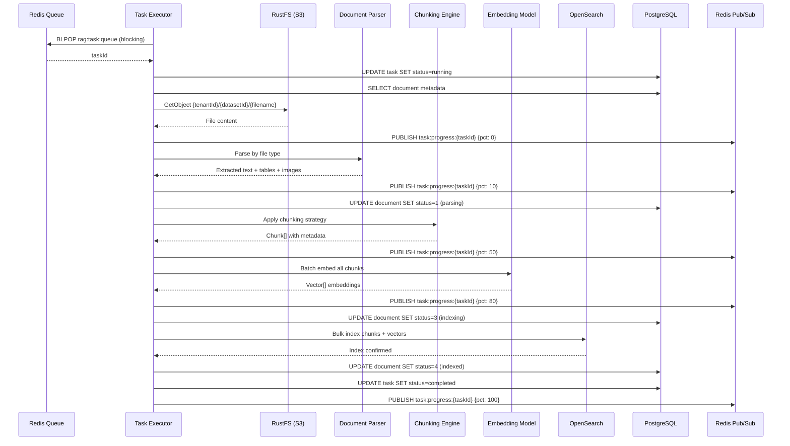
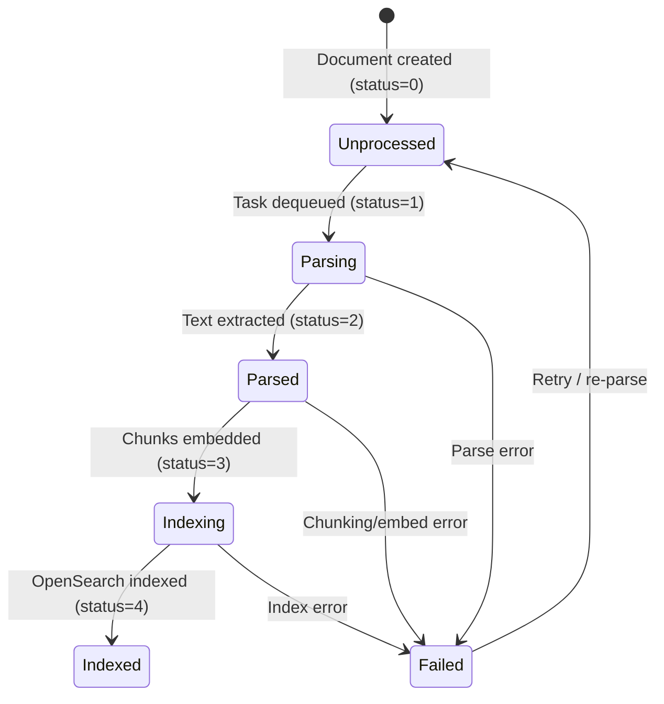
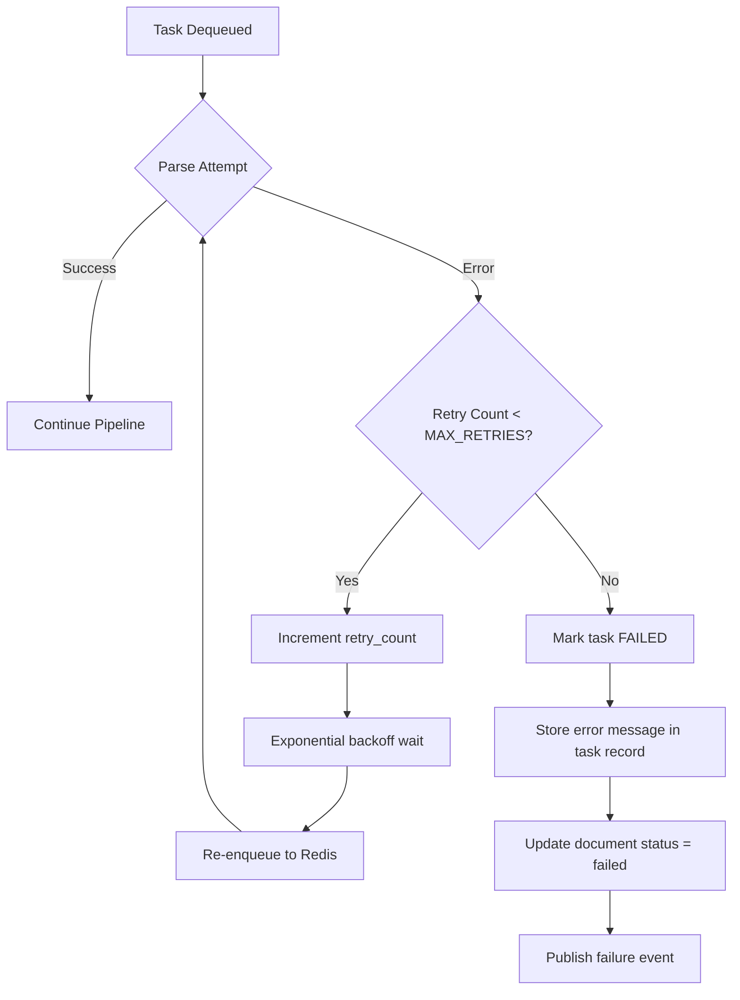

# Document Parsing — Detail Design

## Overview

The Task Executor (Python worker) polls Redis for parse tasks, extracts text from documents, applies chunking strategies, generates embeddings, and indexes chunks to OpenSearch. Progress is broadcast via Redis pub/sub.

## Parsing Sequence

## Task Executor Concurrency

The executor uses a **semaphore** to limit parallel task processing:

- **`MAX_CONCURRENT_TASKS=5`** — configurable via environment variable
- Each dequeued task acquires a semaphore slot before processing
- Slot is released on completion, failure, or timeout
- Prevents memory exhaustion from large document processing

## Document Status State Diagram

| Status Code | Name | Description |
|------------|------|-------------|
| 0 | Unprocessed | Uploaded but not yet parsed |
| 1 | Parsing | Text extraction in progress |
| 2 | Parsed | Text extracted, ready for embedding |
| 3 | Indexing | Embeddings generated, writing to OpenSearch |
| 4 | Indexed | Fully processed and searchable |
| -1 | Failed | Error occurred; check task error message |

## Progress Tracking

Progress is published to Redis pub/sub channels for real-time frontend updates:

| Channel Pattern | Example |
|----------------|---------|
| `task:progress:{taskId}` | `task:progress:abc-123` |

**Progress milestones:**

| Percentage | Stage | Description |
|-----------|-------|-------------|
| 0% | Started | Task dequeued, loading document |
| 10% | Parsed | Text/tables/images extracted from file |
| 50% | Chunked | Document split into chunks with metadata |
| 80% | Embedded | Vector embeddings generated for all chunks |
| 100% | Indexed | Chunks written to OpenSearch, task complete |

The frontend subscribes via SSE or polling to display a progress bar per document.

## Parser Selection by File Type

| File Type | Parser | Notes |
|----------|--------|-------|
| PDF | PyMuPDF / pdfplumber | Table detection, image extraction |
| DOCX | python-docx | Preserves headings and structure |
| XLSX/CSV | pandas | Each sheet/row becomes content |
| PPTX | python-pptx | Slide-by-slide extraction |
| HTML | BeautifulSoup | Strips tags, preserves structure |
| TXT/MD | Direct read | Minimal processing |
| Images | Vision model (OCR) | Sends to LLM for text extraction |
| Audio | Whisper / STT | Transcription to text |
| Code | Direct read | Language-aware splitting |

## Error Recovery

- **Max retries:** 3 (configurable via `MAX_TASK_RETRIES`)
- **Backoff:** Exponential — 5s, 25s, 125s
- **Error storage:** Full error message + stack trace stored in `task.error_message`
- **Manual retry:** User can trigger re-parse from the UI, which resets status to 0 and creates a new task

## Chunking Strategies

| Strategy | Description | Use Case |
|----------|-------------|----------|
| Recursive | Split by separators (`\n\n`, `\n`, `. `, ` `) with overlap | General documents |
| Fixed size | Split by character count with overlap | Uniform chunk sizes |
| Semantic | Split by meaning using embeddings | High-quality retrieval |
| Markdown | Split by heading hierarchy | Structured markdown docs |
| Table | Keep table rows together | Spreadsheets, CSVs |

Configuration per dataset: `chunk_method`, `chunk_size` (default 512), `chunk_overlap` (default 50).

## Key Files

| File | Purpose |
|------|---------|
| `advance-rag/rag/svr/task_executor.py` | Main task executor loop and concurrency |
| `advance-rag/rag/svr/parser/` | File-type-specific parsers |
| `advance-rag/rag/svr/chunk/` | Chunking strategy implementations |
| `advance-rag/rag/svr/embedding/` | Embedding model integration |
