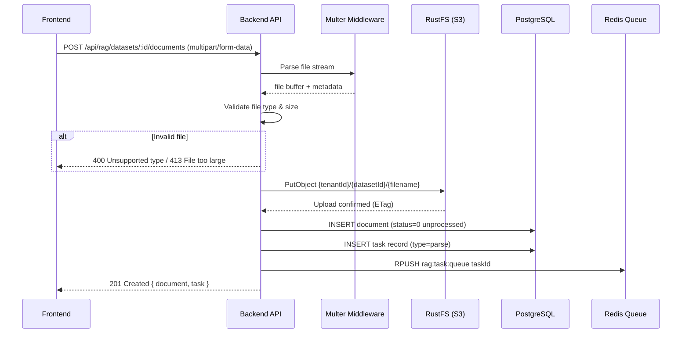
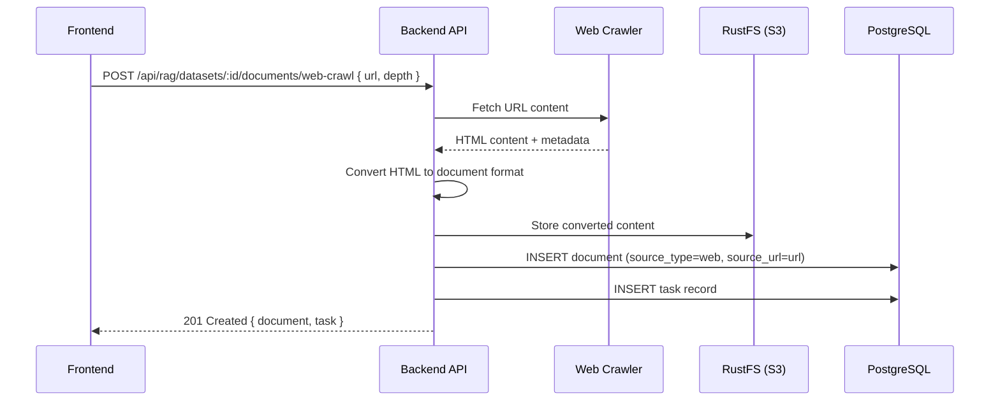

# Document Upload — Detail Design

## Overview

Documents are uploaded to a dataset via multipart/form-data, validated, stored in S3 (RustFS), and queued for asynchronous parsing. Alternative ingestion paths include web crawling and bulk operations.

## Upload Sequence



## S3 Path Convention

All files are stored under a tenant-scoped, dataset-scoped prefix:

```
{tenantId}/{datasetId}/{filename}
```

- `tenantId` — UUID of the tenant owning the dataset
- `datasetId` — UUID of the dataset (knowledge base)
- `filename` — Original filename, deduplicated with suffix if collision occurs

## Supported File Formats

| Category | Extensions | MIME Types |
|----------|-----------|------------|
| Documents | `.pdf`, `.docx`, `.doc` | `application/pdf`, `application/vnd.openxmlformats-officedocument.wordprocessingml.document` |
| Spreadsheets | `.xlsx`, `.xls`, `.csv` | `application/vnd.openxmlformats-officedocument.spreadsheetml.sheet`, `text/csv` |
| Presentations | `.pptx`, `.ppt` | `application/vnd.openxmlformats-officedocument.presentationml.presentation` |
| Text | `.txt`, `.md`, `.html`, `.htm` | `text/plain`, `text/markdown`, `text/html` |
| Data | `.json`, `.xml` | `application/json`, `application/xml` |
| Images | `.png`, `.jpg`, `.jpeg`, `.gif`, `.bmp`, `.webp`, `.svg`, `.tiff` | `image/*` |
| Audio | `.mp3`, `.wav`, `.flac`, `.m4a`, `.ogg` | `audio/*` |
| Code | `.py`, `.js`, `.ts`, `.java`, `.c`, `.cpp`, `.go`, `.rs` | `text/x-*` |

## Web Crawl Alternative



**Parameters:** `url` (required), optional depth for recursive crawling.

## Bulk Operations

| Operation | Endpoint | Description |
|-----------|----------|-------------|
| Bulk Parse | `POST /api/rag/datasets/:id/documents/bulk-parse` | Trigger parsing for multiple selected documents. Accepts `{ document_ids: string[] }`. Creates one task per document and enqueues all to Redis. |
| Bulk Toggle | `POST /api/rag/datasets/:id/documents/bulk-toggle` | Enable or disable multiple documents. Accepts `{ document_ids: string[], enabled: boolean }`. Updates `available_int` on all associated chunks in OpenSearch. |
| Bulk Delete | `DELETE /api/rag/datasets/:id/documents/bulk-delete` | Remove multiple documents. Accepts `{ document_ids: string[] }`. Deletes S3 objects, OpenSearch chunks, DB records, and cancels pending tasks. |

## Error Handling

| Error | HTTP Status | Cause | Resolution |
|-------|------------|-------|------------|
| File too large | 413 | Exceeds `MAX_FILE_SIZE` limit | Reject before upload; return size limit in error |
| Unsupported type | 400 | File extension or MIME not in allowed list | Return list of supported formats |
| S3 upload failure | 502 | RustFS unreachable or bucket misconfigured | Retry up to 3 times with exponential backoff; fail task if exhausted |
| Dataset not found | 404 | Invalid dataset ID or tenant mismatch | Validate dataset ownership before processing |
| Duplicate filename | 409 | Same filename already exists in dataset | Append timestamp suffix or reject based on config |

## Key Files

| File | Purpose |
|------|---------|
| `be/src/modules/rag/controllers/document.controller.ts` | Upload endpoint handler |
| `be/src/modules/rag/services/document.service.ts` | Upload orchestration, S3 interaction |
| `be/src/shared/services/s3.service.ts` | RustFS/S3 client wrapper |
| `advance-rag/rag/svr/task_executor.py` | Task dequeue and processing |
