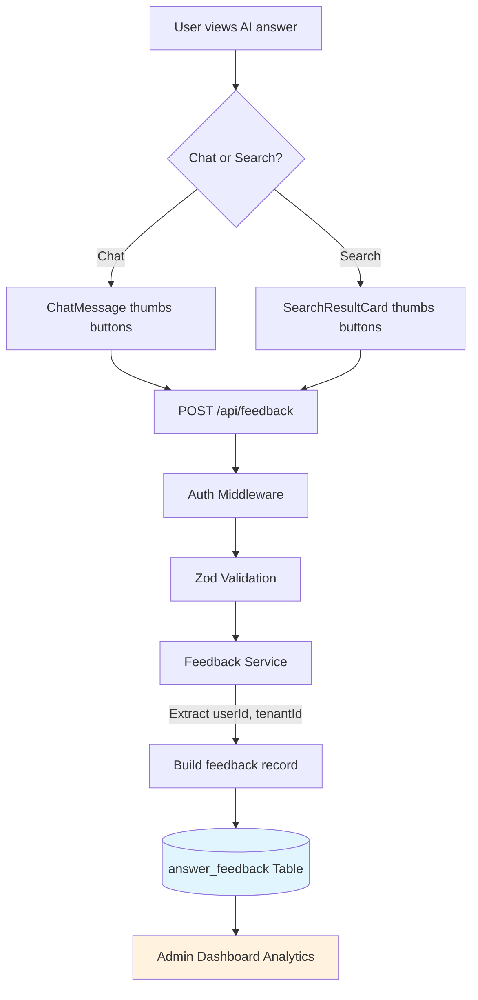
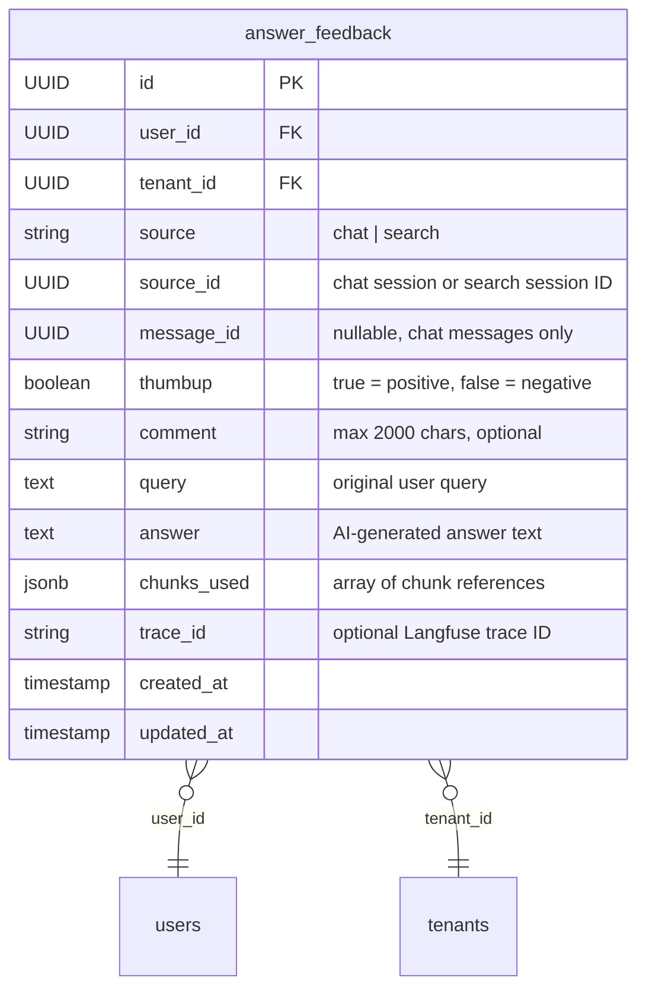
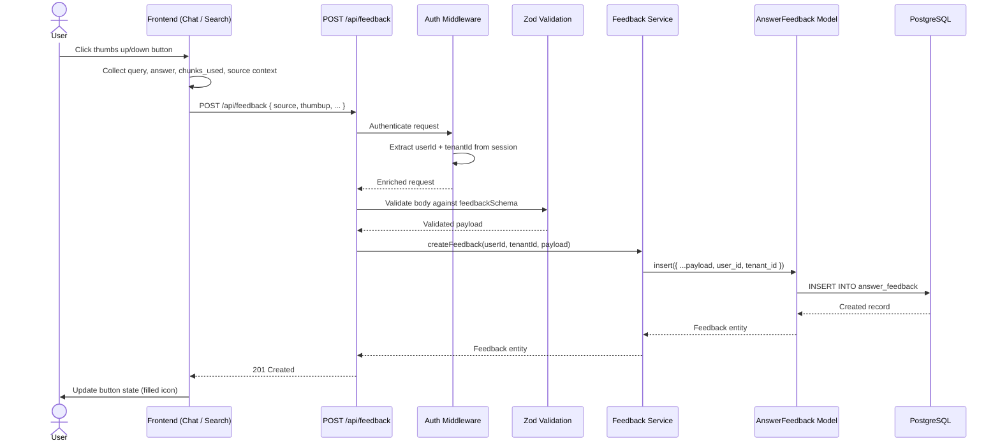

# Answer Feedback Detail Design

## Overview

The Answer Feedback module captures user evaluations (thumbs up/down with optional comments) on AI-generated answers from both Chat and Search sources. Each feedback entry is tied to a specific query, answer, and the chunk references used to generate that answer. This data enables quality analytics on the admin dashboard and supports model improvement over time.

## Feedback Submission Flow



## Data Model

### answer_feedback



| Field | Type | Constraints | Description |
|-------|------|-------------|-------------|
| id | UUID | PK, auto-generated | Primary key |
| user_id | UUID | NOT NULL, FK to users | User who submitted feedback |
| tenant_id | UUID | NOT NULL, FK to tenants | Tenant scope for multi-tenancy |
| source | string | NOT NULL, enum `chat` or `search` | Origin of the AI answer |
| source_id | UUID | NOT NULL | Chat session ID or search session ID |
| message_id | UUID | nullable | Specific chat message (chat source only) |
| thumbup | boolean | NOT NULL | `true` = positive, `false` = negative |
| comment | string | max 2000, nullable | Optional free-text explanation |
| query | text | NOT NULL | The user query that produced the answer |
| answer | text | NOT NULL | The AI-generated answer being evaluated |
| chunks_used | JSONB | NOT NULL, default `[]` | Array of `{chunk_id, doc_id, score}` references |
| trace_id | string | nullable | Langfuse trace ID for observability correlation |
| created_at | timestamp | NOT NULL, default now() | Record creation time |
| updated_at | timestamp | NOT NULL, default now() | Record update time |

### chunks_used JSONB Structure

```json
[
  { "chunk_id": "uuid", "doc_id": "uuid", "score": 0.92 },
  { "chunk_id": "uuid", "doc_id": "uuid", "score": 0.87 }
]
```

## API Endpoints

| Method | Path | Auth | Description |
|--------|------|------|-------------|
| POST | `/api/feedback` | requireAuth | Submit feedback on an AI answer |

### POST /api/feedback

**Request Body (Zod-validated):**

| Field | Type | Required | Validation |
|-------|------|----------|------------|
| source | string | yes | `z.enum(['chat', 'search'])` |
| source_id | string | yes | `z.string().uuid()` |
| message_id | string | no | `z.string().uuid().optional()` |
| thumbup | boolean | yes | `z.boolean()` |
| comment | string | no | `z.string().max(2000).optional()` |
| query | string | yes | `z.string().min(1)` |
| answer | string | yes | `z.string().min(1)` |
| chunks_used | array | yes | `z.array(chunkRefSchema).default([])` |
| trace_id | string | no | `z.string().optional()` |

**Response:** `201 Created` with the created feedback record.

## Submission Sequence



## Step-by-Step Detail

### 1. User Interaction (Frontend)

Both Chat and Search UIs render thumbs up/down buttons alongside each AI-generated answer. When clicked:

1. The frontend collects contextual data: `source`, `source_id`, `message_id` (chat only), the original `query`, the `answer` text, and the `chunks_used` array from the response metadata.
2. An optional comment dialog may appear for the user to elaborate.
3. The frontend fires `POST /api/feedback` with the assembled payload.

### 2. Authentication and Validation (Backend)

1. `requireAuth` middleware verifies the session and attaches `userId` and `tenantId` to the request context.
2. The `validate()` middleware runs the request body through the Zod `feedbackSchema`, rejecting malformed input with a `400` response.

### 3. Service Layer

1. `FeedbackService.createFeedback()` receives the validated payload plus auth context.
2. It constructs the full record including `user_id` and `tenant_id` from the auth context.
3. It delegates to `AnswerFeedbackModel.insert()` for persistence.

### 4. Model Layer

The `AnswerFeedbackModel` follows the Factory Pattern via `ModelFactory` and provides:

| Method | Description |
|--------|-------------|
| `insert(data)` | Create a new feedback record |
| `findBySource(source, sourceId)` | Query feedback by source type and session ID |
| `findByUser(userId)` | Query all feedback submitted by a specific user |
| `findByTenant(tenantId, filters)` | Tenant-scoped query for admin dashboard |

### 5. Analytics Integration

Feedback records are consumed by the admin dashboard to display:

- **Thumbs up/down ratio** per time period, source type, or dataset.
- **Trending negative feedback** to surface quality issues.
- **Per-chunk scoring** by correlating `chunks_used` with feedback polarity to identify low-quality chunks.

## Key Files

| File | Purpose |
|------|---------|
| `be/src/modules/feedback/controllers/feedback.controller.ts` | Route handler for POST /api/feedback |
| `be/src/modules/feedback/services/feedback.service.ts` | Business logic, auth context extraction |
| `be/src/modules/feedback/schemas/feedback.schemas.ts` | Zod validation schemas |
| `be/src/modules/feedback/models/answer-feedback.model.ts` | Knex model with findBySource, findByUser |
| `be/src/modules/feedback/routes/feedback.routes.ts` | Express router with requireAuth + validate |
| `fe/src/features/chat/components/ChatMessage.tsx` | Thumbs up/down buttons on chat answers |
| `fe/src/features/search/components/SearchResultCard.tsx` | Thumbs up/down buttons on search answers |
