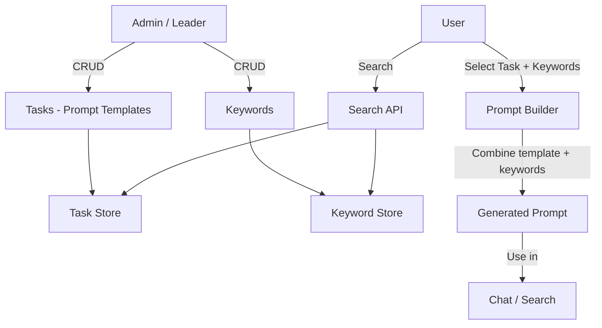
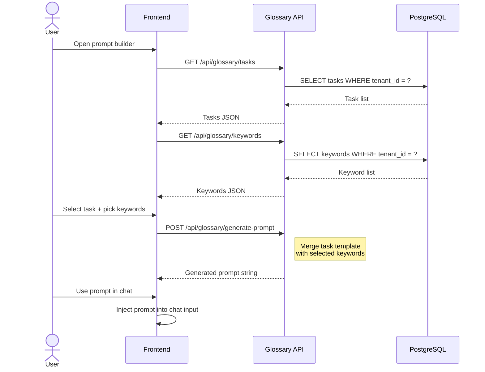
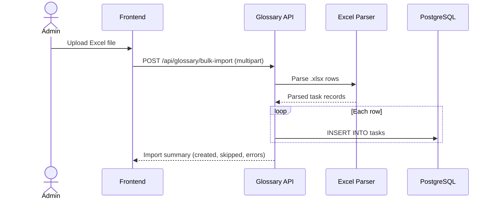

# Glossary & Prompt Builder Detail Design

## Overview

The Glossary module provides a managed library of **Tasks** (prompt templates) and **Keywords** that users combine to generate structured prompts for chat and search. Admins and leaders maintain the glossary; all authenticated users consume it.

## Architecture

## Data Model

### Task (Prompt Template)

| Field | Type | Description |
|-------|------|-------------|
| id | UUID | Primary key |
| name_en | string | English name |
| name_vi | string | Vietnamese name |
| name_ja | string | Japanese name |
| description | text | Template description |
| template | text | Prompt template with placeholders |
| category | string | Grouping category |
| tenant_id | UUID | Owning tenant |
| created_at | timestamp | Creation time |
| updated_at | timestamp | Last update |

### Keyword

| Field | Type | Description |
|-------|------|-------------|
| id | UUID | Primary key |
| keyword | string | The keyword term |
| description | text | Meaning and usage context |
| tenant_id | UUID | Owning tenant |
| created_at | timestamp | Creation time |

## API Endpoints

### Task CRUD

| Method | Path | Description |
|--------|------|-------------|
| POST | `/api/glossary/tasks` | Create task (admin/leader) |
| GET | `/api/glossary/tasks` | List tasks with pagination |
| GET | `/api/glossary/tasks/:id` | Get single task |
| PUT | `/api/glossary/tasks/:id` | Update task (admin/leader) |
| DELETE | `/api/glossary/tasks/:id` | Delete task (admin/leader) |

### Keyword CRUD

| Method | Path | Description |
|--------|------|-------------|
| POST | `/api/glossary/keywords` | Create keyword (admin/leader) |
| GET | `/api/glossary/keywords` | List keywords with pagination |
| PUT | `/api/glossary/keywords/:id` | Update keyword (admin/leader) |
| DELETE | `/api/glossary/keywords/:id` | Delete keyword (admin/leader) |

### Prompt Builder & Search

| Method | Path | Description |
|--------|------|-------------|
| POST | `/api/glossary/generate-prompt` | Combine task + keywords into prompt |
| GET | `/api/glossary/search` | Full-text search across tasks and keywords |

### Bulk Import

| Method | Path | Description |
|--------|------|-------------|
| POST | `/api/glossary/bulk-import` | Import tasks from Excel file |
| POST | `/api/glossary/keywords/bulk-import` | Import keywords from Excel file |

## Prompt Generation Flow

## Bulk Import Flow

## Search

`GET /api/glossary/search?q=<term>` performs full-text search across both tasks and keywords, returning a combined result set ranked by relevance. The search matches against task names (all locales), descriptions, and keyword terms.

## Permissions

| Role | Capabilities |
|------|-------------|
| Admin / Leader | Full CRUD on tasks and keywords, bulk import |
| Authenticated User | Search, list, generate prompts |
| Unauthenticated | No access |

## Key Files

| File | Purpose |
|------|---------|
| `be/src/modules/glossary/` | Module root |
| `be/src/modules/glossary/glossary.controller.ts` | Route handlers |
| `be/src/modules/glossary/glossary.service.ts` | Business logic |
| `be/src/modules/glossary/glossary.model.ts` | Knex model |
| `be/src/modules/glossary/glossary.validation.ts` | Zod schemas |
| `fe/src/features/glossary/` | Frontend feature |
