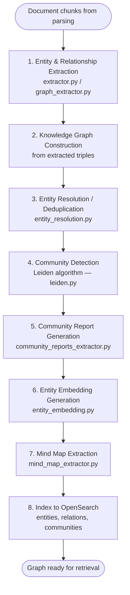
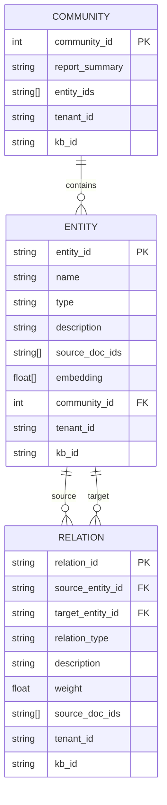
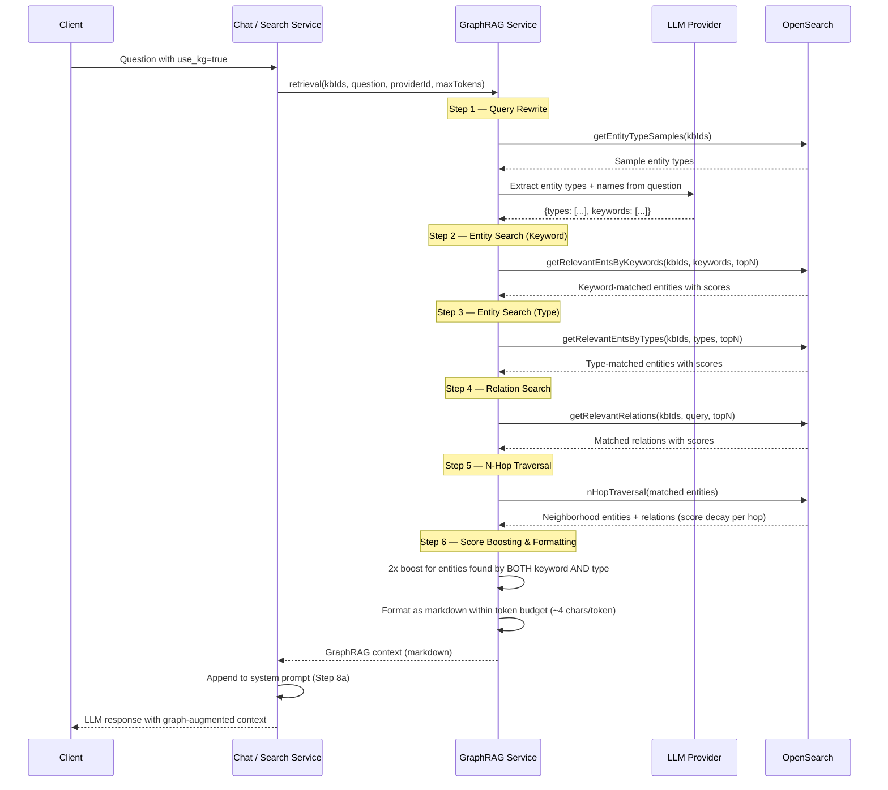

# GraphRAG — Knowledge Graph Building & Retrieval — Detail Design

## Overview

GraphRAG builds and queries knowledge graphs from document content. The Python advance-rag worker constructs graphs during document processing (entity extraction, community detection, embeddings), while the Node.js backend queries them during chat and search retrieval. A lightweight variant reduces LLM calls for cost-sensitive deployments.

## Graph Building Pipeline

### Step 1 — Entity & Relationship Extraction

An LLM processes each chunk to extract structured triples: `(source_entity, relation, target_entity)`. The extractor prompts the model to identify named entities (people, organizations, concepts, etc.) and the relationships between them, returning typed nodes and edges.

| Aspect | Detail |
|--------|--------|
| Input | Document chunk text |
| Output | List of `(entity, relation, entity)` triples with types and descriptions |
| LLM usage | One call per chunk (or batch of chunks) |
| Files | `extractor.py`, `graph_extractor.py` |

### Step 2 — Knowledge Graph Construction

Extracted triples are assembled into an in-memory graph structure. Duplicate entity names are merged, and edge weights accumulate when the same relationship appears across multiple chunks.

### Step 3 — Entity Resolution / Deduplication

An LLM-based pass identifies semantically equivalent entities (e.g., "JS" and "JavaScript") and merges them. This reduces graph noise and improves retrieval precision.

| Aspect | Detail |
|--------|--------|
| Strategy | LLM judges entity equivalence using names + descriptions |
| File | `entity_resolution.py` |

### Step 4 — Community Detection (Leiden Algorithm)

The Leiden algorithm partitions the graph into communities — densely connected subgraphs representing topical clusters. Each community receives an integer ID.

| Aspect | Detail |
|--------|--------|
| Algorithm | Leiden (iterative refinement of Louvain) |
| Output | Community assignments for every entity |
| File | `leiden.py` |

### Step 5 — Community Report Generation

An LLM generates a natural-language summary for each community. Reports describe the key entities, their relationships, and the overall topic of the cluster.

| Aspect | Detail |
|--------|--------|
| Input | All entities and relations within a community |
| Output | Summary text stored as community report |
| File | `community_reports_extractor.py` |

### Step 6 — Entity Embedding Generation

Each entity's description text is embedded using the dataset's configured embedding model. Vectors are stored alongside entities in OpenSearch for semantic retrieval.

| Aspect | Detail |
|--------|--------|
| Input | Entity descriptions |
| Output | Dense vectors per entity |
| File | `entity_embedding.py` |

### Step 7 — Mind Map Extraction

A hierarchical mind map structure is extracted from the graph, providing a navigable overview of document content for the frontend visualization.

| Aspect | Detail |
|--------|--------|
| Output | Tree structure with topic nodes and leaf concepts |
| File | `mind_map_extractor.py` |

## Lightweight GraphRAG Variant

The `rag/graphrag/light/` module provides a reduced-cost alternative with fewer LLM calls:

| Aspect | General | Light |
|--------|---------|-------|
| Extraction prompts | Full multi-step | Simplified single-pass |
| Entity resolution | LLM-based | Heuristic / skipped |
| Community reports | LLM-generated | Abbreviated or skipped |
| Cost | Higher (more LLM calls) | Lower |
| Quality | Higher fidelity graph | Acceptable for smaller datasets |

## Data Model

### OpenSearch Index Structure

| Index | Key Fields | Purpose |
|-------|-----------|---------|
| Entities | `name`, `type`, `description`, `embedding`, `community_id`, `kb_id` | Entity storage and search |
| Relations | `source_entity_id`, `target_entity_id`, `relation_type`, `description`, `kb_id` | Relationship storage and search |
| Communities | `community_id`, `report_summary`, `entity_ids`, `kb_id` | Community report storage |

## Retrieval Pipeline

### Retrieval Functions

| Function | Purpose |
|----------|---------|
| `queryRewrite(kbIds, question, providerId)` | LLM extracts entity types and names from the question |
| `getEntityTypeSamples(kbIds)` | Fetches entity type examples for the rewrite prompt |
| `getRelevantEntsByKeywords(kbIds, keywords, topN)` | Hybrid text search for entities by keyword |
| `getRelevantEntsByTypes(kbIds, types, topN)` | Filters entities by extracted type |
| `getRelevantRelations(kbIds, query, topN)` | Text search across relations |
| `nHopTraversal(entities)` | Traverses N-hop neighborhood with score decay |
| `retrieval(kbIds, question, providerId, maxTokens)` | Full pipeline orchestrator (default `maxTokens=2048`) |
| `getGraphMetrics(kbIds)` | Returns entity/relation/community counts |
| `clearGraphData(kbIds)` | Deletes all graph data for given KBs before rebuild |

### Score Boosting

Entities discovered by both keyword search (Step 2) and type search (Step 3) receive a **2x score multiplier**. This rewards entities that match the question on multiple dimensions, improving precision.

### Token Budget

The formatted markdown output is constrained to `maxTokens` (default 2048). Assuming ~4 characters per token, the service truncates context at approximately `maxTokens * 4` characters to avoid exceeding the LLM's context window.

## Integration Points

| Integration | Trigger | Behavior |
|-------------|---------|----------|
| Chat completion | `prompt_config.use_kg = true` | GraphRAG context appended to system prompt at Step 8a |
| Deep Research | Reasoning mode enabled | GraphRAG context included in initial retrieval context |
| Frontend — Dataset detail | KnowledgeGraphTab component | Displays entity/relation graph and metrics |
| Frontend — Search | SearchMindMapDrawer component | Renders mind map visualization from graph data |

## Key Files

| File | Purpose |
|------|---------|
| `advance-rag/rag/graphrag/general/index.py` | Graph building pipeline orchestrator |
| `advance-rag/rag/graphrag/general/extractor.py` | Entity/relationship extraction |
| `advance-rag/rag/graphrag/general/graph_extractor.py` | Graph construction from triples |
| `advance-rag/rag/graphrag/general/community_reports_extractor.py` | Community summary generation |
| `advance-rag/rag/graphrag/general/leiden.py` | Leiden community detection |
| `advance-rag/rag/graphrag/general/entity_embedding.py` | Entity vector embedding |
| `advance-rag/rag/graphrag/general/mind_map_extractor.py` | Mind map structure extraction |
| `advance-rag/rag/graphrag/entity_resolution.py` | Entity deduplication |
| `advance-rag/rag/graphrag/search.py` | Graph search utilities |
| `advance-rag/rag/graphrag/light/` | Lightweight variant (reduced LLM calls) |
| `be/src/modules/rag/services/rag-graphrag.service.ts` | Node.js retrieval service |
| `fe/src/features/datasets/components/KnowledgeGraphTab.tsx` | Dataset graph visualization |
| `fe/src/features/search/components/SearchMindMapDrawer.tsx` | Search mind map drawer |
