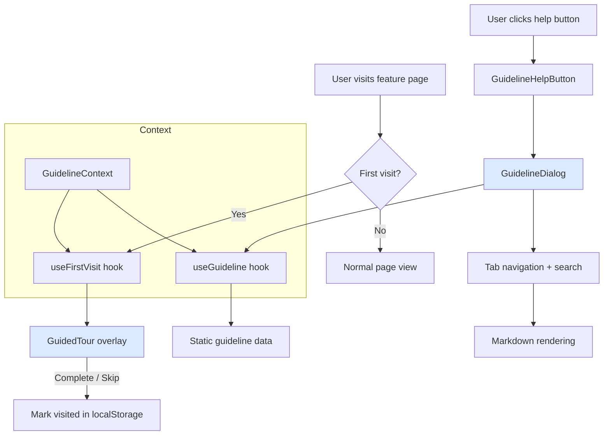
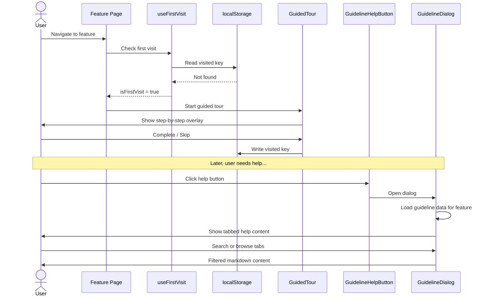

# Guideline & Onboarding Detail Design

## Overview

The Guideline & Onboarding module is a frontend-only feature providing in-app guided tours and searchable help documentation for each major feature area. All guideline data is static and bundled with the frontend — no backend API is required.

## Architecture



## Component Architecture

```mermaid
flowchart TD
    subgraph Feature Page
        HB[GuidelineHelpButton]
        GT[GuidedTour]
    end

    subgraph GuidelineDialog
        TABS[Tabbed Interface]
        SEARCH[Full-text Search]
        MD[Markdown Renderer]
        TABS --> MD
        SEARCH --> TABS
    end

    subgraph Hooks
        UG[useGuideline]
        UFV[useFirstVisit]
        UGT[useGuidedTour]
        UGC[useGuidelineContext]
    end

    subgraph Static Data
        D1[ai-chat.guideline.ts]
        D2[ai-search.guideline.ts]
        D3[audit.guideline.ts]
        D4[broadcast.guideline.ts]
        D5[kb-config.guideline.ts]
        D6[Other guideline files...]
    end

    HB -->|Opens| GuidelineDialog
    GT -->|Tour state| UGT
    UGT -->|First visit check| UFV
    UFV -->|Read/write| LS[(localStorage)]
    UGC -->|Provides context| GT
    UGC -->|Provides context| HB
    UG -->|Maps feature ID| Static Data
    GuidelineDialog -->|Loads content| UG
```

## Guided Tour (react-joyride)

The guided tour provides a step-by-step onboarding overlay that highlights specific DOM elements when a user visits a feature for the first time.

| Property | Value |
|----------|-------|
| Library | react-joyride |
| Spotlight | Blue effect, z-index 10000 |
| Navigation | Next / Previous / Skip buttons |
| Localization | Tour steps support i18n (en, vi, ja) |
| Trigger | Automatic on first visit (localStorage-based) |
| Callback | Fires on completion or skip |

### First-Visit Detection

The `useFirstVisit` hook checks localStorage for a per-feature key. If no key exists, the tour starts automatically. On completion or skip, the key is written to prevent repeat tours.

```
localStorage key format: b-knowledge:visited:<featureId>
```

## Guideline Dialog

The dialog provides searchable, tabbed help documentation rendered from static guideline data.

### Tabbed Interface

| Tab | Content |
|-----|---------|
| Overview | General feature description and purpose |
| Feature guides | Step-by-step instructions with numbered steps |

### Search Behavior

Full-text search filters across three fields:
- Tab titles
- Step descriptions
- Step details

Results update in real-time as the user types. State resets when the dialog opens or the active feature changes.

### Role-Based Visibility

Guideline content respects the role hierarchy. Steps tagged with a minimum role are hidden from users below that level.

| Role | Visible Content |
|------|----------------|
| user | User-level guides only |
| leader | User + leader guides |
| admin | All guides |

### Markdown Rendering

Guideline content supports GitHub Flavored Markdown (GFM) including tables, code blocks, and inline formatting. Content is rendered inside a scrollable container with step numbering.

## Static Guideline Data

Each feature has a dedicated guideline file bundled with the frontend build. Files export a typed guideline object containing tabs, steps, and metadata.

| File | Feature |
|------|---------|
| `ai-chat.guideline.ts` | AI Chat |
| `ai-search.guideline.ts` | AI Search |
| `audit.guideline.ts` | Audit Logging |
| `broadcast.guideline.ts` | Broadcast Messages |
| `global-histories.guideline.ts` | Global Histories |
| `kb-config.guideline.ts` | Knowledge Base Configuration |
| `kb-prompts.guideline.ts` | Knowledge Base Prompts |
| `teams.guideline.ts` | Team Management |
| `users.guideline.ts` | User Management |

## Hooks

| Hook | Purpose |
|------|---------|
| `useGuideline` | Maps a feature ID to its corresponding static guideline object |
| `useFirstVisit` | Reads/writes localStorage to detect first-time visits per feature |
| `useGuidedTour` | Manages tour state (active step, running status, callbacks) |
| `useGuidelineContext` | Provides React context for sharing guideline state across components |

## Interaction Sequence



## Key Files

| File | Purpose |
|------|---------|
| `fe/src/features/guideline/components/GuidedTour.tsx` | react-joyride wrapper with spotlight and localization |
| `fe/src/features/guideline/components/GuidelineDialog.tsx` | Tabbed help dialog with search and markdown rendering |
| `fe/src/features/guideline/components/GuidelineHelpButton.tsx` | Trigger button to open the guideline dialog |
| `fe/src/features/guideline/hooks/useGuideline.ts` | Feature-to-guideline mapping hook |
| `fe/src/features/guideline/hooks/useFirstVisit.ts` | localStorage-based first visit detection |
| `fe/src/features/guideline/hooks/useGuidedTour.ts` | Tour state management hook |
| `fe/src/features/guideline/data/*.guideline.ts` | Static guideline content per feature |
