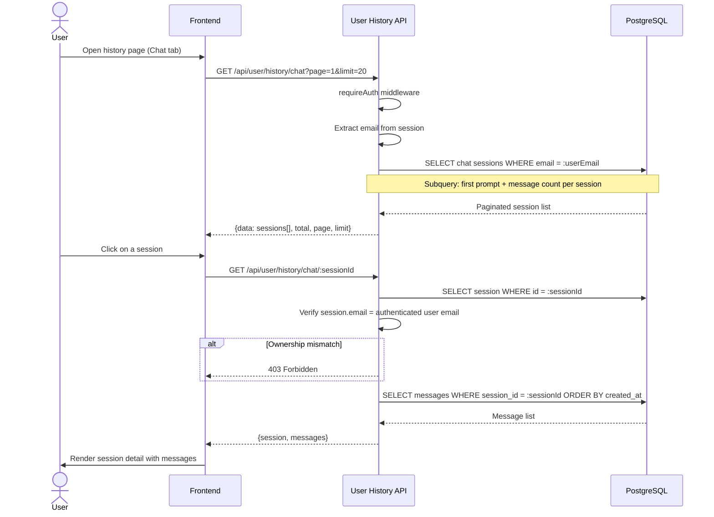
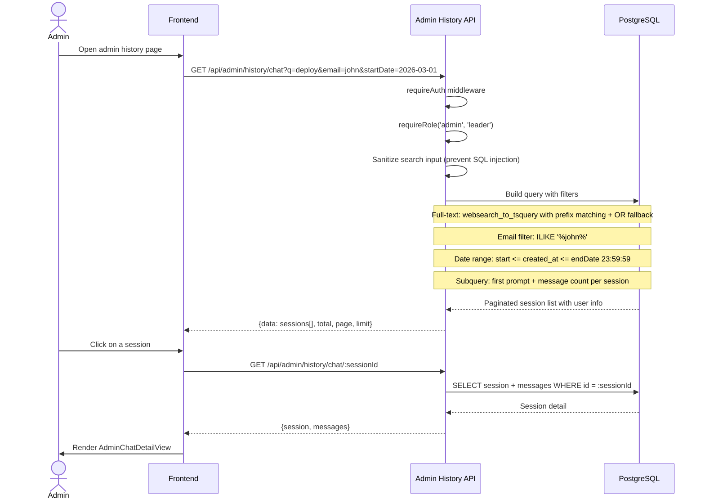
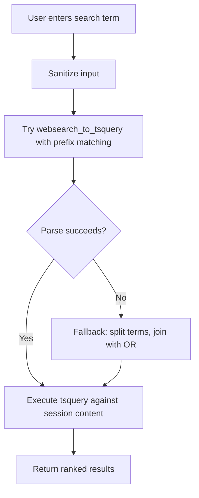
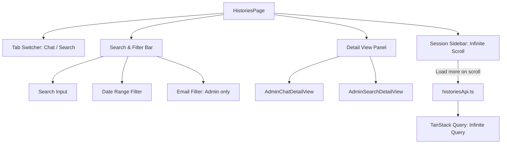

# History Browsing: Detail Design

## Overview

Provides two levels of session history browsing: user-level (own sessions only) and admin-level (all users' sessions). Covers both chat and search session types with full-text search, filtering, and pagination.

## API Endpoints

### User History (requireAuth)

| Method | Path | Description |
|--------|------|-------------|
| GET | `/api/user/history/chat` | Paginated chat sessions for authenticated user |
| GET | `/api/user/history/chat/:sessionId` | Chat session messages (ownership verified) |
| GET | `/api/user/history/search` | Paginated search sessions for authenticated user |
| GET | `/api/user/history/search/:sessionId` | Search session records (ownership verified) |

### Admin History (requireRole('admin', 'leader'))

| Method | Path | Description |
|--------|------|-------------|
| GET | `/api/admin/history/chat` | All chat sessions across users |
| GET | `/api/admin/history/chat/:sessionId` | Chat session detail with messages |
| GET | `/api/admin/history/search` | All search sessions across users |
| GET | `/api/admin/history/search/:sessionId` | Search session detail with records |
| GET | `/api/admin/history/system-chat` | System-level chat with aggregated messages as JSON |

### Common Query Parameters

| Param | Type | Default | Description |
|-------|------|---------|-------------|
| `q` | string | — | Full-text search term |
| `startDate` | ISO date | — | Filter sessions from this date (inclusive) |
| `endDate` | ISO date | — | Filter sessions up to this date (inclusive, extended to 23:59:59) |
| `page` | number | 1 | Page number |
| `limit` | number | 20 | Results per page |
| `email` | string | — | Admin only: partial, case-insensitive email filter |

## User History Flow

## Admin History Flow

## Full-Text Search Strategy

### Search Sanitization

| Step | Action |
|------|--------|
| 1 | Strip special PostgreSQL tsquery characters |
| 2 | Trim and normalize whitespace |
| 3 | Apply `websearch_to_tsquery` for natural language parsing |
| 4 | On parse failure, split into individual terms joined with OR operator |
| 5 | Append prefix matching (`:*`) for partial word matches |

## Filtering Logic

### Date Range

- `startDate`: Inclusive lower bound on `created_at`
- `endDate`: Extended to `23:59:59.999` of the given date for inclusive upper bound
- Both optional; when omitted, no date constraint is applied

### Email Filter (Admin Only)

- Case-insensitive partial match using `ILIKE '%value%'`
- Applied against the session owner's email field

### Ownership Verification (User Only)

- All user-level endpoints filter by the authenticated user's email
- Session detail endpoints verify `session.email = req.user.email` before returning data
- Returns `403 Forbidden` on ownership mismatch

## Session Query Structure

Each session list query uses subqueries to enrich results:

| Subquery | Purpose |
|----------|---------|
| First prompt | Extracts the first user message as session preview text |
| Message count | Counts total messages/records per session |

The `system-chat` admin endpoint additionally aggregates all messages into a JSON array within the query result for bulk export scenarios.

## Frontend Architecture

### Component Responsibilities

| Component | Responsibility |
|-----------|---------------|
| `HistoriesPage` | Top-level layout with tab switcher, sidebar, and detail panel |
| Tab Switcher | Toggles between chat and search session lists |
| Session Sidebar | Infinite-scrolling list of sessions with preview text |
| Search & Filter Bar | Full-text search input, date range picker, email filter (admin) |
| `AdminChatDetailView` | Renders full chat message thread for a selected session |
| `AdminSearchDetailView` | Renders search query and result records for a selected session |

## Role Restrictions

| Endpoint Group | Required Auth |
|----------------|--------------|
| `/api/user/history/*` | requireAuth (any authenticated user) |
| `/api/admin/history/*` | requireRole('admin', 'leader') |

## Key Files

| File | Purpose |
|------|---------|
| `be/src/modules/user-history/user-history.controller.ts` | Route handlers for user history endpoints |
| `be/src/modules/user-history/user-history.service.ts` | Query building, pagination, ownership checks |
| `be/src/modules/user-history/user-history.routes.ts` | Route definitions with requireAuth middleware |
| `be/src/modules/admin/controllers/admin-history.controller.ts` | Route handlers for admin history endpoints |
| `be/src/modules/admin/services/admin-history.service.ts` | Cross-user queries, full-text search, aggregation |
| `be/src/modules/admin/routes/admin-history.routes.ts` | Route definitions with requireRole middleware |
| `fe/src/features/histories/pages/HistoriesPage.tsx` | Main history browsing page with tabs and sidebar |
| `fe/src/features/histories/api/historiesApi.ts` | API client for history endpoints |
