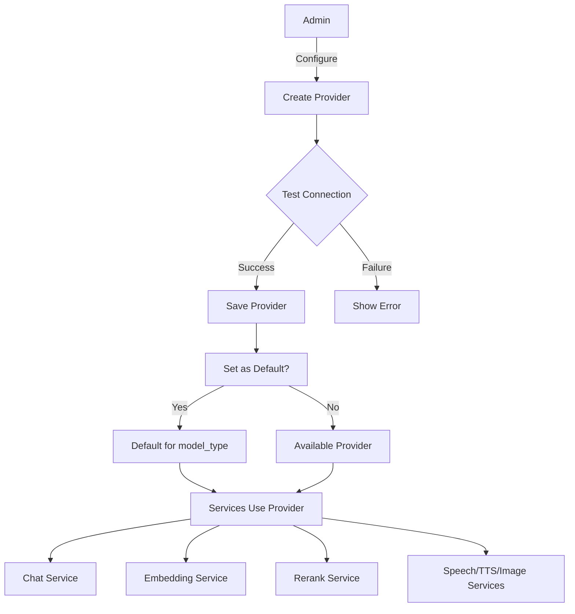
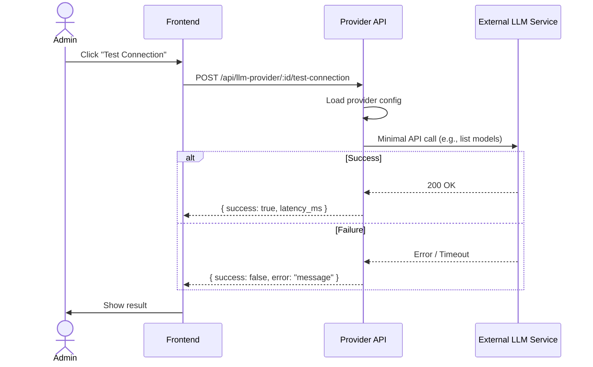
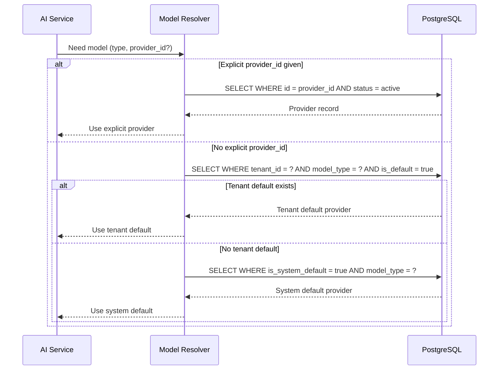

# LLM Provider Management Detail Design

## Overview

The LLM Provider module manages connections to external AI model services. Admins configure providers, test connections, and set defaults. All AI-consuming services resolve models through a priority chain: explicit provider ID, tenant default, then system default.

## Architecture

## Model Types

| Type | Purpose | Example Providers |
|------|---------|-------------------|
| `chat` | Conversational LLM | OpenAI GPT, Azure OpenAI, Anthropic |
| `embedding` | Text embeddings for RAG | OpenAI Ada, Jina, Cohere |
| `rerank` | Re-ranking search results | Cohere Rerank, Jina Rerank |
| `speech2text` | Audio transcription | OpenAI Whisper, Azure Speech |
| `tts` | Text-to-speech | OpenAI TTS, Azure Speech |
| `image2text` | Image understanding | OpenAI Vision, Azure Vision |

## API Endpoints

### Provider CRUD

| Method | Path | Description |
|--------|------|-------------|
| POST | `/api/llm-provider` | Create provider |
| GET | `/api/llm-provider` | List providers for tenant |
| GET | `/api/llm-provider/:id` | Get provider details |
| PUT | `/api/llm-provider/:id` | Update provider config |
| DELETE | `/api/llm-provider/:id` | Soft delete (set status=inactive) |

### Operations

| Method | Path | Description |
|--------|------|-------------|
| POST | `/api/llm-provider/:id/test-connection` | Test API connectivity |
| GET | `/api/llm-provider/defaults` | Get default provider per model_type |
| GET | `/api/llm-provider/presets` | Factory preset configurations |
| GET | `/api/models` | Public model list for authenticated users |

## Connection Test Flow

## Model Resolution Chain

When a service needs an LLM model, it resolves through a priority chain.

## Factory Presets

`GET /api/llm-provider/presets` returns built-in configurations for common providers:

| Preset | Base URL | Models |
|--------|----------|--------|
| OpenAI | `https://api.openai.com/v1` | gpt-4o, gpt-4o-mini, text-embedding-3-small |
| Azure OpenAI | `https://{resource}.openai.azure.com` | Deployment-based |
| Jina | `https://api.jina.ai/v1` | jina-embeddings-v3, jina-reranker-v2 |
| Cohere | `https://api.cohere.ai/v2` | embed-english-v3.0, rerank-v3.5 |

Presets pre-fill the create form; the admin still provides API keys and customizes settings.

## Soft Delete

`DELETE /api/llm-provider/:id` sets `status = 'inactive'` rather than removing the record. This preserves referential integrity with historical chat sessions and search logs that reference the provider.

## Public Model List

`GET /api/models` returns available models across all active providers for the tenant. Used by chat configuration and search app setup UIs to let users pick models without needing provider admin access.

## Key Files

| File | Purpose |
|------|---------|
| `be/src/modules/llm-provider/` | Module root |
| `be/src/modules/llm-provider/llm-provider.controller.ts` | Route handlers |
| `be/src/modules/llm-provider/llm-provider.service.ts` | Business logic, resolution chain |
| `be/src/modules/llm-provider/llm-provider.model.ts` | Knex model (tenant_llm table) |
| `be/src/modules/llm-provider/llm-provider.validation.ts` | Zod schemas |
| `fe/src/features/llm-provider/` | Frontend feature |
