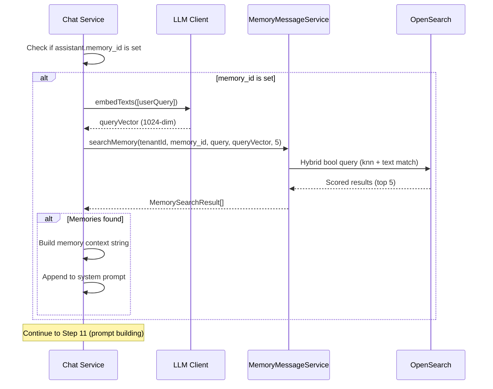
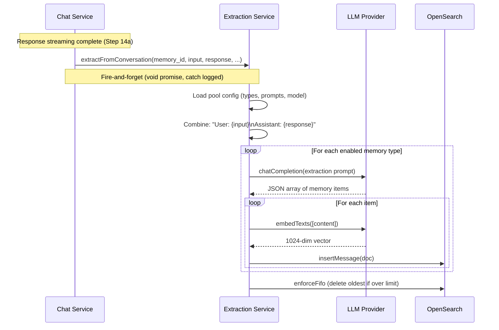
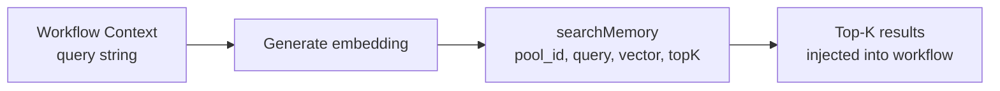

# Memory-Chat Integration: Detail Design

## Overview

The Memory system integrates with the Chat completion pipeline at two key points: **recall** (Step 10b) where relevant memories are injected into the system prompt before LLM generation, and **extraction** (Step 14b) where conversation turns are processed into structured memories after the response is streamed. Both operations are designed to be non-blocking — memory failures never break the chat response.

## Integration Architecture

```mermaid
flowchart TD
    subgraph "Chat Completion Pipeline"
        INPUT[User Message] --> STEP1["Steps 1-10a:<br/>Query refinement, retrieval"]
        STEP1 --> RECALL["Step 10b: Memory Recall<br/>(if assistant.memory_id set)"]
        RECALL --> PROMPT["Step 11: Build system prompt<br/>+ memory context"]
        PROMPT --> GENERATE["Steps 12-14a:<br/>LLM generation, streaming"]
        GENERATE --> EXTRACT["Step 14b: Memory Extraction<br/>(fire-and-forget)"]
    end

    subgraph "Memory System"
        RECALL -->|Search| OS[(OpenSearch<br/>memory_{tenantId})]
        EXTRACT -->|Extract + Store| OS
        RECALL -->|Embed query| LLM[LLM Provider]
        EXTRACT -->|Extract items| LLM
        EXTRACT -->|Embed items| LLM
    end
```

## Step 10b: Memory Recall (Before Generation)

### Trigger Condition

Memory recall activates when `assistant.memory_id` is set on the chat assistant configuration. This field links the assistant to a specific memory pool.

### Recall Flow



### Memory Context Injection

When memories are found, they are formatted and appended to the system prompt:

```typescript
// Build memory context from search results
if (memories.length > 0) {
  memoryContext = `\n\nRelevant memories:\n${memories.map(m => '- ' + m.content).join('\n')}`
}

// Inject into system prompt (Step 11)
const langAwarePrompt = `${langInstruction}\n\n${systemPrompt}${memoryContext}`
```

**Example injected context:**
```
Relevant memories:
- User prefers dark mode and compact layout
- The project uses PostgreSQL 17 with Knex ORM
- Last deployment was on March 20, 2026 with zero downtime
```

### Recall Configuration

| Parameter | Value | Source |
|-----------|-------|--------|
| Top-K results | 5 | Hardcoded in chat service |
| Vector weight | 0.7 | Default from `searchMemory()` |
| Text weight | 0.3 | Complement of vector weight |
| Status filter | `status=1` (active only) | `searchMemory()` filter |

### Embedding Fallback

The recall step attempts to reuse an existing query vector (if generated during retrieval steps). If no vector is available, it generates one:

```typescript
let memoryQueryVector: number[] = []
if (queryVector) {
  // Reuse vector from retrieval pipeline
  memoryQueryVector = queryVector
} else {
  try {
    // Generate fresh embedding
    const vecs = await llmClientService.embedTexts([content])
    memoryQueryVector = vecs[0] ?? []
  } catch {
    // Embedding failed — will fall back to text-only memory search
  }
}
```

If embedding fails entirely, `searchMemory()` receives an empty vector and falls back to text-only (BM25) search.

### Error Handling (Graceful Degradation)

```typescript
try {
  // ... memory search logic
} catch (err) {
  // Memory search failure must not break chat — graceful degradation
  log.warn('Memory search failed, continuing without memories', {
    memoryId: assistant.memory_id,
    error: err instanceof Error ? err.message : String(err),
  })
}
```

Memory recall failures are **logged but never thrown**. The chat continues without memory context.

## Step 14b: Memory Extraction (After Generation)

### Trigger Condition

Memory extraction activates when:
1. `assistant.memory_id` is set
2. A processed answer exists (non-empty response)

### Extraction Flow



### Fire-and-Forget Pattern

Extraction is explicitly non-blocking — the chat response is already streamed to the user:

```typescript
// Fire-and-forget memory extraction — must not block chat response
void memoryExtractionService
  .extractFromConversation(
    assistant.memory_id, content, processedAnswer,
    conversationId, userId, tenantId
  )
  .catch(err => log.error('Memory extraction failed', {
    memoryId: assistant.memory_id,
    error: String(err),
  }))
```

Key characteristics:
- `void` prefix — intentionally ignores the promise return value
- `.catch()` — errors are logged but never propagated
- Non-blocking — user receives chat response before extraction completes
- Fault-tolerant — extraction failure has zero impact on chat UX

## Agent Memory Nodes

### memory_read Node

During agent workflow execution, a `memory_read` node performs the same hybrid search as the chat recall step:



Configuration (from `MemoryForm.tsx`):

| Field | Type | Default | Description |
|-------|------|---------|-------------|
| Memory Pool | UUID select | Required | Which pool to search |
| Top-K | 1-20 | 5 | Number of results |
| Vector Weight | 0-1 slider | 0.7 | Vector vs text balance |

### memory_write Node

During agent workflow execution, a `memory_write` node stores content directly:


Configuration (from `MemoryForm.tsx`):

| Field | Type | Default | Description |
|-------|------|---------|-------------|
| Memory Pool | UUID select | Required | Which pool to write to |
| Message Type | Dropdown | 1 (RAW) | Bitmask value (1/2/4/8) |

> **Note**: Direct message inserts via `POST /api/memory/:id/messages` currently store messages with empty `content_embed` vectors. These messages are not semantically searchable until re-indexed.

## Data Flow Summary

```mermaid
flowchart TD
    subgraph "Chat Turn"
        USER[User sends message]
        RECALL["RECALL: Search memory pool<br/>Inject top-5 into system prompt"]
        GENERATE["GENERATE: LLM response<br/>(with memory context)"]
        STREAM[Stream response to user]
        EXTRACT["EXTRACT: Fire-and-forget<br/>Convert turn to memories"]
    end

    subgraph "Memory Pool (OpenSearch)"
        MEMORIES[(memory_{tenantId}<br/>messages with embeddings)]
    end

    USER --> RECALL
    MEMORIES -->|Top-5 results| RECALL
    RECALL --> GENERATE
    GENERATE --> STREAM
    STREAM --> EXTRACT
    EXTRACT -->|New memory items| MEMORIES
```

## Chat Assistant Configuration

The `memory_id` field is set on the chat assistant model:

| Field | Type | Purpose |
|-------|------|---------|
| `memory_id` | UUID (nullable) | Links assistant to a memory pool |

When set:
- **Recall**: Before each response, top-5 memories are searched and injected
- **Extraction**: After each response, the conversation turn is extracted
- Both operations are independent — one can fail without affecting the other

When not set:
- No memory operations occur during chat
- Zero overhead on the chat pipeline

## Hybrid Search Query (OpenSearch)

The search query used by both chat recall and agent `memory_read`:

```json
{
  "query": {
    "bool": {
      "must": [
        { "term": { "memory_id": "<pool_id>" } }
      ],
      "filter": [
        { "term": { "tenant_id": "<tenant_id>" } },
        { "term": { "status": 1 } }
      ],
      "should": [
        {
          "match": {
            "content": { "query": "<text>", "boost": 0.3 }
          }
        },
        {
          "knn": {
            "content_embed": { "vector": [0.1, ...], "k": 10 }
          }
        }
      ]
    }
  },
  "size": 5,
  "sort": [{ "_score": "desc" }]
}
```

## Current Limitations

| Limitation | Impact | Status |
|-----------|--------|--------|
| **Search vector stub** | `searchMessages` controller passes empty vector `[]`; falls back to text-only BM25 in search UI | Planned: full embedding wiring |
| **Direct insert lacks embedding** | Agent `memory_write` messages have empty `content_embed` | Planned: embed on insert |
| **Realtime extraction not triggered** | Schema supports `extraction_mode: 'realtime'` but chat uses fire-and-forget regardless | By design (same effect) |
| **No LLM re-ranking** | `MEMORY_RANK_PROMPT` defined but unused in recall pipeline | Future enhancement |
| **Temporal fields unused** | `valid_at`/`invalid_at` not enforced in search queries | Future enhancement |
| **Fixed top-K** | Chat recall hardcodes top-K=5 (not configurable per assistant) | Future enhancement |

## Key Files

| File | Purpose |
|------|---------|
| `be/src/modules/chat/services/chat-conversation.service.ts` | Chat pipeline (Step 10b recall, Step 14b extraction) |
| `be/src/modules/memory/services/memory-extraction.service.ts` | Extraction pipeline |
| `be/src/modules/memory/services/memory-message.service.ts` | OpenSearch search + CRUD |
| `fe/src/features/agents/components/canvas/forms/MemoryForm.tsx` | memory_read/write node config |
