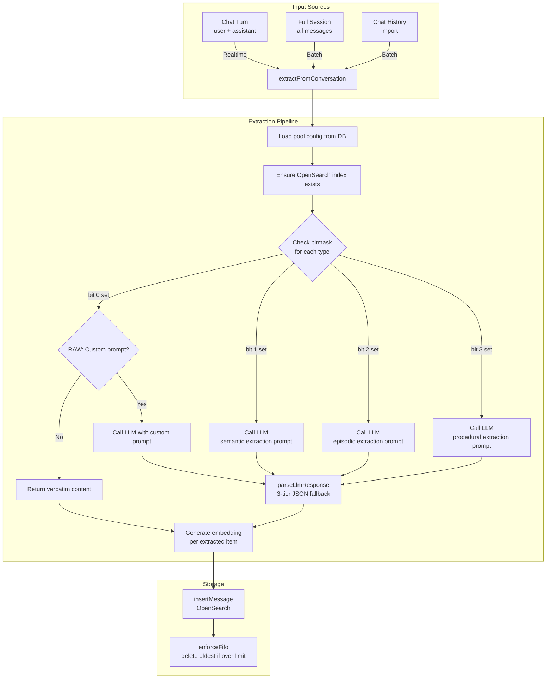
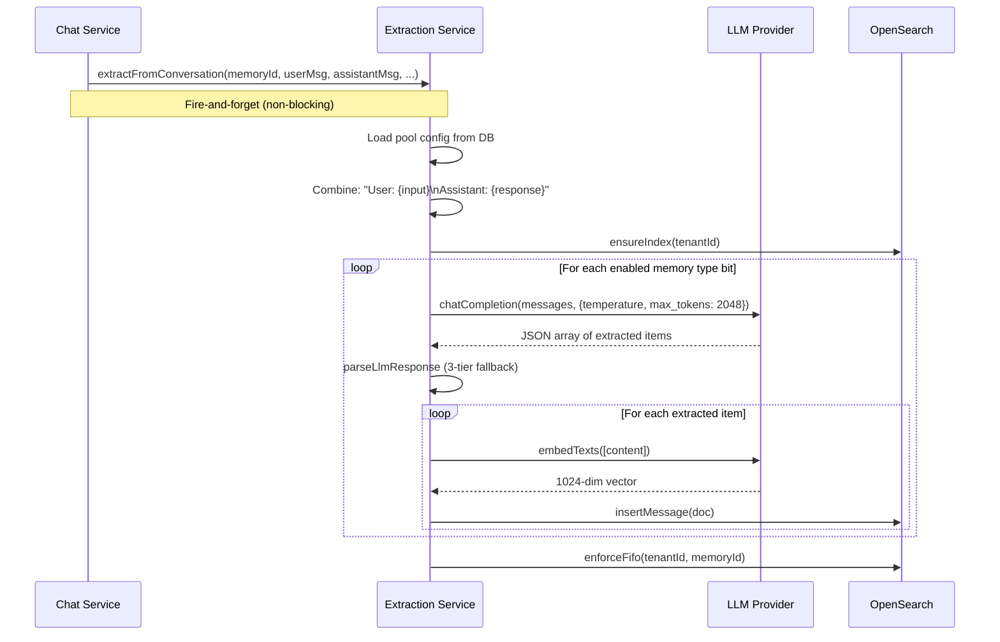
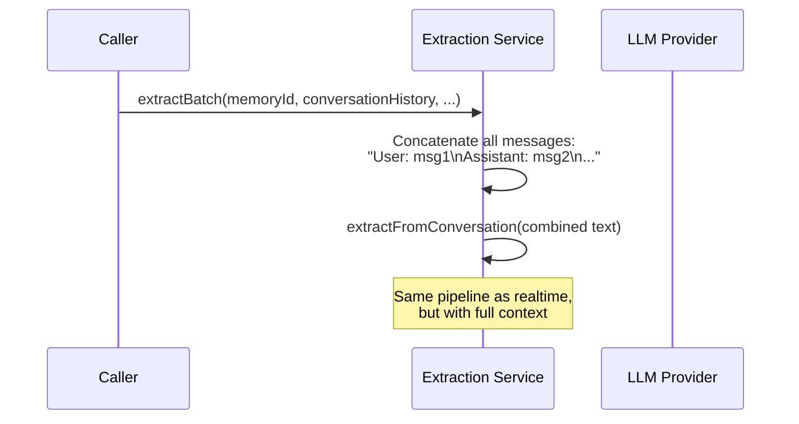
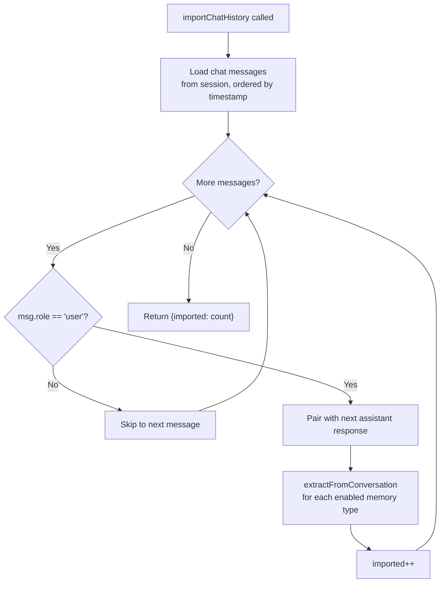

# Memory Extraction Pipeline: Detail Design

## Overview

The memory extraction pipeline converts raw conversations into structured memory items using LLM-powered analysis. It supports four cognitive memory types (Raw, Semantic, Episodic, Procedural) via a bitmask system, with configurable prompts, models, and extraction modes per pool.

## Extraction Architecture



## Extraction Service Methods

### Public Methods

| Method | Signature | Purpose |
|--------|-----------|---------|
| `extractFromConversation` | `(memoryId, userInput, assistantResponse, sessionId, userId, tenantId)` | Main entry: extract from single conversation turn |
| `extractBatch` | `(memoryId, conversationHistory, sessionId, userId, tenantId)` | Batch: extract from full session history |
| `importChatHistory` | `(memoryId, sessionId, userId, tenantId)` | Import existing chat session into pool |

### Private Methods

| Method | Signature | Purpose |
|--------|-----------|---------|
| `extractByType` | `(conversation, type, memory)` | Extract items for a specific memory type using LLM |
| `parseLlmResponse` | `(response)` | Robust JSON parsing with 3-tier fallback |
| `getEmbedding` | `(text, embdId, tenantId)` | Generate 1024-dim embedding vector |

## Extraction Modes

| Mode | Trigger Point | Input | Quality | Latency |
|------|---------------|-------|---------|---------|
| **Realtime** | Per conversation turn | Single user+assistant pair | Lower (limited context) | < 5s per turn |
| **Batch** | End of session | All messages concatenated | Higher (full context) | Varies by session length |

### Realtime Mode Sequence



### Batch Mode Sequence



## Default Prompt Templates

All prompts follow the `PromptTemplate` interface:

```typescript
interface PromptTemplate {
  system: string  // System role message (persona)
  user: string    // User role message (task with {{conversation}} placeholder)
}
```

### Semantic Extraction (type=2)

**System**: Knowledge extraction assistant. Extract factual statements, definitions, and key concepts. Return JSON array with `content` and `confidence` fields.

**User extracts**:
- Definitional knowledge (what something is)
- Factual claims and assertions
- Relationships between concepts
- Named entities and their attributes

### Episodic Extraction (type=4)

**System**: Memory extraction assistant specializing in episodic memory. Extract notable events, experiences, and interactions. Return JSON array with `content` and `confidence` fields.

**User extracts**:
- Specific events or incidents described
- User preferences and decisions made
- Problems encountered and their resolutions
- Temporal references (dates, sequences, deadlines)

### Procedural Extraction (type=8)

**System**: Memory extraction assistant specializing in procedural knowledge. Extract step-by-step procedures, workflows, and how-to instructions. Return JSON array with `content` and `confidence` fields.

**User extracts**:
- Step-by-step instructions
- Workflows and processes described
- Best practices and guidelines mentioned
- Configuration steps and setup procedures

### Raw Extraction (type=1)

**System**: Message archival assistant. Preserve raw conversation content as-is. Return JSON array with `content` and `confidence: 1.0` fields.

**User extracts**: Exact conversation content without summarization or transformation.

### Memory Rank Prompt (Defined, Not Yet Used)

A `MEMORY_RANK_PROMPT` template is defined for LLM-based re-ranking of search results by relevance. It accepts `{{query}}` and `{{memories}}` placeholders and returns items ordered by relevance with a `relevance_score` field. This prompt is currently unused in the recall pipeline.

## LLM Configuration

| Parameter | Source | Default | Purpose |
|-----------|--------|---------|---------|
| Provider ID | `memory.llm_id` | Tenant default | LLM model selection |
| Temperature | `memory.temperature` | 0.1 (schema) / 0.3 (fallback) | Extraction creativity |
| Max tokens | Hardcoded | 2048 | Response length limit |
| Embedding model | `memory.embd_id` | Tenant default | Vector generation model |

> **Note**: There is a temperature fallback inconsistency. The Zod schema defaults to `0.1`, but the extraction service uses `memory.temperature ?? 0.3` as fallback when the field is null.

## JSON Parsing (3-Tier Fallback)

The `parseLlmResponse()` method handles inconsistent LLM output formats:

```mermaid
flowchart TD
    INPUT[LLM Response String] --> T1{"Tier 1:<br/>JSON.parse(response)"}
    T1 -->|Success: Array| EXTRACT[Extract content strings]
    T1 -->|Failure| T2{"Tier 2:<br/>Regex /\\[\\s\\S]*?\\]/"}
    T2 -->|Match found| PARSE2[JSON.parse(match)]
    PARSE2 -->|Success| EXTRACT
    T2 -->|No match| T3["Tier 3:<br/>Treat as single item"]
    PARSE2 -->|Failure| T3
    T3 --> SINGLE["Return [response.trim()]"]
    EXTRACT --> FILTER[Filter empty strings]
    FILTER --> RETURN[Return string[]]
```

### Array Element Handling

The parser handles both formats:
- **String arrays**: `["item 1", "item 2"]` — used directly
- **Object arrays**: `[{"content": "item 1"}, {"content": "item 2"}]` — `content` field extracted

## Chat History Import



Import groups messages into user+assistant pairs. Each pair is processed independently through the full extraction pipeline.

## Zod Validation Schemas

### Pool Schemas

```typescript
const createMemorySchema = z.object({
  name: z.string().min(1).max(255),
  description: z.string().max(2000).optional(),
  memory_type: z.number().int().min(1).max(15).default(15),
  storage_type: z.enum(['table', 'graph']).default('table'),
  memory_size: z.number().int().min(1).default(5242880),
  embd_id: z.string().max(255).optional(),
  llm_id: z.string().max(255).optional(),
  temperature: z.number().min(0).max(2).default(0.1),
  system_prompt: z.string().max(10000).optional(),
  user_prompt: z.string().max(10000).optional(),
  extraction_mode: z.enum(['batch', 'realtime']).default('batch'),
  permission: z.enum(['me', 'team']).default('me'),
  scope_type: z.enum(['user', 'agent', 'team']).default('user'),
  scope_id: hexId.optional(),
})

const updateMemorySchema = createMemorySchema.partial()
```

### Message Schemas

```typescript
const queryMemoryMessagesSchema = z.object({
  page: z.coerce.number().int().positive().default(1),
  page_size: z.coerce.number().int().min(1).max(100).default(20),
  keyword: z.string().max(255).optional(),
  message_type: z.coerce.number().int().min(1).max(8).optional(),
})

const addMessageSchema = z.object({
  content: z.string().min(1).max(50000),
  message_type: z.number().int().min(1).max(8).default(1),
})

const importHistorySchema = z.object({
  session_id: hexId,
})
```

## Error Handling

| Scenario | Behavior |
|----------|----------|
| Pool not found | 404 returned to caller |
| LLM extraction fails | Error logged per type; other types still processed |
| JSON parse fails (all 3 tiers) | Entire LLM response stored as single raw item (Tier 3) |
| Embedding generation fails | Error logged; message stored without embedding |
| OpenSearch insert fails | Error thrown to caller |
| FIFO enforcement fails | Error logged; insertion still succeeds (non-blocking) |
| Index creation fails | Error logged; operations may fail on missing index |

## Key Files

| File | Purpose |
|------|---------|
| `be/src/modules/memory/services/memory-extraction.service.ts` | LLM extraction pipeline (extractByType, parseLlmResponse) |
| `be/src/modules/memory/prompts/extraction.prompts.ts` | Default prompt templates (semantic, episodic, procedural, raw, rank) |
| `be/src/modules/memory/services/memory-message.service.ts` | OpenSearch CRUD + FIFO enforcement |
| `be/src/modules/memory/schemas/memory.schemas.ts` | Zod validation schemas |
