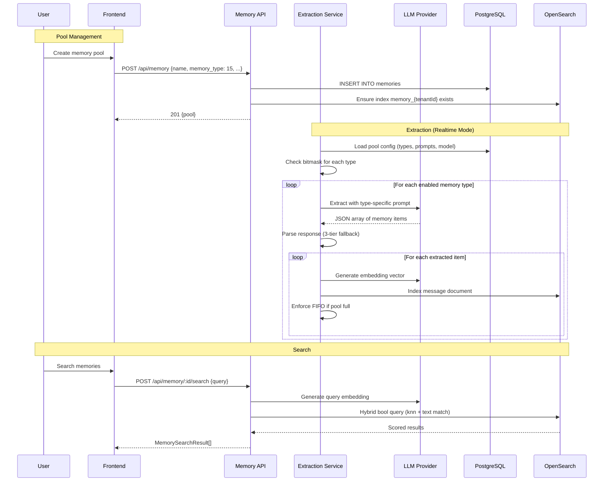
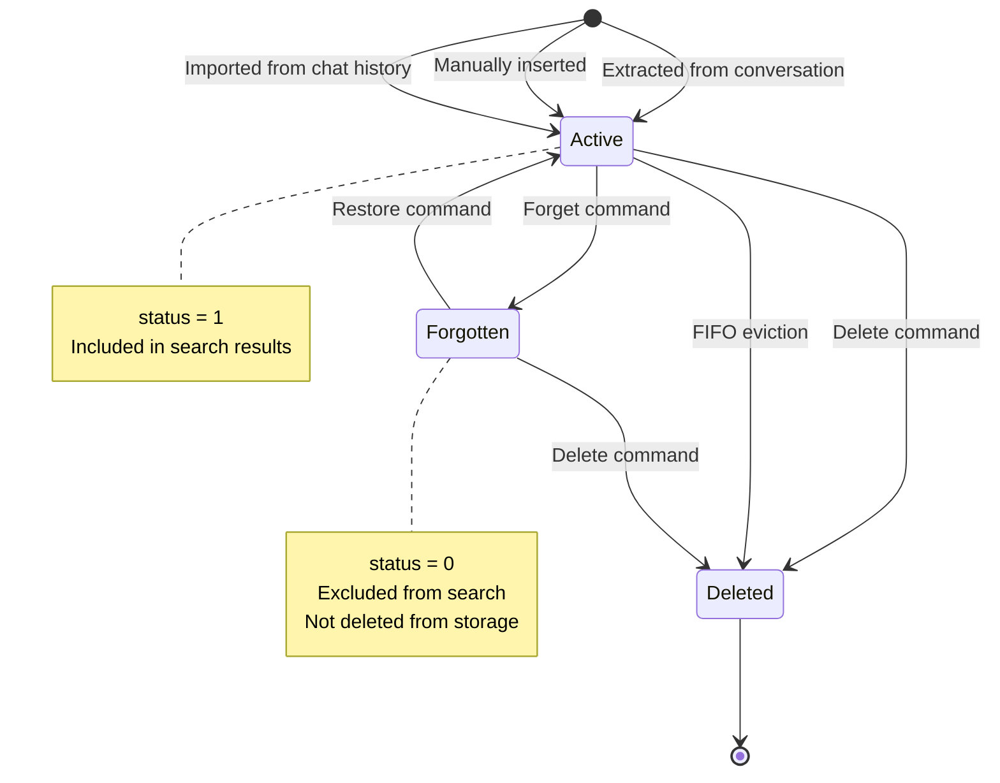
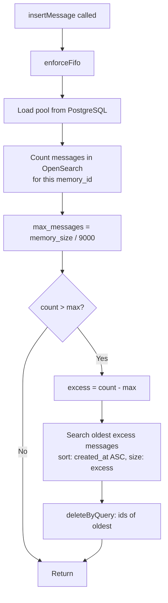
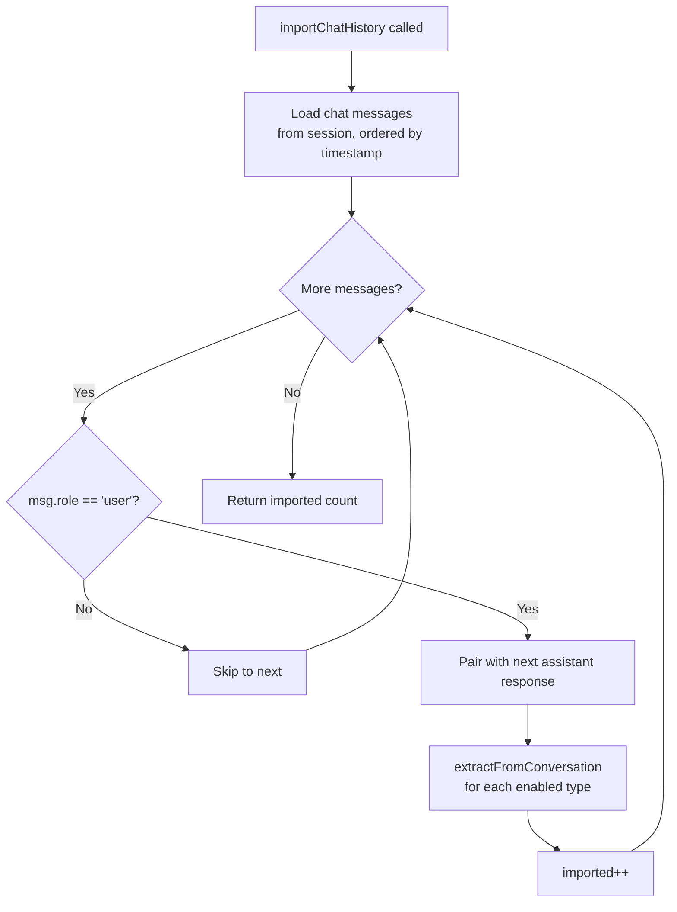

# Memory System: Detail Design Overview

## Architecture Summary

The Memory system extracts structured knowledge from conversations and stores it in searchable memory pools. It implements four cognitive memory types (Raw, Semantic, Episodic, Procedural) via a bitmask system, with LLM-powered extraction and hybrid vector+text search over OpenSearch.

## Component Interaction



## Key Design Decisions

### D-01: Bitmask for Memory Types

**Decision**: Use a single integer bitmask column to represent enabled memory types rather than separate boolean columns or a junction table.

**Rationale**:
- Compact storage (single int vs 4 booleans)
- Fast bitwise checks: `memory_type & SEMANTIC !== 0`
- Easy to combine: `memory_type = RAW | SEMANTIC | EPISODIC` = 7
- Extensible: bits 4-7 available for future types (up to 16 types)

**Bitmask values**: RAW=1, SEMANTIC=2, EPISODIC=4, PROCEDURAL=8

### D-02: Extraction Modes (Batch vs Realtime)

**Decision**: Support both realtime (per-turn) and batch (end-of-session) extraction modes.

**Rationale**:
- **Realtime**: Lower latency for live memory building, but may miss cross-turn context
- **Batch**: Better extraction quality by analyzing full conversation, but delayed storage
- User choice: different use cases benefit from different modes

### D-03: Custom Prompts per Pool

**Decision**: Allow custom system/user prompts to override default extraction templates.

**Rationale**:
- Domain-specific extraction (e.g., medical terminology, legal procedures)
- Users can tune extraction quality for their content
- Default prompts serve as sensible fallback for general use

### D-04: OpenSearch for Message Storage

**Decision**: Store memory messages in OpenSearch rather than PostgreSQL.

**Rationale**:
- Native knn_vector support for semantic search (HNSW index)
- Full-text search with BM25 scoring out of the box
- Per-tenant index isolation (`memory_{tenantId}`)
- Combined hybrid query in a single request
- Horizontal scaling for large message volumes

### D-05: FIFO Forgetting Policy

**Decision**: Implement automatic FIFO (First-In-First-Out) deletion when pool size is exceeded.

**Rationale**:
- Prevents unbounded memory growth
- Oldest memories are least likely to be relevant
- Non-blocking: failures don't prevent new memory insertion
- Configurable pool size gives users control

### D-06: 3-Tier JSON Parsing Fallback

**Decision**: Implement three levels of fallback when parsing LLM extraction responses.

**Rationale**:
- LLMs occasionally wrap JSON in markdown code blocks or add explanatory text
- Tier 1 (direct parse) handles well-formatted responses
- Tier 2 (regex extraction) handles wrapped responses
- Tier 3 (raw fallback) ensures no extraction is lost, even with malformed output

## Extraction Pipeline Detail

### Prompt Templates

Each memory type has a default prompt template with `{{conversation}}` placeholder:

| Type | System Prompt Focus | User Prompt Extracts |
|------|-------------------|---------------------|
| **Raw** | Message archival | Verbatim conversation content |
| **Semantic** | Knowledge extraction | Facts, definitions, concepts, relationships |
| **Episodic** | Event extraction | Events, experiences, decisions, temporal references |
| **Procedural** | Process extraction | Step-by-step procedures, workflows, best practices |

### Extraction Output Format

LLM returns JSON array of items:
```json
[
  {"content": "Extracted memory item text", "confidence": 0.9},
  {"content": "Another memory item", "confidence": 0.7}
]
```

Parser handles both string arrays and object arrays with "content" field.

## Memory Message Lifecycle



## Hybrid Search Detail

### Query Construction

```json
{
  "query": {
    "bool": {
      "must": [
        { "term": { "memory_id": "<pool_id>" } }
      ],
      "filter": [
        { "term": { "tenant_id": "<tenant_id>" } },
        { "term": { "status": 1 } }
      ],
      "should": [
        { "match": { "content": { "query": "<text>", "boost": 0.3 } } },
        { "knn": { "content_embed": { "vector": [0.1, ...], "k": 10 } } }
      ]
    }
  }
}
```

### Score Composition

- **Vector score** (weight 0.7): Cosine similarity between query embedding and stored embeddings
- **Text score** (weight 0.3): BM25 keyword relevance
- Results sorted by combined score, descending

## FIFO Enforcement Detail



**Constants**:
- Approximate message size: 9,000 bytes
- Default pool size: 5,242,880 bytes (5MB)
- Default max messages: ~582

## Chat History Import



## Agent Integration

### memory_read Node

During agent execution, a `memory_read` node:
1. Takes a query string from workflow context
2. Generates embedding for the query
3. Performs hybrid search on the configured memory pool
4. Returns top-K results as node output for downstream nodes

### memory_write Node

During agent execution, a `memory_write` node:
1. Takes content from workflow context
2. Calls the memory insert API directly
3. Stores the content with agent run metadata (source_id, user_id)

## Access Control

### Pool Visibility Matrix

| User Role | `permission: me` | `permission: team` |
|-----------|:-:|:-:|
| Pool creator | Read/Write | Read/Write |
| Same-team member | No access | Read/Write |
| Different-team member | No access | No access |
| Admin | Full access (via CASL manage) | Full access |

### Route-Level Authorization

All routes share a common middleware stack:
```
requireAuth → requireTenant → requireAbility('manage', 'Memory')
```

This means:
- `super-admin`: Full access to all memory pools
- `admin`: Full access within their tenant
- `leader`: Full access within their tenant
- `user`: No access (user role lacks `manage Memory` ability)

## Key Files

| File | Purpose |
|------|---------|
| `be/src/modules/memory/services/memory.service.ts` | Pool CRUD operations |
| `be/src/modules/memory/services/memory-message.service.ts` | OpenSearch message CRUD + search |
| `be/src/modules/memory/services/memory-extraction.service.ts` | LLM extraction pipeline |
| `be/src/modules/memory/prompts/extraction.prompts.ts` | Default prompt templates |
| `be/src/modules/memory/models/memory.model.ts` | Memory pool data model |
| `be/src/modules/memory/routes/memory.routes.ts` | Route definitions with auth |
| `fe/src/features/memory/types/memory.types.ts` | Frontend type definitions |
| `fe/src/features/memory/pages/MemoryListPage.tsx` | Pool list page |
| `fe/src/features/memory/pages/MemoryDetailPage.tsx` | Pool detail + messages |
