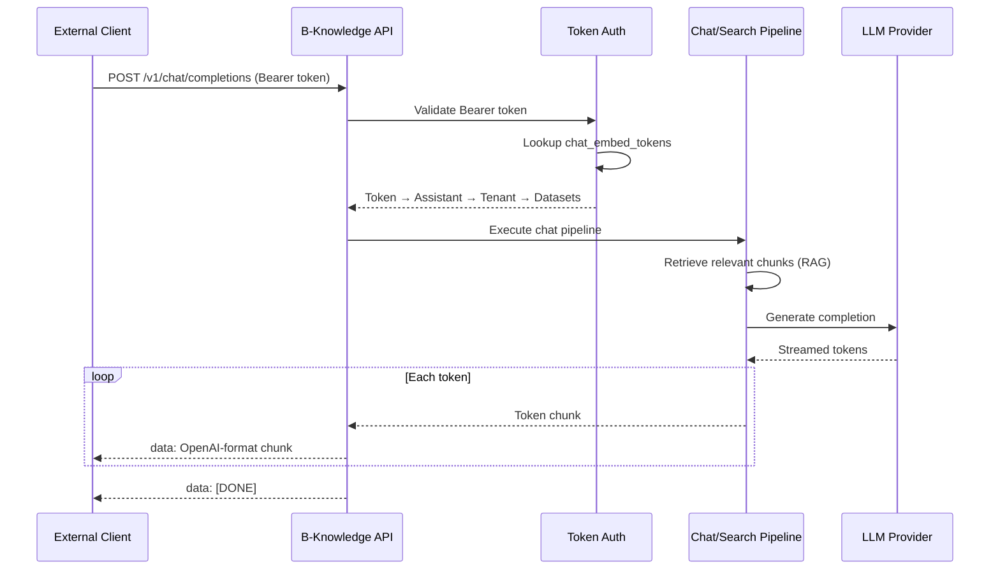
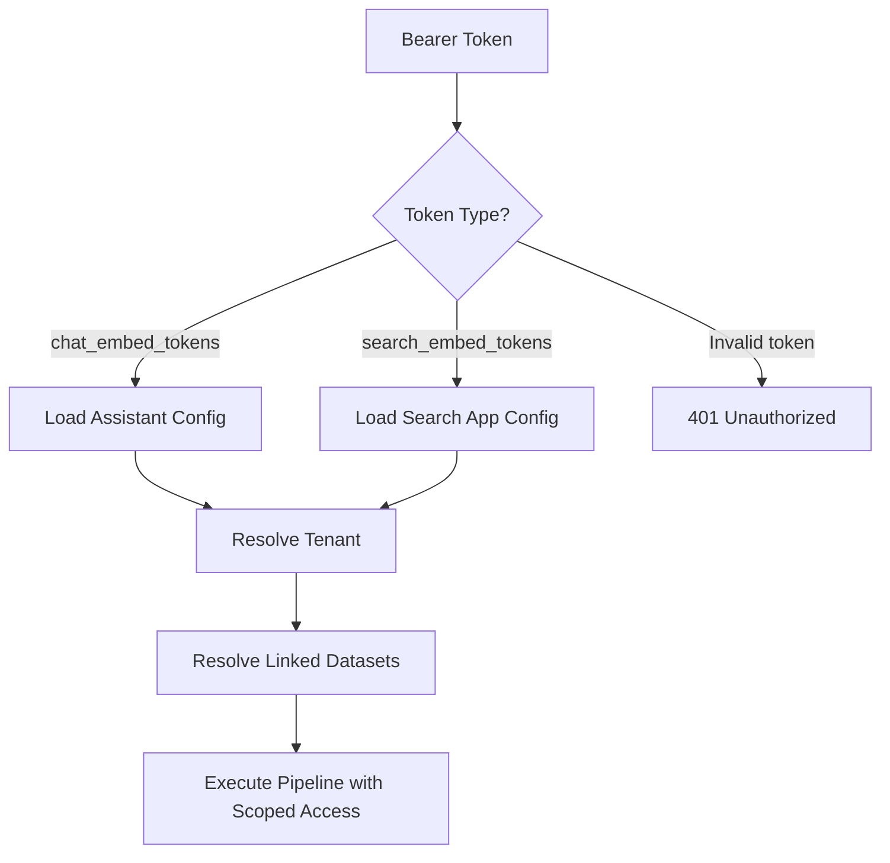
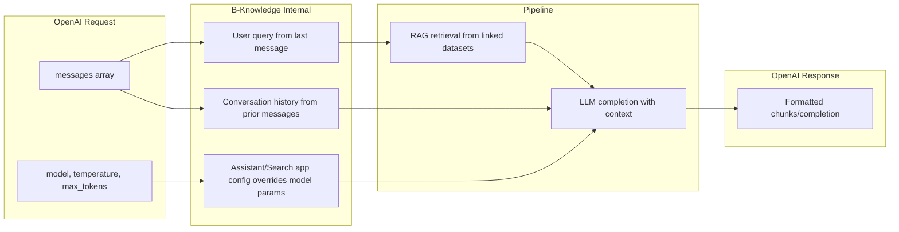

# OpenAI-Compatible API Detail Design

## Overview

B-Knowledge exposes OpenAI-compatible endpoints so external tools (VS Code extensions, CLI utilities, custom apps) can integrate using standard OpenAI client libraries. Authentication uses Bearer tokens mapped to specific assistants or search apps.

## Request Flow



## Endpoints

| Method | Path | Auth | Description |
|--------|------|------|-------------|
| POST | `/v1/chat/completions` | Bearer (chat_embed_tokens) | Chat with RAG pipeline |
| POST | `/v1/search/completions` | Bearer (search_embed_tokens) | Search with AI summary |
| GET | `/v1/models` | None (public) | List available models |

## Request Format

Standard OpenAI chat completion request:

```json
{
  "model": "gpt-4o",
  "messages": [
    { "role": "system", "content": "You are a helpful assistant." },
    { "role": "user", "content": "What is our refund policy?" }
  ],
  "stream": true,
  "temperature": 0.7,
  "max_tokens": 1024
}
```

## Response Format (Streaming)

Each SSE chunk follows the OpenAI format:

```
data: {"id":"chatcmpl-abc123","object":"chat.completion.chunk","created":1711680000,"choices":[{"index":0,"delta":{"content":"Our"},"finish_reason":null}]}

data: {"id":"chatcmpl-abc123","object":"chat.completion.chunk","created":1711680000,"choices":[{"index":0,"delta":{"content":" refund"},"finish_reason":null}]}

data: {"id":"chatcmpl-abc123","object":"chat.completion.chunk","created":1711680000,"choices":[{"index":0,"delta":{},"finish_reason":"stop"}]}

data: [DONE]
```

## Response Format (Non-Streaming)

```json
{
  "id": "chatcmpl-abc123",
  "object": "chat.completion",
  "created": 1711680000,
  "model": "gpt-4o",
  "choices": [
    {
      "index": 0,
      "message": {
        "role": "assistant",
        "content": "Our refund policy allows..."
      },
      "finish_reason": "stop"
    }
  ],
  "usage": {
    "prompt_tokens": 52,
    "completion_tokens": 128,
    "total_tokens": 180
  }
}
```

## Token Authentication



### Token Mapping

| Token Source | Maps To | Pipeline |
|-------------|---------|----------|
| `chat_embed_tokens` | Assistant → Tenant → Datasets | Chat + RAG |
| `search_embed_tokens` | Search App → Tenant → Datasets | Search + Summary |

Tokens are generated in the B-Knowledge admin UI when creating embeddable assistants or search apps.

## Request-to-Pipeline Mapping



## Models Endpoint

`GET /v1/models` returns available models without authentication:

```json
{
  "object": "list",
  "data": [
    {
      "id": "gpt-4o",
      "object": "model",
      "owned_by": "b-knowledge"
    }
  ]
}
```

## Error Responses

Errors follow OpenAI format:

```json
{
  "error": {
    "message": "Invalid authentication token",
    "type": "invalid_request_error",
    "code": "invalid_api_key"
  }
}
```

| HTTP Status | Code | Cause |
|------------|------|-------|
| 401 | `invalid_api_key` | Missing or invalid Bearer token |
| 404 | `model_not_found` | Requested model unavailable |
| 429 | `rate_limit_exceeded` | Too many requests |
| 500 | `internal_error` | Pipeline failure |

## Key Files

| File | Purpose |
|------|---------|
| `be/src/modules/chat/controllers/chat-openai.controller.ts` | OpenAI-compatible chat endpoint |
| `be/src/modules/search/controllers/search-openai.controller.ts` | OpenAI-compatible search endpoint |
| `be/src/modules/chat/services/chat-openai.service.ts` | Request/response format translation |
| `be/src/shared/middleware/embed-token-auth.ts` | Bearer token validation |
