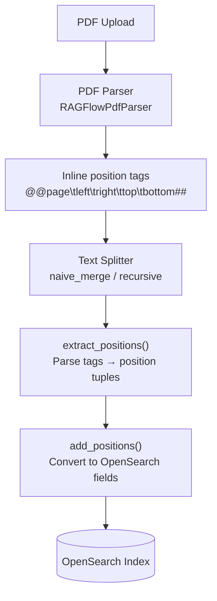
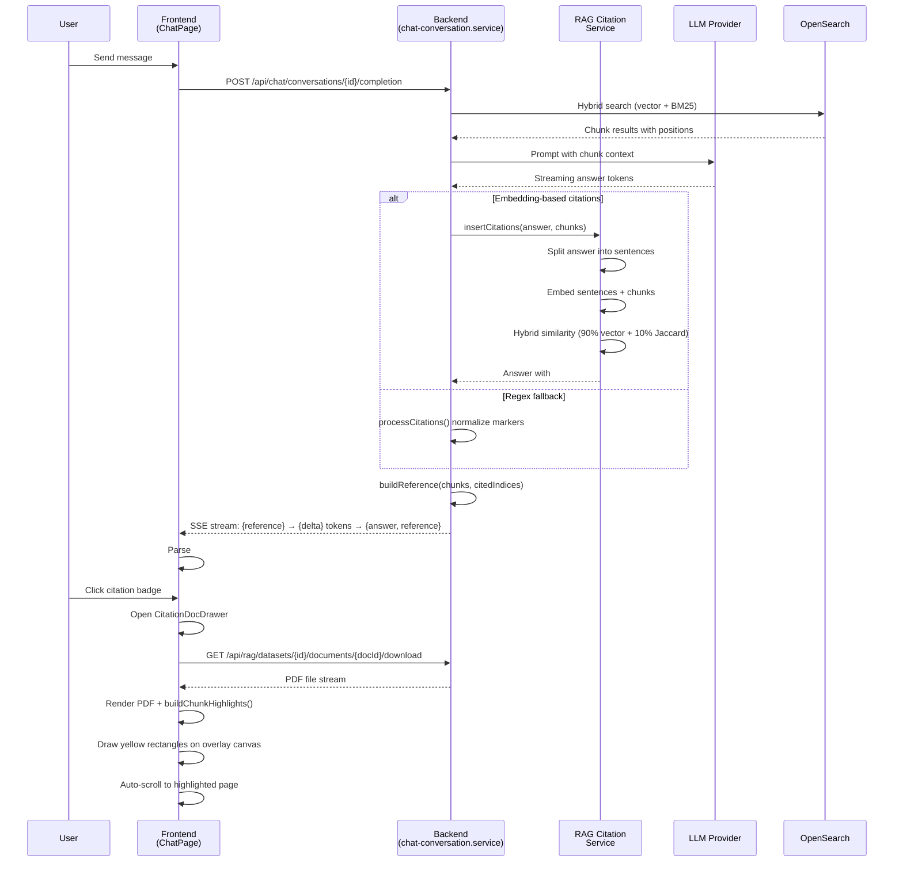
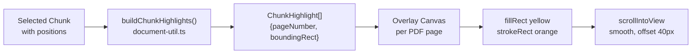
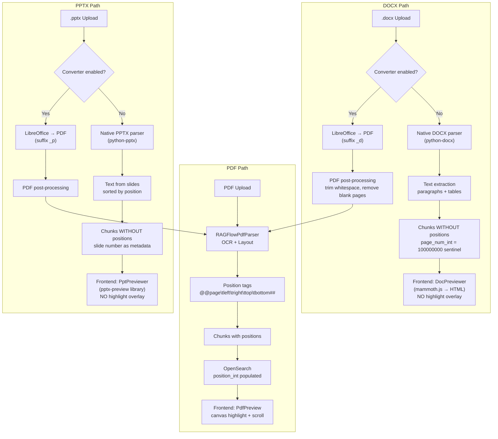

# PDF Citation & Highlight — Detail Design

## Overview

This document covers two core flows: (1) how PDF chunks store position data in the vector database to enable visual highlighting, and (2) how the chat assistant renders inline citations and opens the document reviewer with highlighted regions. It also addresses whether the same highlighting method applies to Word and PowerPoint files.

---

## Flow 1 — PDF Chunking: What Is Saved to the Vector Database

When a PDF is uploaded and parsed, each chunk carries bounding-box coordinates that map back to exact regions on the original PDF pages. These coordinates flow through the pipeline as follows:

### Pipeline Overview



### Step 1 — PDF Parsing & Position Tag Injection

**File:** `advance-rag/deepdoc/parser/pdf_parser.py`

The `RAGFlowPdfParser` uses layout recognition (OCR, table detection, figure detection) to extract text blocks. For each text block, it embeds **inline position tags** directly into the extracted text:

```
@@<page_numbers>\t<left>\t<right>\t<top>\t<bottom>##
```

Examples:
- Single page: `@@1\t100.5\t250.3\t50.2\t150.8##`
- Multi-page span: `@@0-1\t100.5\t250.3\t50.2\t150.8##`

These tags travel with the text through the chunking pipeline.

### Step 2 — Chunking & Position Extraction

**File:** `advance-rag/rag/flow/splitter/splitter.py`

After the text splitter produces chunks (via `naive_merge` with configurable token limits and overlap), positions are extracted from the embedded tags:

```python
"positions": [[pos[0][-1], *pos[1:]] for pos in RAGFlowPdfParser.extract_positions(c)]
```

The `extract_positions()` static method parses the `@@...##` tags with regex:
```python
@staticmethod
def extract_positions(txt):
    poss = []
    for tag in re.findall(r"@@[0-9-]+\t[0-9.\t]+##", txt):
        pn, left, right, top, bottom = tag.strip("#").strip("@").split("\t")
        left, right, top, bottom = float(left), float(right), float(top), float(bottom)
        poss.append(([int(p) - 1 for p in pn.split("-")], left, right, top, bottom))
    return poss
```

Each position becomes: `[page_num, left, right, top, bottom]` (0-indexed page numbers).

### Step 3 — Conversion to OpenSearch Fields

**File:** `advance-rag/rag/nlp/__init__.py` → `add_positions()`

Before indexing, the raw positions list is converted into three OpenSearch fields:

```python
def add_positions(d, poss):
    page_num_int = []
    position_int = []
    top_int = []
    for pn, left, right, top, bottom in poss:
        page_num_int.append(int(pn + 1))       # Convert 0-indexed → 1-indexed
        top_int.append(int(top))
        position_int.append((int(pn + 1), int(left), int(right), int(top), int(bottom)))
    d["page_num_int"] = page_num_int
    d["position_int"] = position_int
    d["top_int"] = top_int
```

### Step 4 — OpenSearch Index Schema

**File:** `advance-rag/conf/mapping.json`

| Field | Type | Content | Purpose |
|-------|------|---------|---------|
| `page_num_int` | integer[] | `[1, 2, 3]` | Page numbers (1-indexed) for filtering/display |
| `position_int` | integer[][] | `[[1, 100, 250, 50, 150], ...]` | Bounding boxes: `[page, left, right, top, bottom]` |
| `top_int` | integer[] | `[50, 10]` | Top coordinates for sort/scroll |
| `content_with_weight` | text | Chunk text with BM25 weights | Full-text search + display |
| `doc_id` | keyword | Document UUID | Link chunk → document |
| `docnm_kwd` | keyword | Original filename | Display in citations |

### What a Single Chunk Record Looks Like in OpenSearch

```json
{
  "content_with_weight": "The quarterly revenue increased by 15%...",
  "doc_id": "abc-123",
  "docnm_kwd": "financial-report.pdf",
  "page_num_int": [3, 4],
  "position_int": [[3, 72, 540, 120, 280], [4, 72, 540, 50, 150]],
  "top_int": [120, 50],
  "q_vec": [0.012, -0.034, ...],
  "available_int": 1,
  "kb_id": "kb-456"
}
```

This chunk spans pages 3-4, with bounding boxes that the frontend uses to draw yellow highlight rectangles on the PDF canvas.

---

## Flow 2 — Citation Display in Chat Assistant

### End-to-End Sequence



### Step-by-Step Breakdown

#### 1. Chat Completion Request

**Frontend:** `fe/src/features/chat/hooks/useChatStream.ts`
**API:** `POST /api/chat/conversations/{conversationId}/completion`

```typescript
chatApi.sendMessage(conversationId, content, dialogId, options, signal)
```

Returns an SSE (Server-Sent Events) stream.

#### 2. Retrieval & Citation Insertion (Backend)

**File:** `be/src/modules/chat/services/chat-conversation.service.ts`

After retrieving chunks from OpenSearch and getting the LLM response, the backend inserts citation markers:

**Embedding-based strategy (preferred):**
- Splits the answer into sentences (multi-language aware)
- Embeds both sentences and chunks using the embedding model
- Computes hybrid similarity: `90% vector cosine + 10% keyword Jaccard`
- Adaptive threshold starting at `0.63`, decaying by 20% until matches found (min `0.3`)
- Inserts `##ID:n$$` markers at sentence boundaries where `n` is the 0-based chunk index

**Regex fallback:**
- Normalizes alternative citation formats (`[ID:n]`, `(ID:n)`, `ref n`) to `##ID:n$$`

#### 3. Reference Building

**File:** `be/src/modules/chat/services/chat-conversation.service.ts` → `buildReference()`

Transforms chunk data into the frontend reference format:

```typescript
// Reference object sent via SSE
{
  chunks: [
    {
      chunk_id: "chunk-uuid",
      content_with_weight: "The quarterly revenue...",
      doc_id: "doc-uuid",
      docnm_kwd: "financial-report.pdf",
      page_num_int: [3, 4],
      position_int: [[3, 72, 540, 120, 280], [4, 72, 540, 50, 150]],
      positions: [[3, 72, 540, 120, 280], [4, 72, 540, 50, 150]],
      score: 0.87
    }
  ],
  doc_aggs: [
    { doc_id: "doc-uuid", doc_name: "financial-report.pdf", count: 3 }
  ]
}
```

#### 4. SSE Event Order

The backend sends events in this order:

| Order | Event | Purpose |
|-------|-------|---------|
| 1 | `{ reference: {...} }` | Pre-populate reference panel |
| 2 | `{ delta: "token" }` (repeated) | Stream answer tokens |
| 3 | `{ answer: "...", reference: {...} }` | Final complete response |

#### 5. Inline Citation Rendering

**File:** `fe/src/components/CitationInline.tsx`

Parses `##ID:n$$` markers from the message content using regex and renders them as clickable badges:

```
"Revenue grew 15% ##ID:0$$ driven by cloud adoption ##ID:1$$"
      ↓ parsed into ↓
["Revenue grew 15% ", <Badge>[1]</Badge>, " driven by cloud adoption ", <Badge>[2]</Badge>]
```

Each badge is a `Popover` that shows on hover:
- Document name with file icon
- Page number (if available)
- Chunk text preview (6-line clamp)
- Relevance score (e.g., `87%`)

#### 6. Citation Click → Document Reviewer

**File:** `fe/src/features/chat/pages/ChatPage.tsx`

When a user clicks a citation badge:

1. `onChunkCitationClick(chunk)` sets `previewChunk` state
2. `CitationDocDrawer` opens as a slide-out panel
3. The drawer renders `DocumentPreviewer` with:
   - `datasetId`, `docId`, `fileName` from the chunk reference
   - `downloadUrl`: `GET /api/rag/datasets/{datasetId}/documents/{docId}/download`
   - `showChunks=true` (displays chunk list sidebar)

#### 7. PDF Highlight Rendering

**File:** `fe/src/components/DocumentPreviewer/previews/PdfPreview.tsx`



**`buildChunkHighlights()`** (`fe/src/utils/document-util.ts`):

Converts the chunk's `positions` array into highlight objects:

```typescript
// Input: positions = [[3, 72, 540, 120, 280]]
//                      ↑page ↑x1  ↑x2  ↑y1  ↑y2
// Output:
{
  position: {
    pageNumber: 3,
    boundingRect: { width: pdfWidth, height: pdfHeight, x1: 72, x2: 540, y1: 120, y2: 280 },
    rects: [/* same as boundingRect */]
  }
}
```

**Canvas overlay drawing:**
1. For each highlight, find the page `<div>` by `data-page={pageNumber}`
2. Get the overlay `<canvas>` for that page
3. Scale coordinates: `x = rect.x1 * (canvasWidth / refWidth)`
4. Draw filled rectangle: `rgba(255, 226, 143, 0.4)` (yellow)
5. Draw border: `rgba(255, 180, 0, 0.8)` (orange)
6. Auto-scroll to the first highlighted page with smooth behavior

### API Endpoints Summary

| Endpoint | Method | Purpose |
|----------|--------|---------|
| `/api/chat/conversations/{id}/completion` | POST | Stream chat response with answer + reference (SSE) |
| `/api/rag/datasets/{datasetId}/documents/{docId}/download` | GET | Download document file for preview |
| `/api/chat/conversations/{id}/feedback` | POST | Submit thumbs up/down feedback on messages |

No separate "citation lookup" API exists — all citation data (including `positions` for highlighting) comes embedded in the streaming response.

### Component Hierarchy

```
ChatPage
├── ChatMessageList
│   └── ChatMessage
│       ├── CitationInline              ← renders ##ID:n$$ as popover badges
│       │   └── Badge onClick → onChunkCitationClick(chunk)
│       └── Document aggregate badges   ← shows doc_aggs by document
├── ChatReferencePanel (right sidebar)  ← shows aggregated documents
├── CitationDocDrawer (slide-out)
│   └── DocumentPreviewer
│       ├── PdfPreview                  ← PDF with highlight overlays
│       │   └── Overlay canvas with highlight rects
│       └── ChunkList (sidebar)         ← selectable chunk cards
└── useChatStream                       ← SSE state management
```

---

## DOC & PowerPoint: Same Highlighting Method?

### Short Answer: No — highlighting with bounding-box scroll-to-page only works for PDF files.

### Detailed Comparison



### Key Differences by File Type

| Aspect | PDF (native) | DOCX/PPTX via Converter (→ PDF) | DOCX Native | PPTX Native |
|--------|-------------|--------------------------------|-------------|-------------|
| **Parser** | RAGFlowPdfParser (OCR + layout) | Same as PDF (after conversion) | python-docx | python-pptx |
| **Position tags** | Yes (`@@page\t...##`) | Yes (converted PDF has pages) | No | No |
| **`position_int` in OpenSearch** | Populated with bounding boxes | Populated with bounding boxes | Empty or sentinel `[100000000]` | Empty or sentinel |
| **`page_num_int`** | Accurate page numbers | Accurate (from converted PDF) | Sentinel value | Slide number (if stored) |
| **Frontend previewer** | `PdfPreview` (pdfjs-dist + canvas overlay) | `PdfPreview` (same — file is PDF) | `DocPreviewer` (mammoth.js → HTML) | `PptPreviewer` (pptx-preview) |
| **Highlight overlay** | Yes — yellow rectangles on canvas | Yes — same as native PDF | No — HTML rendering, no canvas | No — library rendering, no canvas |
| **Scroll to page** | Yes — auto-scroll to highlighted page | Yes — same as native PDF | No — no page concept in HTML | No — no page-level scroll |
| **Citation inline badges** | Yes — with page number shown | Yes — with page number shown | Yes — but no page number | Yes — but no page/slide number |
| **Chunk sidebar** | Yes — click chunk scrolls to position | Yes — same behavior | Yes — but no visual scroll target | Yes — but no visual scroll target |

### Converter Module Details

**File:** `converter/word_converter.py`, `converter/powerpoint_converter.py`

Both Word and PowerPoint conversions use LibreOffice headless mode:

```bash
libreoffice --headless --norestore --convert-to pdf <input_file>
```

After conversion, PDFs undergo post-processing (`pdf_processor.py`):
- Empty page removal via pdfminer content detection
- Whitespace trimming via CropBox with margin analysis
- Artifact filtering (ignores decorative elements < 5pt)

The converted PDF is stored with a suffix: `_d` (Word), `_p` (PowerPoint), `_x` (Excel).

### When Does Highlight + Scroll-to-Page Work?

| Scenario | Highlight Works? | Why |
|----------|-----------------|-----|
| Upload PDF → parse | **Yes** | Native PDF parser extracts bounding boxes |
| Upload DOCX → **converter enabled** → parse as PDF | **Yes** | Converted to PDF first, then PDF parser extracts positions |
| Upload DOCX → **native parse** (no conversion) | **No** | DOCX parser extracts text only, no bounding boxes |
| Upload PPTX → **converter enabled** → parse as PDF | **Yes** | Converted to PDF first, same as above |
| Upload PPTX → **native parse** (no conversion) | **No** | PPTX parser extracts slide text only, no bounding boxes |

### Frontend Rendering Limitation

Even if position data existed for DOCX/PPTX, the frontend previewers cannot render highlights:

- **`DocPreviewer`** uses mammoth.js to convert DOCX → HTML. There is no canvas overlay or coordinate system to draw highlight rectangles.
- **`PptPreviewer`** uses pptx-preview to render slides. There is no highlight/overlay API.
- **Only `PdfPreview`** (using pdfjs-dist) renders pages as canvas elements with an overlay canvas for highlight drawing.

The `buildChunkHighlights()` utility and the highlight drawing logic in `PdfPreview.tsx` are **PDF-specific** — they rely on the PDF canvas coordinate system.

### Conclusion

To get bounding-box highlighting and scroll-to-page for Word and PowerPoint documents, the **converter must be enabled** so that these files are converted to PDF before parsing. Once converted, they follow the exact same pipeline as native PDFs: the PDF parser extracts position tags, chunks store bounding boxes in OpenSearch, and the frontend renders highlights on the PDF canvas with auto-scroll to the cited page.
