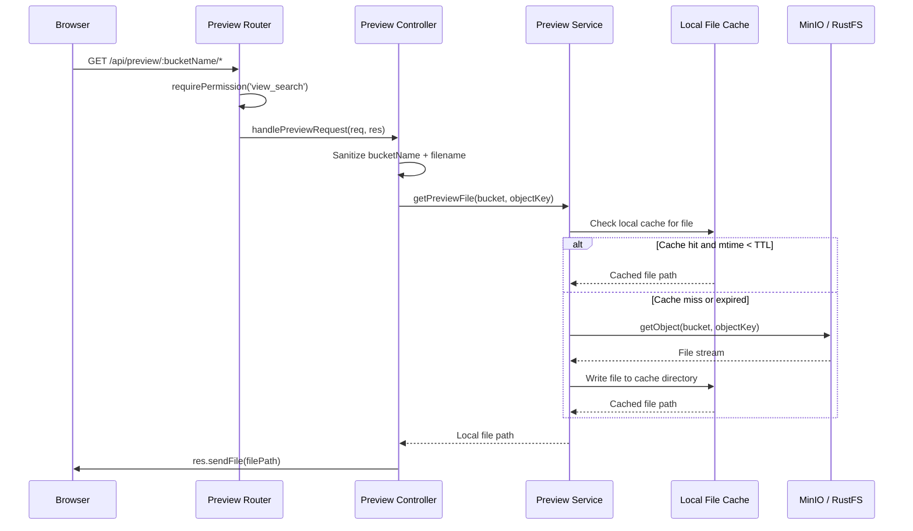

# Document Preview Detail Design

## Overview

The Preview module serves cached document files from MinIO/RustFS object storage for in-browser preview. It lazy-downloads files on first request and caches them locally with TTL-based expiration. This module operates entirely on file system operations and the MinIO client — no database models are involved.

## API Endpoint

| Method | Path | Permission | Description |
|--------|------|------------|-------------|
| GET | `/api/preview/:bucketName/*` | `view_search` | Serve a preview file from cache or MinIO |

The wildcard segment captures the full object key within the bucket, supporting nested paths (e.g., `/api/preview/documents/tenant-1/report.pdf`).

## Preview Flow



## Caching Strategy

### Cache Location

Preview files are stored in a local temporary directory, organized by bucket name and object key to avoid collisions:

```
<tempDir>/preview-cache/
  └── <bucketName>/
      └── <objectKey>          # Preserves original file name
```

### TTL-Based Expiration

| Config Key | Purpose |
|------------|---------|
| `config.tempFileTTL` | Maximum age (in ms) before a cached file is considered stale |

Cache validity is determined by checking the file's `mtime` (last modification time) against the configured TTL. When a request arrives:

1. If the file exists and `Date.now() - mtime < tempFileTTL` — serve from cache
2. If the file exists but is stale — re-download from MinIO and overwrite
3. If the file does not exist — download from MinIO and write to cache

### Cache Cleanup

Stale files are replaced on next access (lazy eviction). There is no background cleanup process — the cache is self-managing through TTL checks on read.

## Security

### Path Traversal Prevention

Both `bucketName` and the filename (wildcard segment) are sanitized before use:

- Strip `..` path segments to prevent directory traversal
- Reject requests containing null bytes or other control characters
- Validate that the resolved path stays within the cache directory

### Authorization

The route is protected by the `requirePermission('view_search')` middleware, ensuring only authenticated users with search/view access can retrieve preview files.

## Error Handling

| Scenario | Response |
|----------|----------|
| Object not found in MinIO | 404 Not Found |
| Invalid or malicious path | 400 Bad Request |
| MinIO connection failure | 500 Internal Server Error |
| Unauthorized user | 403 Forbidden |

## Frontend Consumers

The preview endpoint is consumed by these frontend components:

| Component | Feature | Usage |
|-----------|---------|-------|
| `ChatDocumentPreviewDrawer` | Chat | Preview source documents referenced in chat responses |
| `SearchDocumentPreviewDrawer` | Search | Preview documents from search results |
| `DocumentReviewerPage` | Dataset | Full-page document review and annotation |

Each component constructs the preview URL from the document's bucket name and object key, then renders the file in an iframe or embedded viewer.

## Key Files

| File | Purpose |
|------|---------|
| `be/src/modules/preview/preview.routes.ts` | Route registration and permission middleware |
| `be/src/modules/preview/preview.controller.ts` | Request handling, input sanitization, response |
| `be/src/modules/preview/preview.service.ts` | Cache management, MinIO download, TTL checks |
