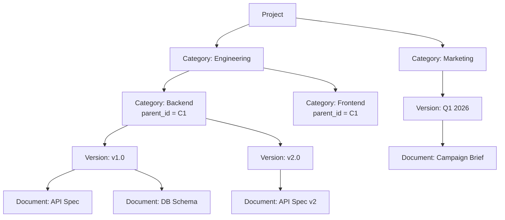
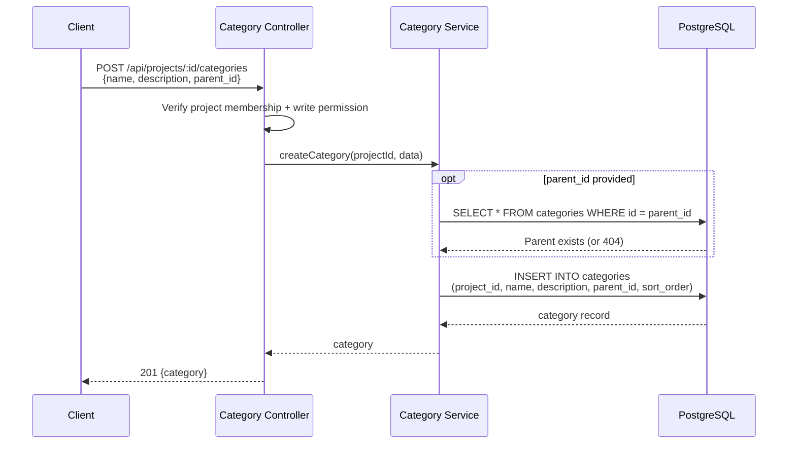
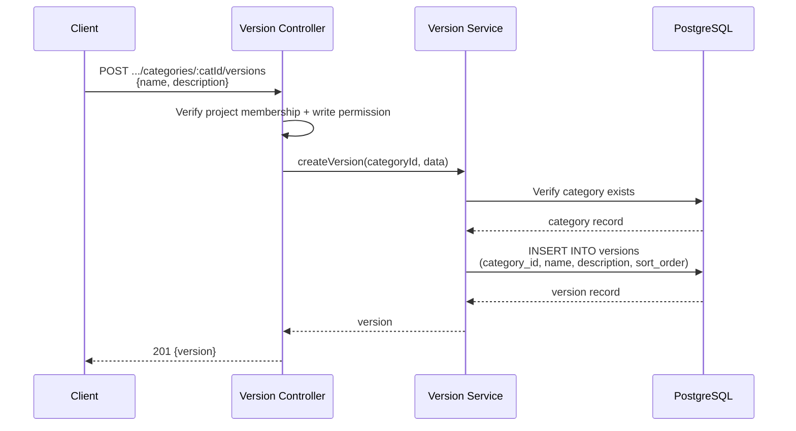
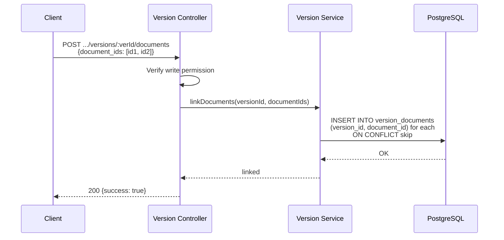
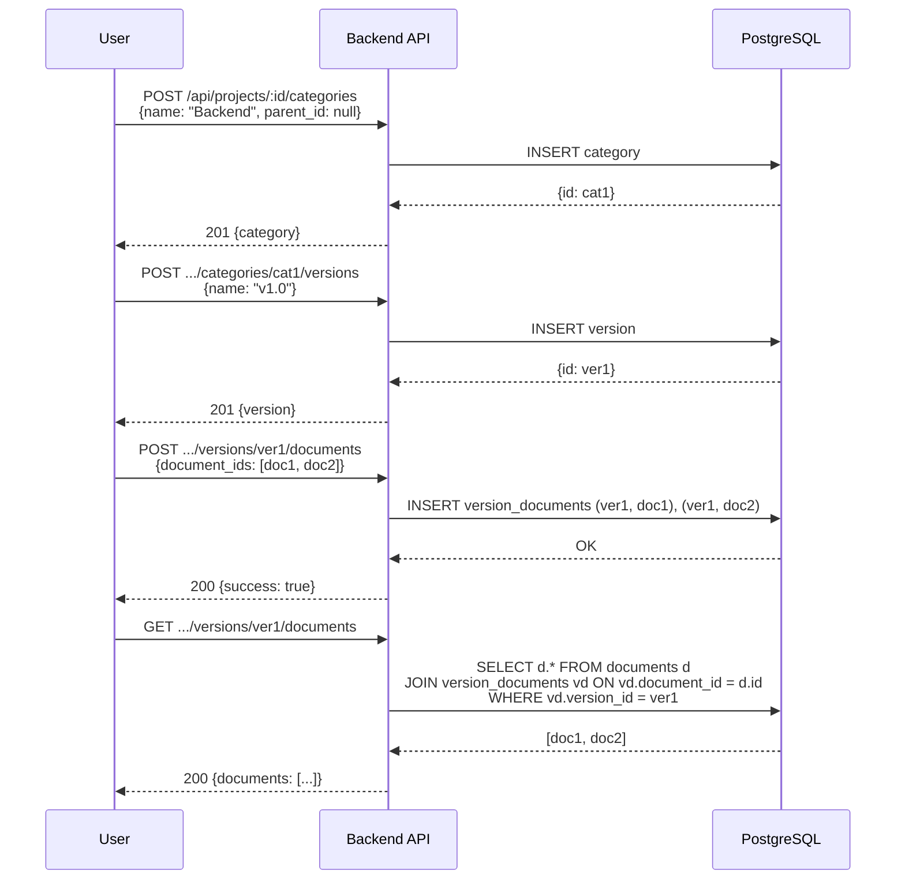

# Project Categories & Versions - Detail Design

## Overview

Categories provide hierarchical organization within a project. Each category can contain versions, and each version links to a set of documents. Categories support nesting via `parent_id` to form a tree structure.

## Hierarchy

## Category CRUD

### Endpoints

| Method | Endpoint | Description |
|--------|----------|-------------|
| POST | `/api/projects/:id/categories` | Create a category |
| GET | `/api/projects/:id/categories` | List all categories (tree) |
| PUT | `/api/projects/:id/categories/:catId` | Update a category |
| DELETE | `/api/projects/:id/categories/:catId` | Delete a category and children |

### Create Category Sequence

### Category Schema

| Column | Type | Description |
|--------|------|-------------|
| `id` | uuid | Primary key |
| `project_id` | uuid | Parent project |
| `name` | string | Category name |
| `description` | text | [OPTIONAL] Description |
| `parent_id` | uuid | [OPTIONAL] Parent category for nesting |
| `sort_order` | integer | Display order among siblings |
| `created_at` | timestamp | Creation time |
| `updated_at` | timestamp | Last update time |

## Version CRUD

### Endpoints

| Method | Endpoint | Description |
|--------|----------|-------------|
| POST | `.../categories/:catId/versions` | Create a version |
| GET | `.../categories/:catId/versions` | List versions in category |
| PUT | `.../categories/:catId/versions/:verId` | Update a version |
| DELETE | `.../categories/:catId/versions/:verId` | Delete a version |

### Create Version Sequence

### Version Schema

| Column | Type | Description |
|--------|------|-------------|
| `id` | uuid | Primary key |
| `category_id` | uuid | Parent category |
| `name` | string | Version name (e.g., "v1.0", "Q1 2026") |
| `description` | text | [OPTIONAL] Description |
| `sort_order` | integer | Display order |
| `created_at` | timestamp | Creation time |
| `updated_at` | timestamp | Last update time |

## Version Documents

### Endpoints

| Method | Endpoint | Description |
|--------|----------|-------------|
| GET | `.../versions/:verId/documents` | List documents in version |
| POST | `.../versions/:verId/documents` | Link documents to version |
| DELETE | `.../versions/:verId/documents/:docId` | Unlink a document |

### Link Documents Sequence

## Full Workflow: Category to Documents

## Delete Cascade

- **Delete category**: Removes all child categories (recursive), their versions, and version-document links.
- **Delete version**: Removes version-document links. Documents themselves are not deleted (they belong to datasets).

## Sync Configs

Projects support external sync configuration for automated content ingestion.

| Method | Endpoint | Description |
|--------|----------|-------------|
| GET | `/api/projects/:id/sync-configs` | List sync configurations |
| POST | `/api/projects/:id/sync-configs` | Create sync config |
| PUT | `/api/projects/:id/sync-configs/:configId` | Update sync config |
| DELETE | `/api/projects/:id/sync-configs/:configId` | Delete sync config |

Sync configs define external sources (e.g., Git repositories, cloud storage) and schedules for automatic document synchronization into project categories.

## Key Files

| File | Purpose |
|------|---------|
| `be/src/modules/projects/controllers/category.controller.ts` | Category endpoint handlers |
| `be/src/modules/projects/controllers/version.controller.ts` | Version endpoint handlers |
| `be/src/modules/projects/services/category.service.ts` | Category business logic |
| `be/src/modules/projects/services/version.service.ts` | Version business logic |
| `be/src/modules/projects/routes/` | Route definitions |
