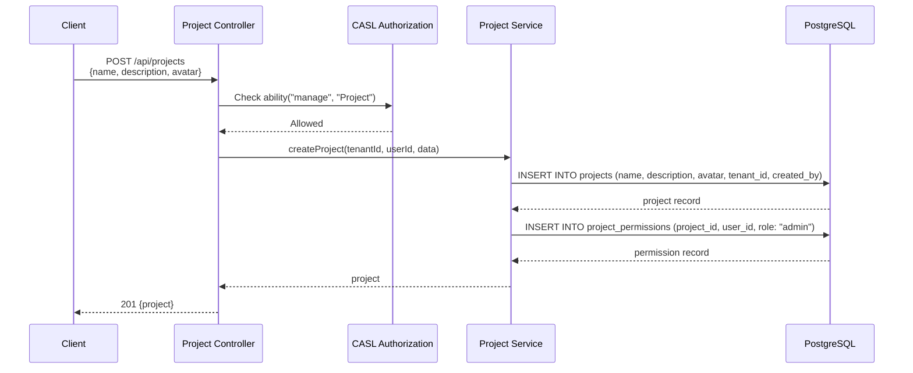
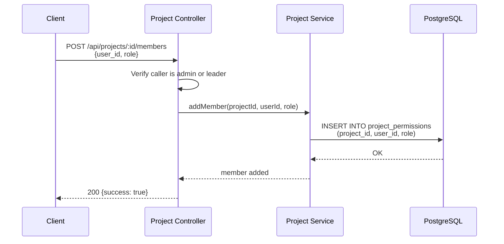
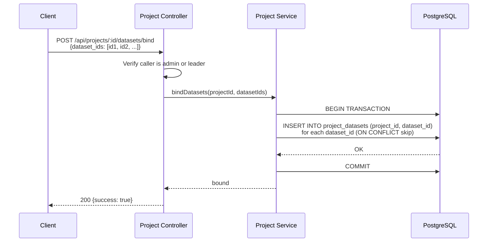
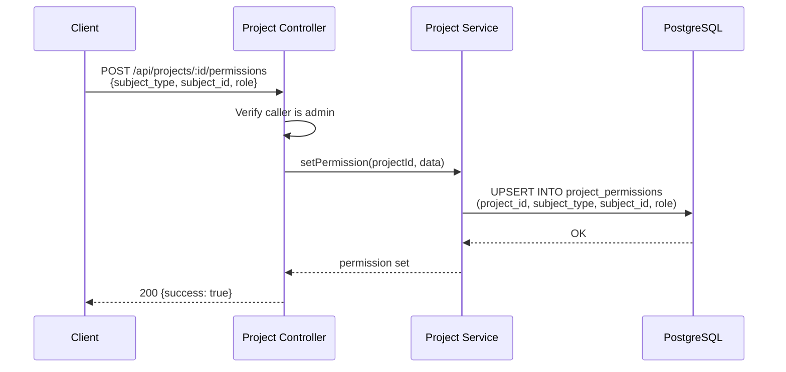
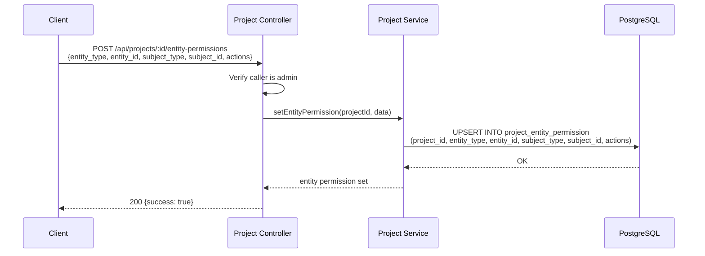
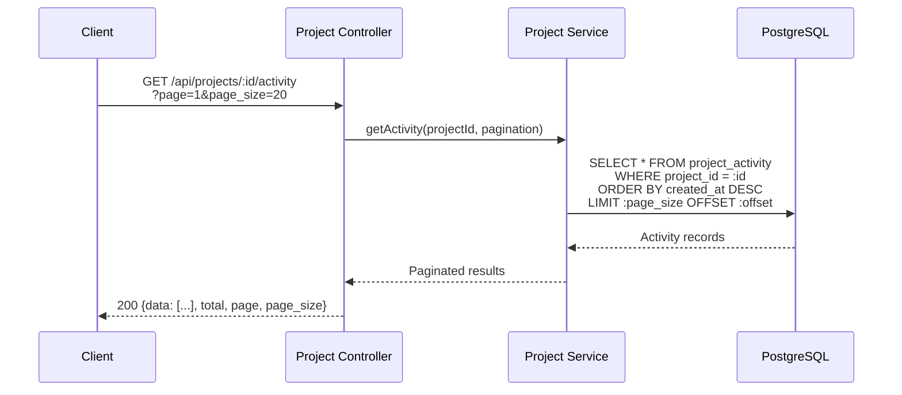
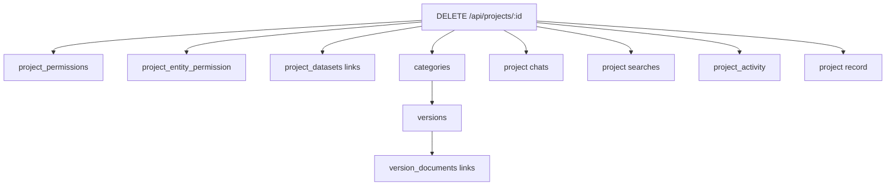

# Project CRUD - Detail Design

## Overview

This document details the CRUD operations for projects, members, dataset bindings, permissions, entity permissions, and activity logs. All operations enforce tenant scoping and CASL-based authorization.

## Create Project

The creator is automatically assigned the `admin` role.

## Manage Members

| Operation | Endpoint | Required Role |
|-----------|----------|---------------|
| Add member | `POST /api/projects/:id/members` | admin, leader |
| Update role | `PUT /api/projects/:id/members/:userId` | admin |
| Remove member | `DELETE /api/projects/:id/members/:userId` | admin |
| List members | `GET /api/projects/:id/members` | any member |

## Dataset Binding

| Operation | Endpoint | Description |
|-----------|----------|-------------|
| Bind datasets | `POST /api/projects/:id/datasets/bind` | Batch bind multiple datasets |
| Unbind dataset | `DELETE /api/projects/:id/datasets/:datasetId` | Remove single binding |
| List bound datasets | `GET /api/projects/:id/datasets` | List all linked datasets |

## RBAC Permissions

| Operation | Endpoint |
|-----------|----------|
| Set permission | `POST /api/projects/:id/permissions` |
| List permissions | `GET /api/projects/:id/permissions` |
| Update permission | `PUT /api/projects/:id/permissions/:permId` |
| Delete permission | `DELETE /api/projects/:id/permissions/:permId` |

## Entity Permissions (ABAC)

| Operation | Endpoint |
|-----------|----------|
| Set entity permission | `POST /api/projects/:id/entity-permissions` |
| List entity permissions | `GET /api/projects/:id/entity-permissions` |
| Update entity permission | `PUT /api/projects/:id/entity-permissions/:id` |
| Delete entity permission | `DELETE /api/projects/:id/entity-permissions/:id` |

## Activity Log

Activity records are automatically created by service methods during mutations.

## Delete Cascade

When a project is deleted, all dependent resources are removed in order:

Deletion is performed within a database transaction to ensure atomicity.

## Key Files

| File | Purpose |
|------|---------|
| `be/src/modules/projects/controllers/project.controller.ts` | CRUD endpoint handlers |
| `be/src/modules/projects/services/project.service.ts` | Business logic and authorization |
| `be/src/modules/projects/routes/project.routes.ts` | Route definitions |
