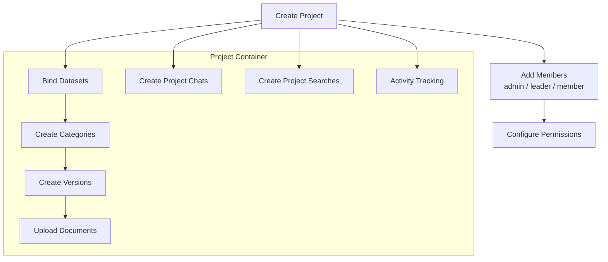
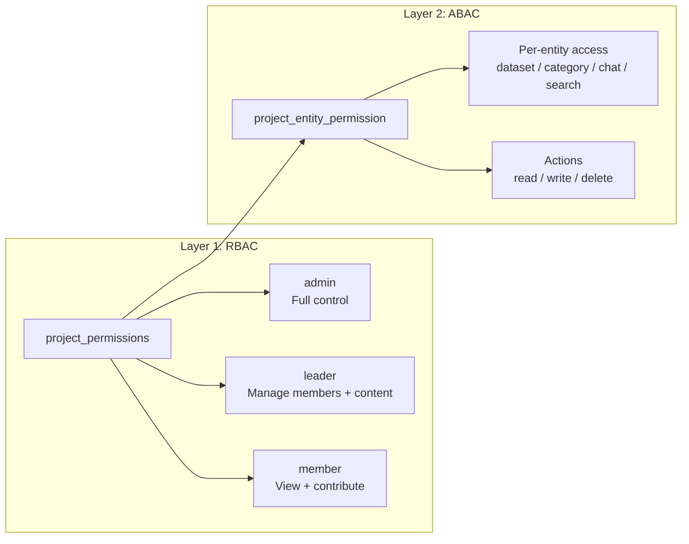
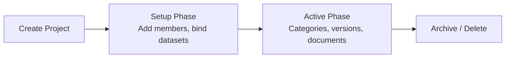

# Project Management - Overview

## Overview

Projects are organizational containers that group datasets, categories, chats, and searches under a unified structure with role-based access control. All projects are scoped to a tenant.

## Project Architecture

## Core Concepts

### Project as Container

A project groups related resources under a single management boundary:

| Resource | Relationship | Description |
|----------|-------------|-------------|
| Datasets | Many-to-many (bind) | Knowledge base datasets linked to the project |
| Categories | One-to-many | Hierarchical categorization tree |
| Versions | One-to-many (per category) | Version snapshots within categories |
| Documents | Many-to-many (per version) | Documents linked to specific versions |
| Chats | One-to-many | Chat dialogs scoped to project context |
| Searches | One-to-many | Search apps scoped to project datasets |
| Members | Many-to-many | Users assigned to the project with roles |

### Tenant Scoping

All projects belong to a tenant. Queries are always filtered by `tenant_id` to ensure data isolation between tenants.

## Permission Model

The project module uses a dual-layer permission system.

### RBAC - Role-Based Access Control

Stored in `project_permissions` table. Each user or team is assigned a role per project.

| Role | Capabilities |
|------|-------------|
| `admin` | Full control: manage members, permissions, all resources |
| `leader` | Manage content, categories, versions; invite members |
| `member` | View resources, contribute documents, use chats and searches |

### ABAC - Attribute-Based Access Control

Stored in `project_entity_permission` table. Provides fine-grained control over individual entities.

| Field | Description |
|-------|-------------|
| `project_id` | Parent project |
| `entity_type` | Type of resource (dataset, category, chat, search) |
| `entity_id` | Specific resource ID |
| `subject_type` | User or team |
| `subject_id` | Specific user or team ID |
| `actions` | Allowed actions (read, write, delete) |

### Permission Resolution

1. Check RBAC role from `project_permissions`.
2. If role grants sufficient access, allow.
3. If role is insufficient, check `project_entity_permission` for the specific entity.
4. Deny if neither layer grants access.

## Project Lifecycle

### Activity Tracking

All mutations within a project are logged for audit purposes:

- Member additions/removals
- Dataset bindings
- Category and version changes
- Document uploads and deletions
- Permission changes

Activity logs are queryable via `GET /api/projects/:id/activity` with pagination.

## Key Files

| File | Purpose |
|------|---------|
| `be/src/modules/projects/` | Project module root |
| `be/src/modules/projects/controllers/` | Request handlers |
| `be/src/modules/projects/services/` | Business logic |
| `be/src/modules/projects/routes/` | Route definitions |
| `be/src/modules/projects/models/` | Data models and queries |
