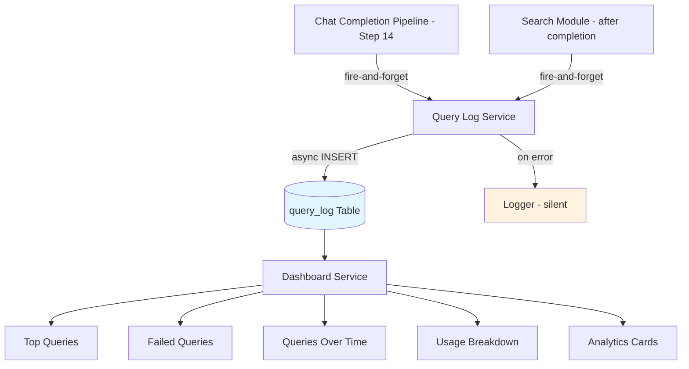
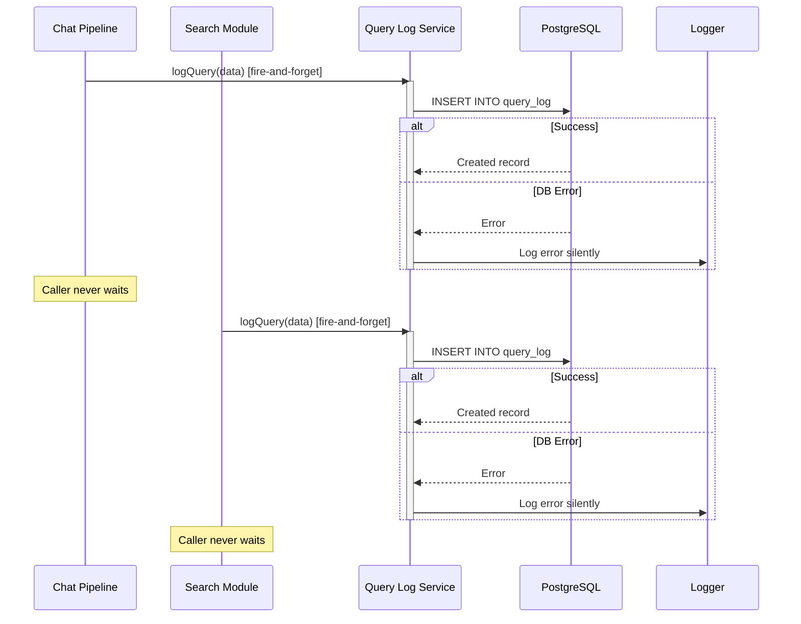
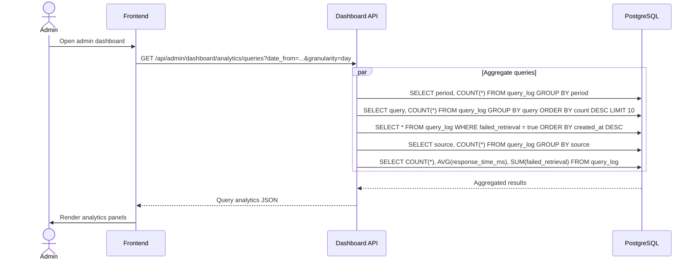

# Query Logging & Analytics Detail Design

## Overview

Fire-and-forget query logging that records every chat and search query for analytics. Data feeds the admin dashboard's query analytics section (top queries, failed queries, queries over time). The logging path never blocks the caller; errors are silently logged to prevent query failures from impacting user-facing operations.

## Logging Flow

## Data Model

### query_log

| Field | Type | Description |
|-------|------|-------------|
| id | UUID | Primary key |
| source | enum | Origin of query: `chat` or `search` |
| source_id | UUID | Reference to chat session or search request |
| user_id | UUID | User who issued the query |
| tenant_id | UUID | Tenant scope |
| query | text | Raw query string |
| dataset_ids | UUID[] | Datasets searched against |
| result_count | integer | Number of results returned |
| response_time_ms | integer | End-to-end response time in milliseconds |
| confidence_score | float | Retrieval confidence (0.0 - 1.0), nullable |
| failed_retrieval | boolean | True if retrieval returned no usable results |
| created_at | timestamp | Record creation time |

## Logging Sequence

## Dashboard Analytics Flow

## Logging Service API

### logQuery(data)

| Parameter | Type | Required | Description |
|-----------|------|----------|-------------|
| source | `'chat'` \| `'search'` | Yes | Query origin |
| source_id | UUID | Yes | Chat session or search request ID |
| user_id | UUID | Yes | Acting user |
| tenant_id | UUID | Yes | Tenant scope |
| query | string | Yes | Raw query text |
| dataset_ids | UUID[] | Yes | Target datasets |
| result_count | number | Yes | Results returned |
| response_time_ms | number | Yes | Response duration |
| confidence_score | number | No | Retrieval confidence |
| failed_retrieval | boolean | Yes | Whether retrieval failed |

The method returns `void`. It wraps the INSERT in a try-catch and logs any error without re-throwing, ensuring the calling pipeline is never disrupted.

## Dashboard Components

| Component | Data Source | Visualization |
|-----------|-----------|---------------|
| `QueryAnalyticsCards` | Total queries, avg response time, failure rate | Stat cards |
| `TopQueriesTable` | Most frequent queries by count | Sortable table |
| `FailedQueriesTable` | Queries where `failed_retrieval = true` | Filterable table |
| `QueriesOverTimeChart` | Query count grouped by day/week/month | Line/bar chart |
| `UsageBreakdownChart` | Query count by source (chat vs search) | Pie/donut chart |

## Key Files

| File | Purpose |
|------|---------|
| `be/src/modules/rag/services/query-log.service.ts` | Fire-and-forget logging service |
| `be/src/modules/rag/models/query-log.model.ts` | Knex model for query_log table |
| `be/src/modules/dashboard/dashboard.service.ts` | Reads query_log for analytics aggregations |
| `fe/src/features/dashboard/pages/AdminDashboardPage.tsx` | Dashboard page layout |
| `fe/src/features/dashboard/components/TopQueriesTable.tsx` | Top queries table |
| `fe/src/features/dashboard/components/FailedQueriesTable.tsx` | Failed queries table |
| `fe/src/features/dashboard/components/QueriesOverTimeChart.tsx` | Time series chart |
| `fe/src/features/dashboard/components/QueryAnalyticsCards.tsx` | Summary stat cards |
| `fe/src/features/dashboard/components/UsageBreakdownChart.tsx` | Chat vs search breakdown |
