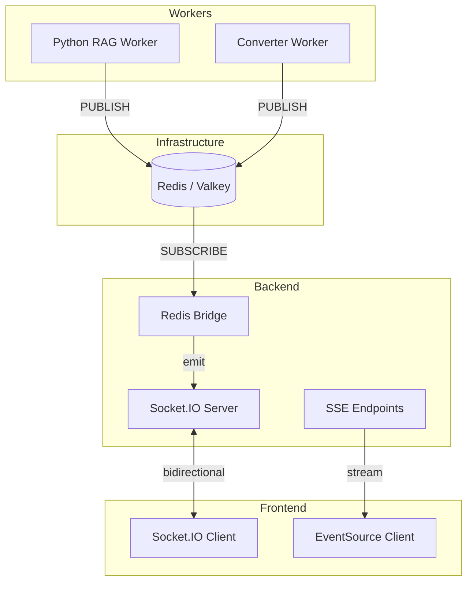
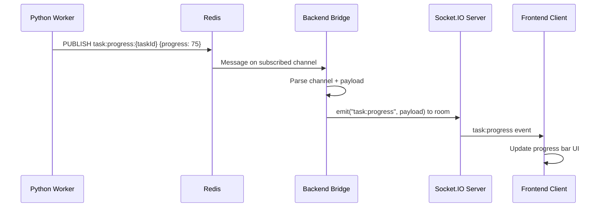
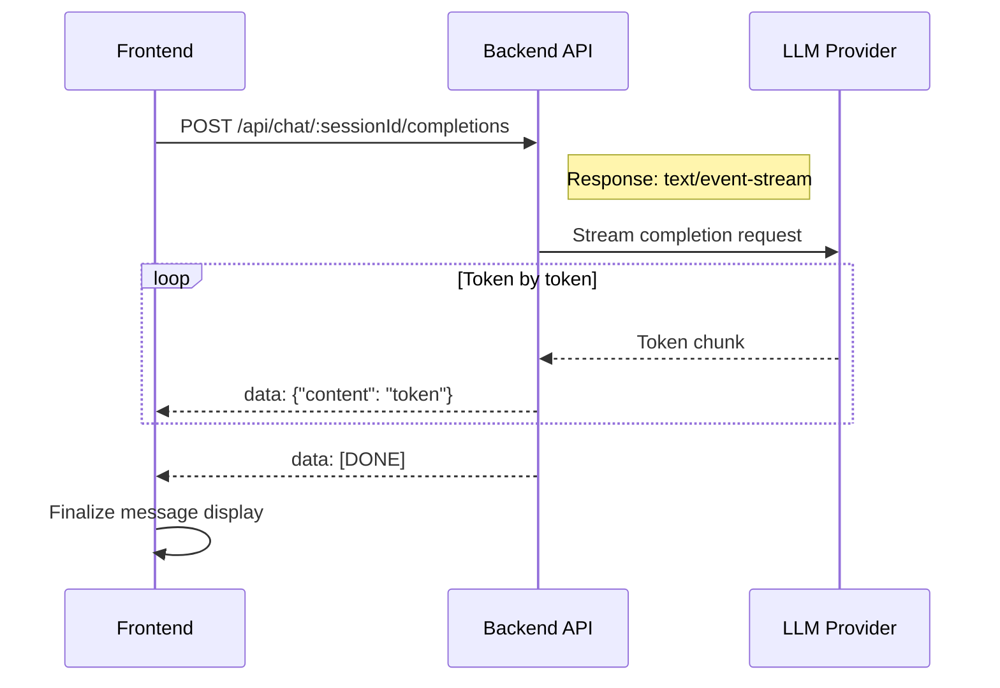
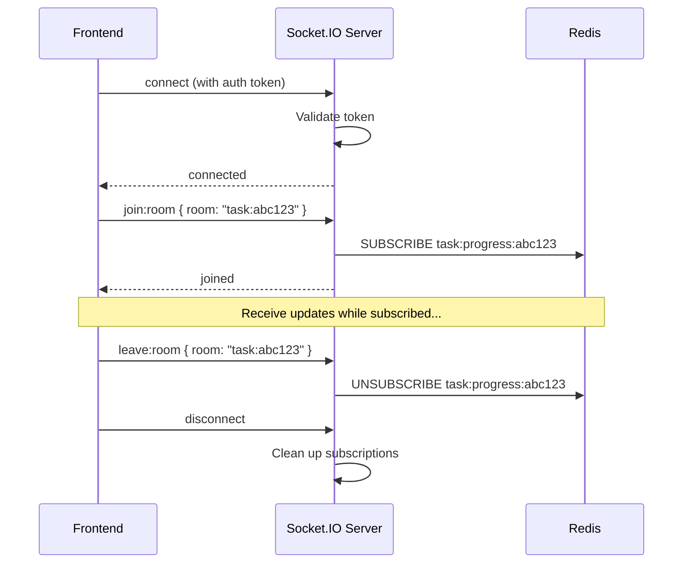

# Real-Time Communication Detail Design

## Overview

B-Knowledge uses three complementary patterns for real-time communication: **Socket.IO** for bidirectional events, **Redis pub/sub** as a backend message bridge, and **SSE (Server-Sent Events)** for streaming LLM responses.

## Architecture



## Pattern 1: Socket.IO (Bidirectional Events)

Used for push notifications, task progress, and document status changes.

### Events

| Event | Direction | Payload | Purpose |
|-------|-----------|---------|---------|
| `task:progress` | Server to Client | `{ taskId, progress, status }` | RAG task progress updates |
| `document:status` | Server to Client | `{ documentId, status }` | Document processing state changes |
| `notification` | Server to Client | `{ type, title, message }` | General push notifications |
| `join:room` | Client to Server | `{ room }` | Subscribe to entity-specific updates |
| `leave:room` | Client to Server | `{ room }` | Unsubscribe from updates |

### Connection Management

- Auto-reconnect with exponential backoff
- Room-based subscriptions (e.g., `task:{taskId}`, `dataset:{datasetId}`)
- Redis adapter for horizontal scaling across multiple backend instances

## Pattern 2: Redis Pub/Sub (Worker Bridge)

Python workers cannot emit Socket.IO events directly. Instead, they publish to Redis channels, and the backend bridges messages to Socket.IO clients.

### Channels

| Channel Pattern | Publisher | Description |
|----------------|-----------|-------------|
| `task:progress:{taskId}` | RAG Worker | Parsing/embedding progress |
| `converter:progress:{jobId}` | Converter | File conversion progress |
| `document:status:{documentId}` | RAG Worker | Document state transitions |

### Bridge Sequence



## Pattern 3: SSE (Server-Sent Events)

Used for streaming responses where the client only needs to receive data (no bidirectional communication needed).

### SSE Endpoints

| Endpoint | Purpose |
|----------|---------|
| `POST /api/chat/:sessionId/completions` | Stream chat LLM response |
| `POST /api/search/ask` | Stream search AI summary |
| `GET /api/documents/:id/status/stream` | Stream document processing status |

### Chat Streaming Sequence



### SSE Format

```
data: {"id":"msg_1","content":"Hello"}

data: {"id":"msg_1","content":" world"}

data: [DONE]
```

## Connection Lifecycle



## Scaling Considerations

| Concern | Solution |
|---------|----------|
| Multiple backend instances | Socket.IO Redis adapter shares events across instances |
| Client reconnection | Socket.IO auto-reconnect with room re-join on connect |
| Message ordering | SSE uses sequential streaming; Socket.IO events include timestamps |
| Memory | Room subscriptions are cleaned up on disconnect |

## Key Files

| File | Purpose |
|------|---------|
| `be/src/shared/socket/` | Socket.IO server setup and configuration |
| `be/src/shared/socket/redis-bridge.ts` | Redis pub/sub to Socket.IO bridge |
| `be/src/shared/sse/` | SSE response helpers |
| `fe/src/lib/socket.ts` | Socket.IO client setup |
| `fe/src/hooks/useSocket.ts` | React hook for Socket.IO events |
| `advance-rag/src/redis_publisher.py` | Worker Redis publish helpers |
| `converter/src/redis_client.py` | Converter Redis publish helpers |
