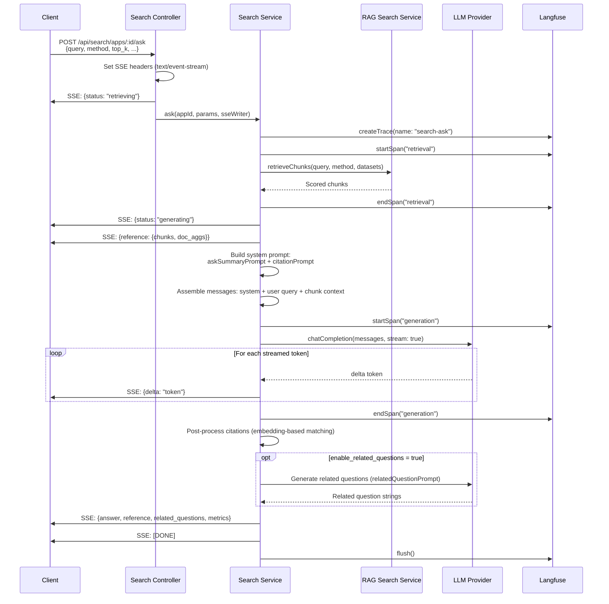
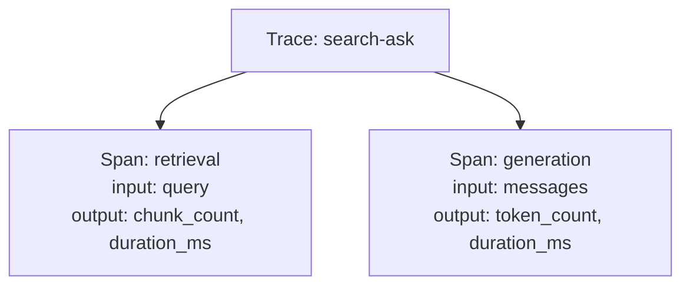

# Search Ask SSE Streaming - Detail Design

## Overview

The `/ask` endpoint combines retrieval with LLM-powered summarization, streamed to the client via Server-Sent Events (SSE). It retrieves relevant chunks, builds a contextual prompt, streams the LLM response token-by-token, post-processes citations, and optionally generates related questions.

## End-to-End Sequence



## SSE Event Format

The response is a stream of newline-delimited JSON events. Each event is prefixed with `data: `.

| Event Payload | Stage | Description |
|---------------|-------|-------------|
| `{status: "retrieving"}` | Start | Search pipeline is querying datasets |
| `{status: "generating"}` | After retrieval | LLM is generating the answer |
| `{reference: {chunks, doc_aggs}}` | After retrieval | Source documents and chunk metadata |
| `{delta: "token"}` | During generation | Incremental token from LLM stream |
| `{answer, reference, related_questions, metrics}` | End | Complete final result object |
| `[DONE]` | End | Stream termination signal |

### Example SSE Stream

```
data: {"status":"retrieving"}

data: {"status":"generating"}

data: {"reference":{"chunks":[...],"doc_aggs":[...]}}

data: {"delta":"Based"}

data: {"delta":" on"}

data: {"delta":" the"}

data: {"delta":" documents"}

...

data: {"answer":"Based on the documents...","reference":{...},"related_questions":["..."],"metrics":{"retrieval_ms":120,"generation_ms":1500}}

data: [DONE]
```

## Prompt Construction

### System Prompt

The system prompt is built from two templates:

1. **askSummaryPrompt** - Instructs the LLM to synthesize an answer from the provided context chunks. Includes instructions for handling cases where context is insufficient.
2. **citationPrompt** - Instructs the LLM to insert inline citation markers (e.g., `[1]`, `[2]`) referencing specific chunks.

### Message Assembly

```
messages = [
  { role: "system", content: askSummaryPrompt + citationPrompt },
  { role: "user", content: "Context:\n{chunk_texts}\n\nQuestion: {query}" }
]
```

## Citation Post-Processing

After the full answer is generated, citations are refined using embedding-based matching:

1. Extract citation markers from the answer text (`[1]`, `[2]`, etc.).
2. For each cited span, compute embedding similarity against source chunks.
3. Map citation numbers to the most relevant chunk based on similarity.
4. Return citation mappings in the final `reference` object.

## Langfuse Tracing

Observability is implemented via Langfuse for monitoring retrieval and generation performance.



| Span | Captured Data |
|------|---------------|
| `retrieval` | Query, method, dataset_ids, chunk count, duration |
| `generation` | Messages, model, temperature, token count, duration |

## Error Handling

- If retrieval returns zero chunks, the LLM is still called with an empty context; the askSummaryPrompt instructs it to say "I don't have enough information."
- If the LLM stream errors mid-generation, a partial answer is sent with an error status event.
- SSE connection drops are handled by the client reconnecting and re-issuing the request.

## Key Files

| File | Purpose |
|------|---------|
| `be/src/modules/search/services/search.service.ts` | Ask orchestration, SSE streaming, prompt building |
| `be/src/modules/search/controllers/search.controller.ts` | SSE header setup, stream piping |
| `be/src/modules/rag/services/rag-search.service.ts` | Chunk retrieval |
| `be/src/modules/search/prompts/` | askSummaryPrompt, citationPrompt, relatedQuestionPrompt |
