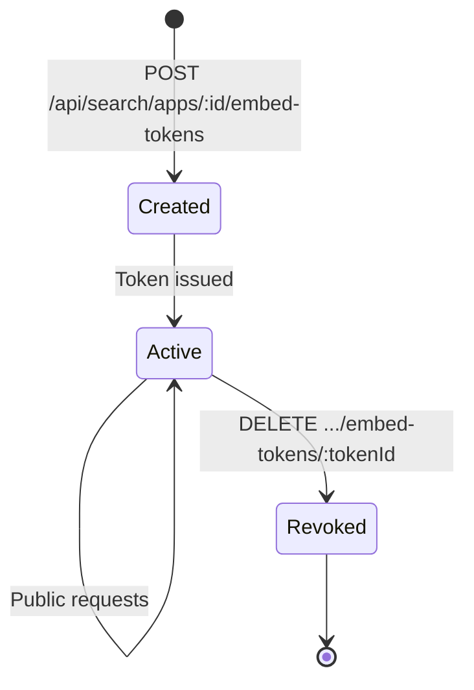
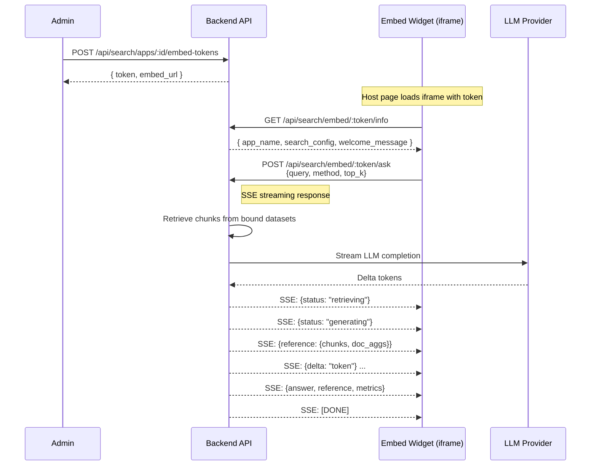
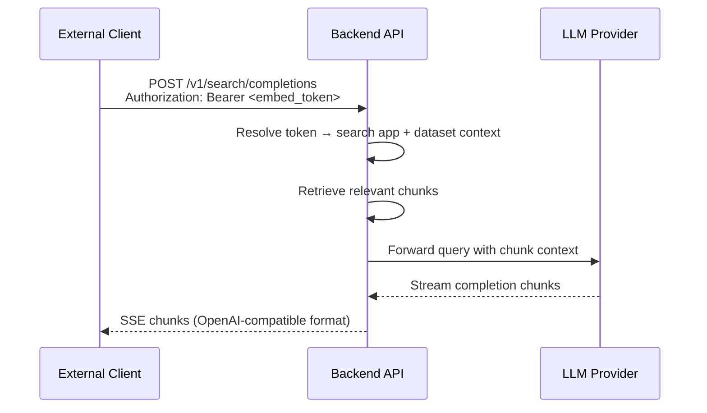

# Search Embed Widget - Detail Design

## Overview

The search embed widget allows external sites to embed B-Knowledge search functionality via an iframe or IIFE bundle. Like the chat embed widget, it uses token-based authentication instead of user sessions, enabling anonymous public access. An OpenAI-compatible endpoint is also provided.

## Token Management



### Token CRUD

| Method | Endpoint | Description |
|--------|----------|-------------|
| POST | `/api/search/apps/:id/embed-tokens` | Create new embed token |
| GET | `/api/search/apps/:id/embed-tokens` | List all tokens for this app |
| DELETE | `/api/search/apps/:id/embed-tokens/:tokenId` | Revoke a token |

Token creation and management requires an authenticated admin session. The generated tokens themselves are used for public access.

## End-to-End Sequence



## Public API Endpoints

All embed endpoints bypass session authentication. The embed token is the sole credential.

| Method | Endpoint | Purpose |
|--------|----------|---------|
| GET | `/api/search/embed/:token/info` | Retrieve search app metadata and config |
| POST | `/api/search/embed/:token/search` | Chunk search (non-streaming) |
| POST | `/api/search/embed/:token/ask` | AI-summarized search (SSE streaming) |

## OpenAI-Compatible Endpoint



- **Auth**: `Authorization: Bearer <embed_token>` header.
- **Request body**: `{ model, messages, stream }` following OpenAI schema.
- **Response**: OpenAI-compatible SSE chunks with `choices[].delta.content`.

## Widget Integration

### IIFE Bundle

```html
<script src="https://your-domain/embed/search-widget.iife.js"></script>
<script>
  BKnowledgeSearch.init({
    token: 'embed_token_value',
    containerId: 'search-container',
    placeholder: 'Search our knowledge base...'
  });
</script>
```

### iframe Embedding

```html
<iframe
  src="https://your-domain/embed/search?token=embed_token_value"
  width="600" height="500"
  style="border:none;">
</iframe>
```

### CORS and Security

- **frame-ancestors**: CSP relaxed for embed routes to permit cross-origin iframe loading.
- **CORS**: Permissive `Access-Control-Allow-Origin: *` on embed endpoints.
- **Rate limiting**: Token-scoped rate limits to prevent abuse.

## Key Files

| File | Purpose |
|------|---------|
| `be/src/modules/search/controllers/search-embed.controller.ts` | Embed endpoint handlers |
| `be/src/modules/search/services/search-embed.service.ts` | Token management, public search logic |
| `be/src/modules/search/routes/search-embed.routes.ts` | Embed route definitions |
