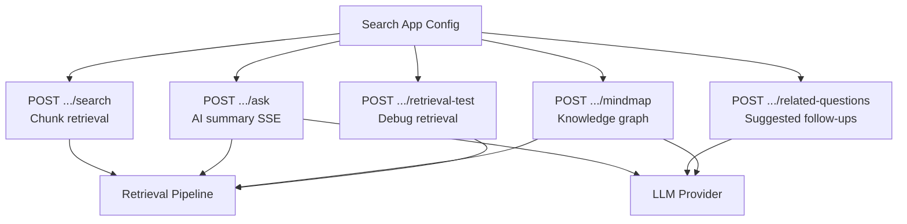

# Search System - Overview

## Overview

The search system provides AI-powered retrieval over knowledge base datasets. A Search App wraps configuration (LLM, reranker, filters) and exposes five endpoints: chunk search, AI-summarized ask, related questions, mind map, and retrieval test.

## Architecture

## Search App Configuration

Each search app stores configuration that governs retrieval and generation behavior.

| Field | Type | Required | Description |
|-------|------|----------|-------------|
| `name` | string | Yes | Display name of the search app |
| `dataset_ids` | string[] | Yes | Datasets to search over |
| `llm_id` | string | [OPTIONAL] | LLM model for ask/mindmap/related-questions |
| `llm_setting` | object | [OPTIONAL] | Temperature, top_p, max_tokens overrides |
| `rerank_id` | string | [OPTIONAL] | Reranker model (Jina, Cohere, etc.) |
| `rerank_top_k` | number | [OPTIONAL] | Max chunks after reranking (default: 5) |
| `enable_related_questions` | boolean | [OPTIONAL] | Auto-generate follow-up questions |
| `metadata_filter` | object | [OPTIONAL] | Default metadata filters applied to all queries |

## Runtime Query Parameters

Callers pass these at request time to override or refine search behavior.

| Parameter | Type | Default | Description |
|-----------|------|---------|-------------|
| `query` | string | (required) | User search query |
| `method` | enum | `hybrid` | `full_text`, `semantic`, or `hybrid` |
| `top_k` | number | 5 | Max chunks to return |
| `similarity_threshold` | number | 0.0 | Min similarity score filter |
| `vector_similarity_weight` | number | 0.5 | Weight for vector vs. text score in hybrid mode |
| `page` | number | 1 | Pagination page |
| `page_size` | number | 20 | Pagination size |
| `metadata_filter` | object | [OPTIONAL] | Per-request metadata filter override |

## High-Level Flow

```mermaid
flowchart LR
    Q[User Query] --> EMB{Embed Query}
    EMB -->|semantic/hybrid| VEC[Vector Embedding]
    EMB -->|full_text| SKIP[Skip Embedding]
    VEC --> MS[Multi-Dataset Search]
    SKIP --> MS
    MS --> MRG[Merge Results by Score]
    MRG --> RR{Rerank?}
    RR -->|OPT: rerank_id set| RERANK[Reranker Provider]
    RR -->|No reranker| OUT
    RERANK --> OUT[Return Chunks]
    OUT --> SUM{AI Summary?}
    SUM -->|OPT: ask endpoint| LLM[LLM Streaming]
    SUM -->|search endpoint| DONE[Response]
    LLM --> CIT[OPT: Citation Post-processing]
    CIT --> RQ{Related Questions?}
    RQ -->|OPT: enabled| RQGEN[Generate Related Questions]
    RQ -->|Disabled| FINAL[Final Response]
    RQGEN --> FINAL
```

### Flow Steps

1. **Query** - User submits search query with optional parameters.
2. **Embed** - If method is `semantic` or `hybrid`, query is embedded via the configured embedding model.
3. **Multi-Dataset Search** - Each dataset is searched independently using the selected method.
4. **Merge** - Results from all datasets are merged and sorted by score.
5. **[OPT] Rerank** - If `rerank_id` is configured, chunks are re-scored by the reranker.
6. **Return Chunks** - For `/search` endpoint, paginated chunks are returned here.
7. **[OPT] AI Summary** - For `/ask` endpoint, chunks are fed to the LLM as context.
8. **[OPT] Citations** - Embedding-based citation matching links answer spans to source chunks.
9. **[OPT] Related Questions** - If enabled, LLM generates follow-up question suggestions.

## Endpoints Summary

| Endpoint | Method | Response | Streaming |
|----------|--------|----------|-----------|
| `/api/search/apps/:id/search` | POST | Paginated chunks | No |
| `/api/search/apps/:id/ask` | POST | AI answer + references | Yes (SSE) |
| `/api/search/apps/:id/related-questions` | POST | String array | No |
| `/api/search/apps/:id/mindmap` | POST | JSON nodes + edges | No |
| `/api/search/apps/:id/retrieval-test` | POST | Raw chunks (debug) | No |

## Key Files

| File | Purpose |
|------|---------|
| `be/src/modules/search/` | Search module root |
| `be/src/modules/search/controllers/search.controller.ts` | Request handlers |
| `be/src/modules/search/services/search.service.ts` | Core search orchestration |
| `be/src/modules/search/routes/search.routes.ts` | Route definitions |
