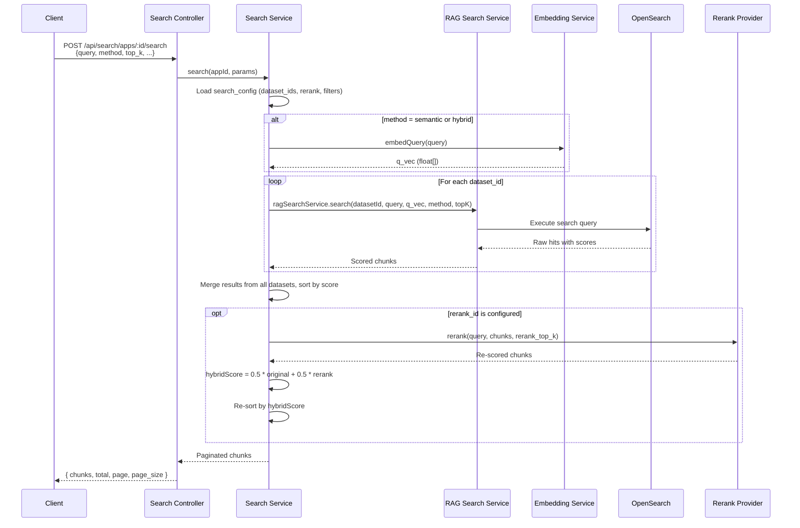
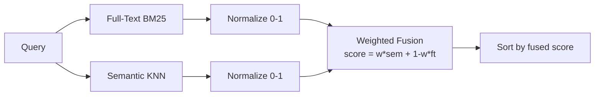
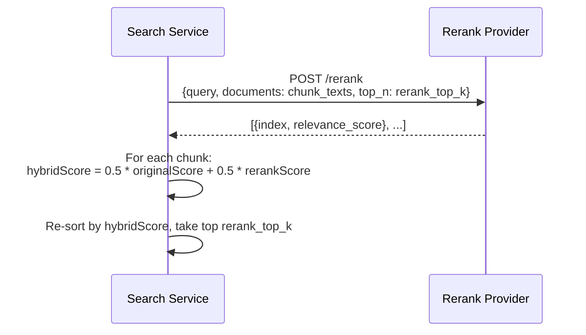

# Search Retrieval Pipeline - Detail Design

## Overview

The retrieval pipeline handles chunk-level search across one or more datasets. It supports three retrieval methods (full-text, semantic, hybrid), applies boost factors, and optionally reranks results via an external provider.

## Retrieval Sequence



## Retrieval Methods

### Full-Text Search (weight = 0)

- Uses BM25 scoring on the `content_with_weight` field in OpenSearch.
- Applies `minimum_should_match: "30%"` to balance recall and precision.
- Boost factors applied to specialized fields (see below).

### Semantic Search (weight = 1)

- Query is embedded via the dataset's configured embedding model.
- KNN search on the `q_vec` vector field in OpenSearch.
- Returns top-k results by cosine similarity.

### Hybrid Search (0 < weight < 1)

- Executes full-text and semantic searches in parallel.
- Normalizes scores from each method to [0, 1] range.
- Final score = `weight * semantic_score + (1 - weight) * fulltext_score`.



## Boost Factors

Field-level boost factors amplify scores for matches in high-value fields during full-text search.

| Field | Boost Factor | Rationale |
|-------|-------------|-----------|
| `title_tks` | 10x | Title matches are strong relevance signals |
| `important_kwd` | 30x | Manually tagged keywords indicate high relevance |
| `question_tks` | 20x | FAQ-style question matches are highly targeted |
| `content_ltks` | 2x | Body content has baseline relevance |

## Reranking

When `rerank_id` is set in the search app configuration, retrieved chunks undergo a second-pass reranking.



### Supported Reranker Providers

| Provider | API Style | Notes |
|----------|-----------|-------|
| Jina | `POST /v1/rerank` | `jina-reranker-v2-base-multilingual` |
| Cohere | `POST /v1/rerank` | `rerank-english-v3.0`, `rerank-multilingual-v3.0` |
| Generic | Configurable endpoint | Any provider following the rerank API contract |

### Hybrid Score Formula

```
hybridScore = 0.5 * normalize(originalScore) + 0.5 * normalize(rerankScore)
```

Both scores are normalized to [0, 1] before combining. The 0.5/0.5 weighting gives equal importance to initial retrieval relevance and reranker assessment.

## Multi-Dataset Search

When a search app is bound to multiple datasets:

1. Each dataset is searched independently with the same query and parameters.
2. Results from all datasets are collected into a single list.
3. Scores are normalized across the combined result set.
4. Results are sorted by normalized score (descending).
5. The combined list is capped at `top_k`.
6. If reranking is enabled, it operates on the merged list.

## Key Files

| File | Purpose |
|------|---------|
| `be/src/modules/rag/services/rag-search.service.ts` | Core retrieval logic (BM25, KNN, hybrid) |
| `be/src/modules/search/services/search.service.ts` | Search orchestration, multi-dataset merge |
| `be/src/modules/rag/services/rerank.service.ts` | Reranker provider integration |
| `be/src/modules/rag/services/embedding.service.ts` | Query embedding |
