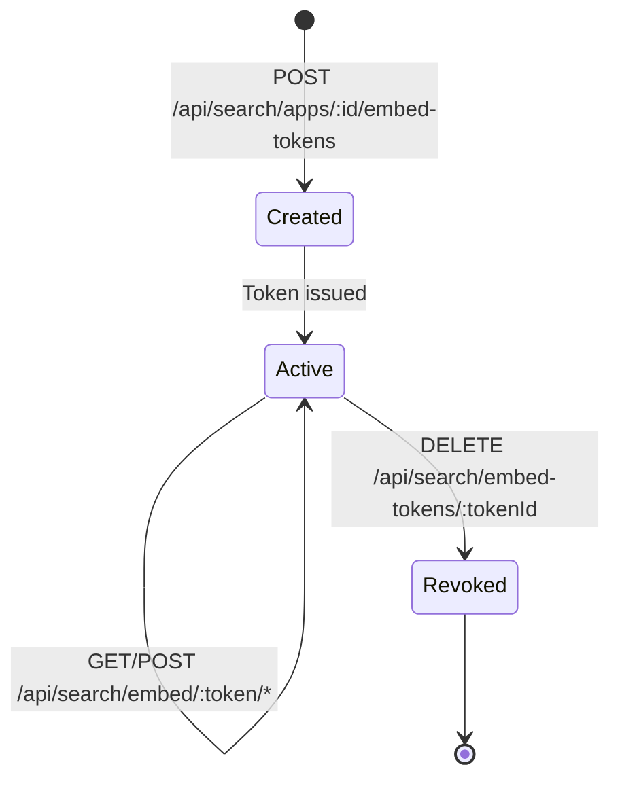
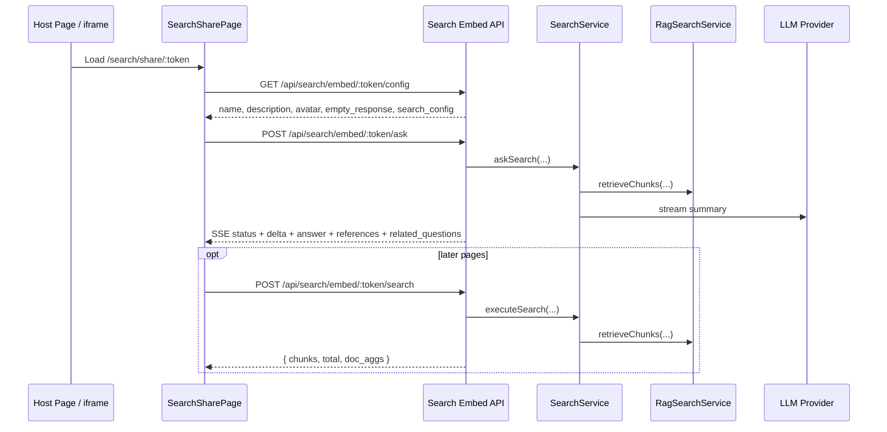

# Search Embed Widget - Detail Design

> Token-based public search access for iframe embedding and standalone share pages.

## 1. Overview

The current implementation is iframe-first. Admin users create embed tokens for a search app, then external pages load the standalone share page at `/search/share/:token`. The share page calls token-authenticated backend endpoints and does not require a user session.

There is no separate IIFE widget implementation in the latest source code. The public surface is the share page plus the token-authenticated API.

## 2. Token Lifecycle

### Admin token management

| Method | Endpoint | Description |
|--------|----------|-------------|
| POST | `/api/search/apps/:id/embed-tokens` | Create a token for one search app |
| GET | `/api/search/apps/:id/embed-tokens` | List tokens for that app |
| DELETE | `/api/search/embed-tokens/:tokenId` | Revoke a token |

These routes require `requireAuth` and `requirePermission('manage_users')`.

## 3. Public Embed Endpoints

All public embed endpoints validate the token first, then resolve the associated search app. For search execution, tenant context is derived from `search_apps.created_by`.

| Method | Endpoint | Purpose |
|--------|----------|---------|
| GET | `/api/search/embed/:token/info` | Legacy public app metadata endpoint |
| GET | `/api/search/embed/:token/config` | Public-safe app config including `avatar`, `empty_response`, and an allowlisted subset of `search_config` |
| POST | `/api/search/embed/:token/search` | Non-streaming chunk search with pagination |
| POST | `/api/search/embed/:token/ask` | SSE streaming answer generation |
| POST | `/api/search/embed/:token/related-questions` | Follow-up question suggestions |
| POST | `/api/search/embed/:token/mindmap` | Mind map generation |

### Exposed config fields

`GET /config` intentionally strips sensitive provider credentials and returns only safe fields:

- Search app `name`
- Search app `description`
- Search app `avatar`
- Search app `empty_response`
- Allowlisted `search_config` keys such as `top_k`, `search_method`, `highlight`, `enable_related_questions`, `enable_mindmap`, `metadata_filter`

## 4. Share Page Flow

## 5. Standalone Share Page

The frontend route is `/search/share/:token`.

Implemented display options from URL query params:

| Param | Effect |
|-------|--------|
| `locale=en|vi|ja` | Override i18n locale |
| `hide_avatar=true` | Hide app avatar and branding |
| `hide_powered_by=true` | Hide footer branding |

The page renders:

- Minimal branded header using app `avatar`, `name`, and `description`
- Shared `SearchBar`
- Streaming page-1 search using `useSearchStream`
- Non-streaming page 2+ pagination via `/embed/:token/search`
- Shared `SearchResults`
- Related questions and mind map when enabled
- Configurable empty-state message via `empty_response`
- Spotlight background on the landing state

## 6. Security Notes

- Public access is token-based, not session-based.
- Validation is enforced on both route params and request bodies.
- `/config` uses an explicit allowlist for exposed config keys.
- The share page is served from the same application origin as the API, so no extra cross-origin API flow is required for the default deployment model.

## 7. Key Files

| File | Purpose |
|------|---------|
| `be/src/modules/search/routes/search-embed.routes.ts` | Public and admin embed route registration |
| `be/src/modules/search/controllers/search-embed.controller.ts` | Token validation, config filtering, public search handlers |
| `be/src/modules/search/services/search.service.ts` | Shared search execution used by embed endpoints |
| `fe/src/features/search/pages/SearchSharePage.tsx` | Standalone iframe/share page |
| `fe/src/features/search/components/SearchAppEmbedDialog.tsx` | Admin UI for token listing and iframe code generation |
