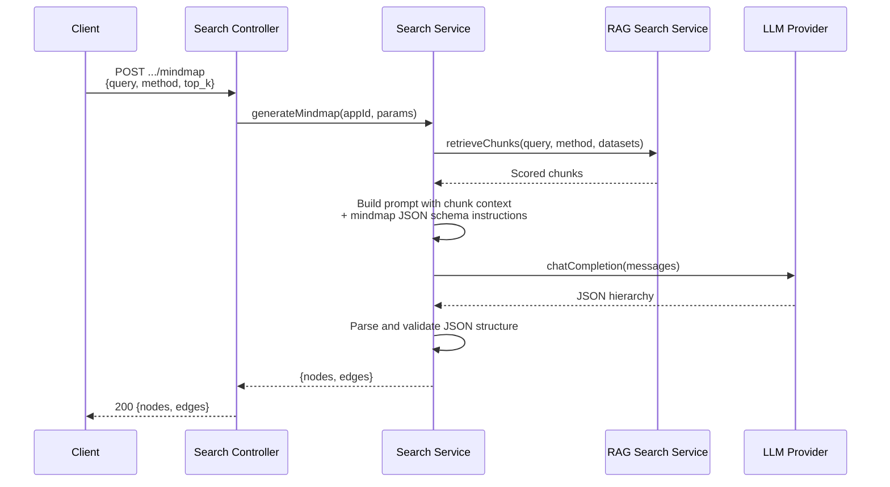
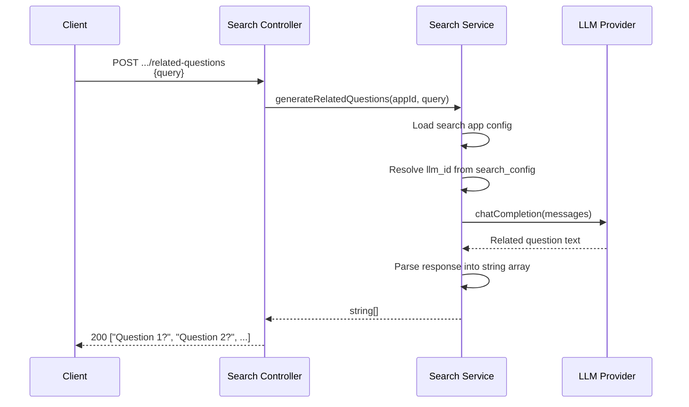
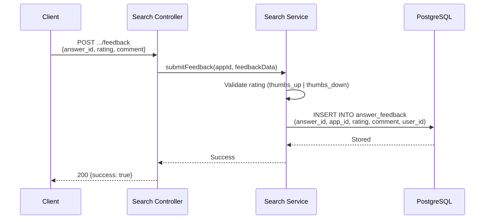
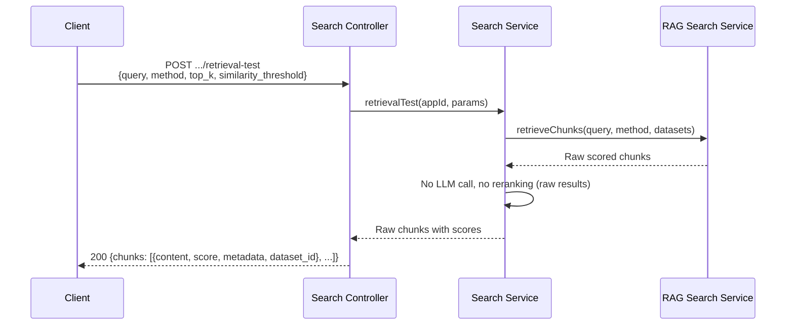

# Search Features - Detail Design

> Supplementary search capabilities built on top of the shared retrieval pipeline.

## Overview

Beyond core `search` and `askSearch`, the latest implementation exposes:

- Mind map generation
- Related question suggestions
- Retrieval testing
- Public embed/share endpoints
- Search-app branding fields (`avatar`, `empty_response`)

Feedback remains part of the broader product direction, but it is not the main focus of the 2026-03-25 search implementation work.

## Mind Map

Generates a hierarchical knowledge map from retrieved chunks using LLM summarization.

**Endpoint**: `POST /api/search/apps/:id/mindmap`



### Response Structure

```json
{
  "nodes": [
    { "id": "1", "label": "Main Topic", "level": 0 },
    { "id": "2", "label": "Subtopic A", "level": 1 },
    { "id": "3", "label": "Subtopic B", "level": 1 }
  ],
  "edges": [
    { "source": "1", "target": "2" },
    { "source": "1", "target": "3" }
  ]
}
```

## Related Questions

Generates follow-up question suggestions for a query. In the current implementation, the dedicated endpoint uses the query plus the configured LLM provider. In streaming search, related questions are generated after answer streaming completes and emitted in the final SSE payload.

**Endpoint**: `POST /api/search/apps/:id/related-questions`



### Prompt Design

The related question flow is shared through `relatedQuestionsService`, which is reused from both normal search and embed search.

## Feedback

Captures user feedback (thumbs up/down) on search answers for quality tracking.

**Endpoint**: `POST /api/search/apps/:id/feedback`



### Feedback Table Schema

| Column | Type | Description |
|--------|------|-------------|
| `id` | uuid | Primary key |
| `answer_id` | uuid | Reference to the search answer |
| `app_id` | uuid | Search app that produced the answer |
| `rating` | enum | `thumbs_up` or `thumbs_down` |
| `comment` | text | [OPTIONAL] User-provided comment |
| `user_id` | uuid | User who submitted feedback |
| `created_at` | timestamp | Submission time |

## Retrieval Test

A debug tool that runs the retrieval pipeline without LLM generation. Returns raw chunks with scores for evaluating retrieval quality.

**Endpoint**: `POST /api/search/apps/:id/retrieval-test`



### Use Cases

- **Tuning retrieval parameters**: Compare `full_text` vs. `semantic` vs. `hybrid` results.
- **Evaluating boost factors**: Check if title/keyword boosts surface the right chunks.
- **Debugging low-quality answers**: Inspect what context the LLM would receive.
- **Threshold calibration**: Test different `similarity_threshold` values.

## Public Embed / Share Features

The search module now exposes public token-authenticated features for embedded usage:

| Method | Endpoint | Purpose |
|--------|----------|---------|
| GET | `/api/search/embed/:token/config` | Share-page bootstrap config |
| POST | `/api/search/embed/:token/search` | Non-streaming paginated results |
| POST | `/api/search/embed/:token/ask` | Streaming answer generation |
| POST | `/api/search/embed/:token/related-questions` | Public follow-up suggestions |
| POST | `/api/search/embed/:token/mindmap` | Public mind map generation |

This is paired with the frontend route `/search/share/:token`.

## Search-App Presentation Features

Search apps now support two user-facing presentation fields:

| Field | Purpose |
|-------|---------|
| `avatar` | Emoji/icon branding on the main search page, app management table, and share page |
| `empty_response` | Custom no-results message displayed in the search UI |

## Feature Comparison

| Feature | Retrieval | LLM | Streaming | Public Token Support |
|---------|-----------|-----|-----------|----------------------|
| Mind map | Yes | Yes | No | Yes |
| Related questions | No | Yes | Final SSE payload only in `ask` | Yes |
| Retrieval test | Yes | No | No | No |
| Embed/share search | Yes | Yes | Yes | Yes |
| Search app avatar / empty response | No | No | No | Exposed via `/config` |

## Key Files

| File | Purpose |
|------|---------|
| `be/src/modules/search/services/search.service.ts` | All feature orchestration |
| `be/src/modules/search/controllers/search.controller.ts` | Endpoint handlers |
| `be/src/modules/search/controllers/search-embed.controller.ts` | Public token-authenticated handlers |
| `be/src/modules/search/routes/search-embed.routes.ts` | Embed/share route registration |
| `be/src/shared/services/related-questions.service.ts` | Shared follow-up question generation |
| `fe/src/features/search/pages/SearchSharePage.tsx` | Standalone share page |
